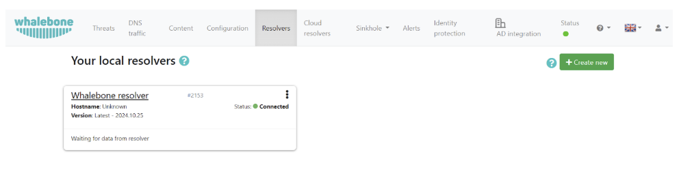
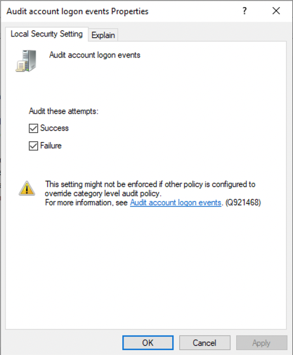
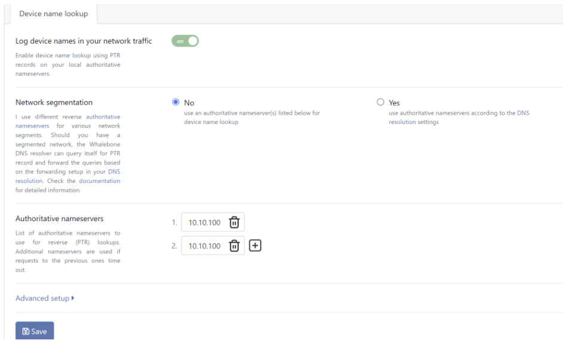
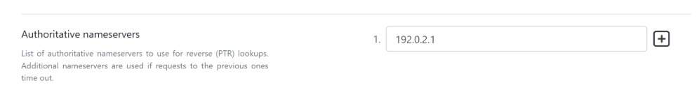
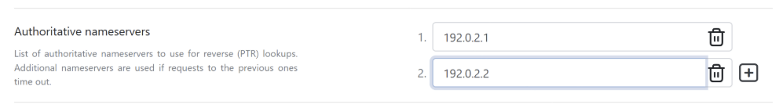
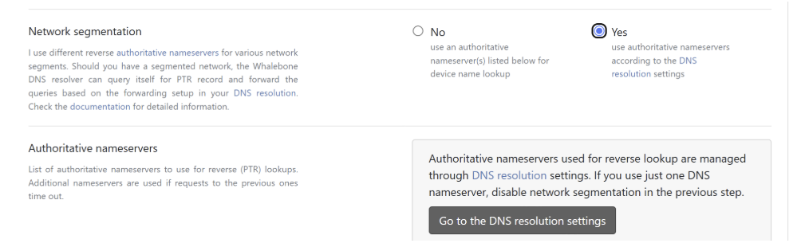
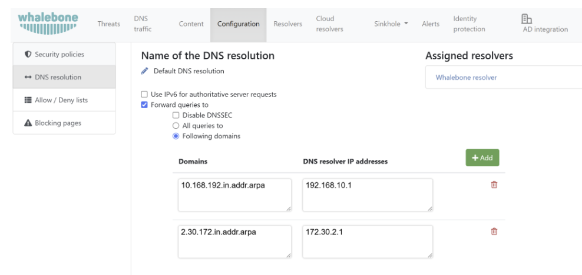
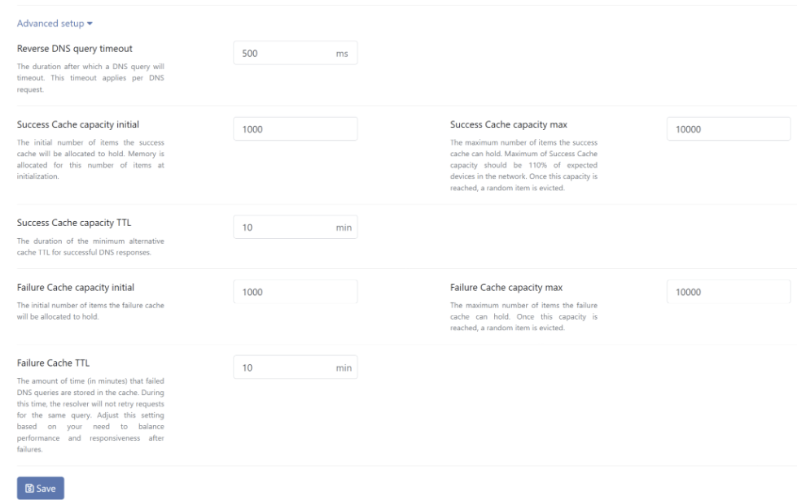
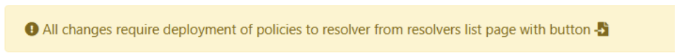

============================
Vyhledání názvu zařízení
============================

Whalebone Immunity lze snadno integrovat s Active Directory a zobrazit tak názvy zařízení (hostnames). Viditelnost názvů vám umožní urychlit následnou analýzu a řešení problémů, a není tak nutné korelovat název zařízení s IP adresou.

Jak to funguje?
===============

Po konfiguraci se Whalebone resolver dotazuje autoritativního name serveru na název zařízení pomocí PTR dotazu. PTR (Pointer) záznam je typ DNS záznamu používaný k mapování IP adresy na doménové jméno, tedy k provádění reverzního DNS překladu. Na rozdíl od A nebo AAAA záznamů, které překládají doménová jména na IP adresy, PTR záznam poskytuje doménové jméno (hostname) přidělené určité IP adrese.
Integraci DNS dotazů lze jednoduše provést v několika krocích. Přejděte do portálu Whalebone -> Resolvers

Klikněte na resolver, pro který chcete integraci nastavit. Poté přejděte na kartu "Integrace" na levé straně stránky.

   

Povolte možnost "Zaznamenávat názvy zařízení v síti".

   

Přidejte svůj autoritativní name server.

   

Kliknutím na ikonu "+" přidáte sekundární server sloužící pro případ výpadku primárního.

   

s/ad-integration-5.png
Pokud je vaše síť segmentovaná a name servery jsou přiřazeny k různým IP rozsahům ,či segmentům sítě, můžete využít funkci segmentace sítě.

   

Po aktivaci této volby, resolver začne dotazovat sám sebe na PTR záznamy (za účelem obohacení log záznamů o název zařízení). Dotazy budou následně přesměrovaný na autoritativní name server dle konfigurace v DNS překladu.

Poznámka: IP adresy či rozsahy v PTR záznamech se zapisují v obráceném pořadí, viz následující příklady.

   

   
Klikněte na "Přejít do konfigurace DNS překladu" a nastavte požadovaná pravidla pro přesměrování.

V pokročilém nastavení můžete nakonfigurovat detailní parametry ohledně ukládání zpětných záznamů. Výchozí hodnoty jsou námi doporučené.
Pokud chcete hodnoty upravit, po úpravě klikněte na tlačítko "Uložit" ve spodní části stránky.
Nastavení je následně nutno aplikovat na resolver.

Přejděte zpět na stránku s resolvery a aplikujte konfiguraci na resolver stisknutím tlačítka "Nahrát konfiguraci" u vašeho resolveru.

Poznámka: PTR záznamy, které resolver provádí sám na sebe, nejsou viditelné v log záznamech o DNS provozu. Standardní DNS dotazy od klientů zůstávají logovány.

.. toctree::
   :maxdepth: 1

   active_directory_secondary