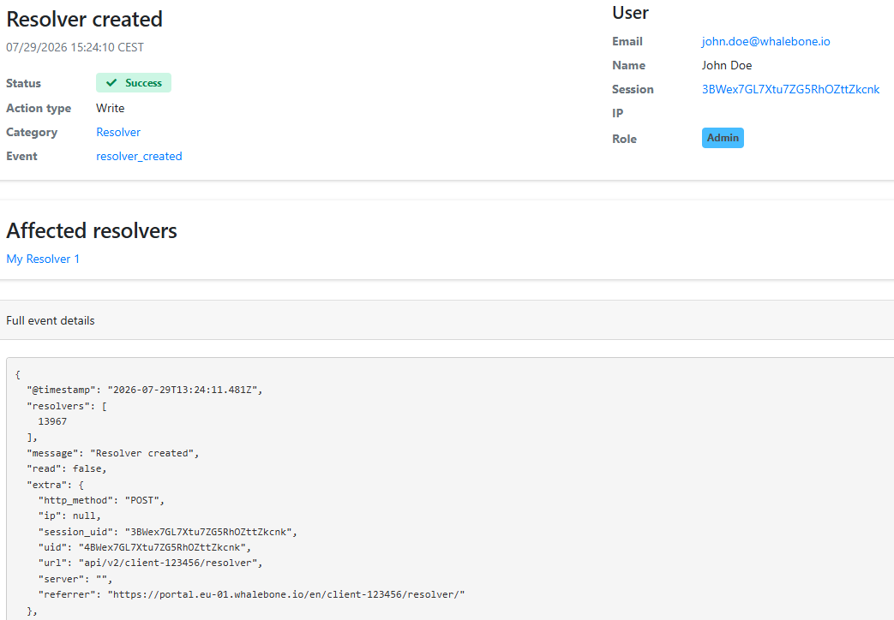

***************
Auditní záznamy
***************

Funkce Audit logy poskytuje přehled a sledovatelnost administrátorských aktivit napříč platformou Whalebone. Administrátoři mají přístup k hlavnímu auditnímu záznamu přímo v Admin portálu, a to výběrem položky Audit logy v nabídce vpravo nahoře. Přístup k auditním záznamům je zabezpečen a omezen pomocí řízení přístupu na základě rolí (RBAC).

Zaznamenávané události
======================

Auditní záznam zachycuje akce prováděné jak prostřednictvím rozhraní Admin portálu, tak prostřednictvím integrací přes veřejné API. Zaznamenávané aktivity zahrnují:

* Autentizaci a autorizaci uživatelů: Přihlášení, události přístupu a související aktivity relací.
* Administrátorské a konfigurační změny: Akce na úrovni systému, změny zásad a aktualizace konfigurace prováděné v portálu.

Filtrování a zobrazení detailů událostí
=======================================

V Admin portálu mohou administrátoři procházet a filtrovat zaznamenané události. Pro zúžení zobrazených událostí lze použít filtry na základě typů událostí, identity uživatelů, časových razítek a dalších relevantních kritérií. Kliknutím na ikonu oka vedle jednotlivé události se zobrazí podrobné informace včetně provedené akce, aktéra a výsledku.

.. figure:: ./img/audit-logs-1.png
   :alt: Filtrování auditních záznamů
   :align: center

   Příklad zobrazení událostí v Auditních záznamech.

   Příklad zobrazení podrobných informací o konkrétní události v Auditních záznamech.

Přístup přes API
================

K auditním záznamům lze přistupovat také programově prostřednictvím veřejného API Whalebone. To umožňuje integraci s externími monitorovacími a logovacími systémy a automatickou analýzu či upozorňování na základě auditních událostí. Přístup k auditním záznamům přes API podléhá stejným omezením RBAC jako Admin portál, což zajišťuje, že k citlivým auditním informacím mají přístup pouze autorizovaní uživatelé. Dokumentaci k API najdete na stránce :ref:`Integrace API<Integrace API>`.