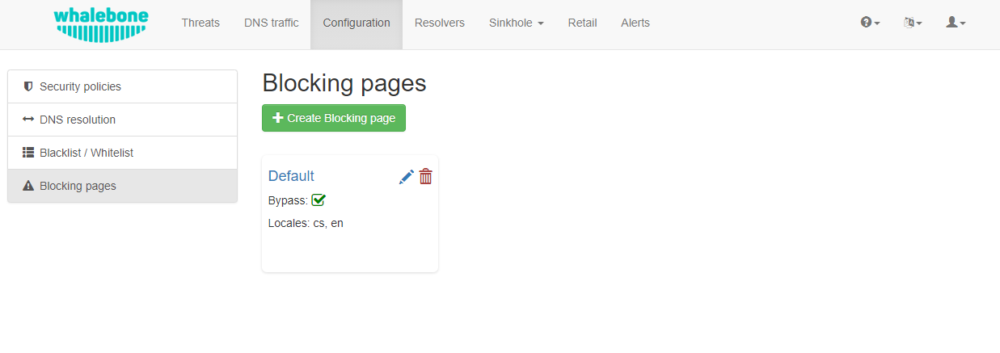
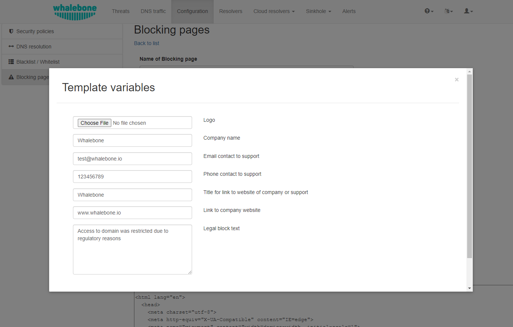

Blokační stránky
================
 `Zde <https://docs.whalebone.io/cs/latest/video_guides.html#blocking-page-configuration>`__ si můžete prohlédnout videonávod.
V případě blokování přístupu k doméně (z důvodů bezpečnosti, obsahu nebo regulace) odpovídají resolvery klientům konkrétní IP adresou, která vede na jednu z blokovacích stránek. Zatímco klienti iniciují HTTP(S) spojení směrem k blokované doméně, jsou jim zobrazeny vlastní blokační stránky s různým obsahem na základě důvodu blokování. 
Pro blokační Stránky Whalebone poskytuje vzorovou šablonu, avšak není nutné ji dodržovat a prakticky každá úprava, branding a copywriting je možný. Kód šablony je napsán tak, aby byl kompatibilní s co nejširším rozsahem prohlížečů, aby se předešlo problémům se staršími verzemi.

Různé verze **Blokačních Stránek** mohou být přiřazeny různým segmentům sítí v **Resolvery** → **Přiřazení politiky**.

   
   Blocking Pages Overview

Pro každou verzi, na základě nasazení, jsou dostupné a mohou být nakonfigurovány čtyři varianty blokačních stránek:

* **Bezpečnost**: zobrazeno, když je přístup blokován z bezpečnostních důvodů
* **Blacklist**: zobrazeno, když je přístup blokován Administrátory
* **Právní**: zobrazeno, když je přístup regulován na základě zákona nebo soudního příkazu
* **Obsah**: zobrazeno, když je přístup blokován kvůli obsahu domény

Navíc, každá verze může mít různé možnosti lokalizace. Jazyk blokační stránky se odvíjí od jazyka prohlížeče ze kterého je na ni přistupováno. Nové lokalizace mohou být snadno přidány.

.. figure:: ./img/blocking-pages.png
   :alt: Blokační stránky
   :align: center
   
   Blocking Pages Menu

Pro každou lokalizaci je dostupné několik možností. V příkladu výše má anglická verze následující možnosti:

**1. Možnost** – Použití šablony:

  Při použití šablony jsou zadané informace vloženy přímo do kódu šablony. To je nejrychlejší a nejjednodušší způsob, jak přizpůsobit blokační stránku.

   

.. note:: Nastavení blokovací stránky lze provést kliknutím na tlačítko **Kouzelná hůlka**. Při použití šablony dojde k přemázání předešlé konfigurace.
   

**2. Možnost** – Výchozí lokalizace blokační stránky:

  Tato možnost umožňuje přizpůsobit výchozí jazyk blokační stránky. V případě, že některý prohlížeč neuvádí svůj preferovaný jazyk, funguje "Výchozí" jazyk jako záložní mechanismus. Výchozí lokalita je označena pomocí symbolu hvězdičky (*) vedle typu jazyka.

**3. Možnost** – Odstranění lokalizace blokační stránky:

Lokalitu lze smazat kliknutím na ikonu **Koše**.

Každou z verzí blokační stránky (Bezpečnost, Blacklist, Právní, Obsah) lze detailněji přizpůsobit úpravou HTML kódu. Po kliknutí na každou verzi se zobrazí editor, který umožňuje provést jakékoli požadované změny.

Editor také exponuje rozhraní "Ověření", které analyzuje konečný HTML kód a kontroluje povolené funkce. Kontrola je založena na `id` konkrétních prvků. Více informací a požadavků pro každou funkci lze najít kliknutím na příslušné štítky.

.. note:: Každá Verze blokační stránky má unikátní charakteristiky, které lze vybrat. Například, Blokovací Stránka pro **Bezpečnost** může zahrnovat tlačítko **Obejití blokace**, které není dostupné ve verzi stránky v případě **Regulace** a **Blacklist**.

Po editaci a uložení změn na blokačních stránkách je důležité, aby byly aplikovány na jednotlivé resolvery.

.. tip:: Blokovací Stránky jsou zobrazovány přímo z webového serveru na Resolveru. Stránky se očekávají jako jediný soubor, takže veškeré další zdroje (CSS, obrázky, skripty) musí být buď přímo vloženy do HTML kódu, nebo dostupné z veřejně přístupného webového serveru. Resolver neneposkytuje žádnou možnost vkládat jiný obsah.

Podpis blokačních stránek pomocí Certifikační Autority
------------------------------------------------------

Pro nasazení, kde máte kontrolu nad koncovými body (typicky firemní prostředí s Group Policy) a můžete do jejich úložišť vložit podepsané SSL certifikáty a díky tomu lze podepsat blokační stránku přímo za provozu. To vede k tomu, že prohlížeče přímo přecházejí na blokovací stránku bez zobrazení bezpečnostního varování, které je obvykle přítomno. Resolver v podstatě provádí MITM pokaždé, když provádí přesměrování na blokační stránku, takže je očekáváno varování prohlížeče.

**Krok 1.** – Vytvořte soubor "v3_cfg" s následujícím obsahem:

.. code-block:: INI

   [req]
   req_extensions = v3_ca_extensions
   distinguished_name = req_dn
   [v3_ca_extensions]
   basicConstraints = CA:TRUE
   subjectKeyIdentifier = hash
   authorityKeyIdentifier = keyid:always,issuer:always
   keyUsage = cRLSign, keyCertSign
   subjectAltName = @alt_names
   [alt_names]
   DNS.1 = localhost
   [req_dn]
   countryName = Country Name (2 letter code)
   countryName_default = US
   stateOrProvinceName = State or Province Name (full name)
   stateOrProvinceName_default = New York
   localityName = Locality Name (eg, city)
   localityName_default = New York City
   organizationName = Organization Name (eg, company)
   organizationName_default = My Organization
   commonName = Common Name (eg, your name or your server's hostname)
   commonName_max = 64

**Krok 2.** – Vygenerujte klíč:

.. code-block:: shell

   openssl genpkey -algorithm RSA -out /certs/ca.key

**Krok 3.** – Vytvořte a podepište certifikát:

.. code-block:: shell

   openssl req -x509 -new -nodes -key /certs/ca.key -sha256 -days 1024 -out /certs/ca.crt -config /certs/v3_cfg

**Krok 4.** – Exportujte .pfx soubor a uložte ho do /certs/ folder:

.. code-block:: shell

   openssl pkcs12 -export -in ca.crt -inkey ca.key -out ca.pfx -certpbe PBE-SHA1-3DES -keypbe PBE-SHA1-3DES -macal   

**Krok 5.** – Pošlete název souboru a heslo na podporu Whalebone, aby byla konfigurace trvale uložena na backendu a zajistilo se, že nebude smazána při restartu VM nebo kontejneru.

