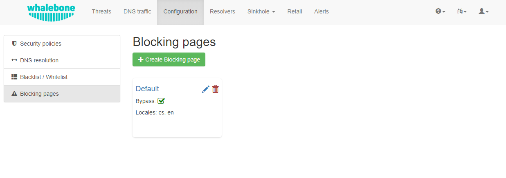
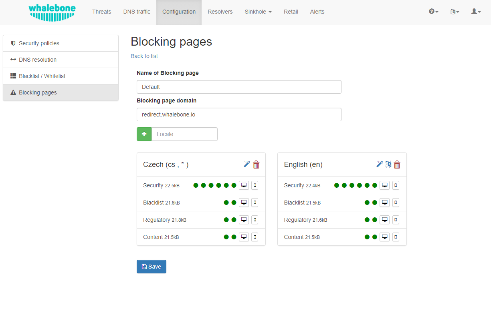

****************
Blokační stránky
****************

V případě blokování přístupu k doméně odpovídají resolvery klientům IP adresou blokační stránky, kde jsou uživatelé informováni o tom, že na danou stránku nemohou přistoupit a důvod, proč byl přístup zablokován. Pro blokační stránky Whalebone poskytuje vzorovou šablonu, kterou lze libovolně upravovat. Kód šablony je napsán tak, aby byl kompatibilní s co nejširším rozsahem prohlížečů.

Různé verze **blokačních stránek** mohou být přiřazeny různým segmentům sítí v **Resolvery** → **Přiřazení politiky**.

   Přehled blokačních stránek

Whalebone nabízí čtyři varianty blokačních stránek:

* **Bezpečnost**: zobrazeno, když je přístup blokován z bezpečnostních důvodů
* **Blacklist**: zobrazeno, když je přístup blokován administrátory
* **Právní**: zobrazeno, když je přístup regulován na základě zákona nebo soudního příkazu
* **Obsah**: zobrazeno, když je přístup blokován kvůli obsahu domény

Navíc každá verze může existovat v různých jazykových mutacích. Jazyk blokační stránky se odvíjí od jazyka prohlížeče, ze kterého je na ni přistupováno.

   Blokační stránky

Nastavení blokačních stránek poskytuje následující možnosti:

1. Použití šablony: Při použití šablony jsou zadané informace vloženy přímo do kódu šablony. To je nejrychlejší a nejjednodušší způsob, jak přizpůsobit blokační stránku. Nastavení blokační stránky lze provést kliknutím na tlačítko **Kouzelná hůlka**. Při použití šablony dojde k přemázání předešlé konfigurace.

   .. figure:: ./img/template.png
      :alt: Použití šablony
      :align: center

2. Výchozí lokalizace blokační stránky: Tato možnost umožňuje přizpůsobit výchozí jazyk blokační stránky. V případě, že některý prohlížeč neuvádí svůj preferovaný jazyk, funguje "výchozí" jazyk jako záložní mechanismus. Výchozí lokalita je označena pomocí symbolu hvězdičky (*) vedle typu jazyka.

3. Odstranění lokalizace blokační stránky: Lokalitu lze smazat kliknutím na ikonu **Koše**.

Každou z verzí blokační stránky (Bezpečnost, Blacklist, Právní, Obsah) lze detailněji přizpůsobit úpravou HTML kódu. Po kliknutí na každou verzi se zobrazí editor, který umožňuje provést jakékoli požadované změny.

Editor také exponuje rozhraní "Ověření", které analyzuje konečný HTML kód a kontroluje povolené funkce. Kontrola je založena na `id` konkrétních prvků. Více informací a požadavků pro každou funkci lze najít kliknutím na příslušné štítky.

.. note:: Každá verze blokační stránky má unikátní charakteristiky, které lze vybrat. Například, blokační stránka pro **Bezpečnost** může zahrnovat tlačítko **Obejití blokace**, které není dostupné ve verzi stránky v případě **Regulace** a **Blacklist**.

Po editaci a uložení změn na blokačních stránkách je důležité, aby byly aplikovány na jednotlivé resolvery.

.. tip:: Blokační stránky jsou zobrazovány přímo z webového serveru na resolveru. Stránky se očekávají jako jediný soubor, takže veškeré další zdroje (CSS, obrázky, skripty) musí být buď přímo vloženy do HTML kódu, nebo dostupné z veřejně přístupného webového serveru. Resolver neposkytuje žádnou možnost vkládat jiný obsah.

:ref:`Zde<Konfigurace bokacni stranky video>` si můžete prohlédnout videonávod.

Podpis blokačních stránek pomocí certifikační autority
======================================================

Pro nasazení, kde máte kontrolu nad pracovními stanicemi, což je typicky firemní prostředí s Group Policy, můžete do jejich úložišť s důvěryhodnými certifikačními autoritami vložit vlastní certifikační autoritu (CA), kterou používají resolvery. To vede k tomu, že prohlížeče přímo přecházejí na blokační stránku bez zobrazení varování o neplatném certifikátu. Resolver v podstatě provádí útok **man-in-the-middle** pokaždé, když provádí přesměrování na blokační stránku a poskytuje vlastní certifikát pro blokovanou doménu.

.. important:: Tato funkce se vztahuje pouze na blokační stránky umístěné (hostované) na lokálních resolverech (On-premise). Pokud používáte blokační stránky hostované ve Whalebone Cloudu, není možné podepisovat blokační stránky vlastní CA .

Požadavky
---------

Aby byla blokační stránka klientům přístupná, musíte ověřit, že jsou splněny následující požadavky:

* Resolver musí mít **otevřené příchozí TCP porty 80 a 443** pro všechny klientské podsítě.

* Kompletní seznam síťových požadavků naleznete v části `Požadavky na nastavení sítě <https://docs.whalebone.io/cs/immunity/local_resolver.html#pozadavky-na-nastaveni-site>`_ v naší dokumentaci.

Konfigurace v admin portálu Whalebone:
--------------------------------------

Ujistěte se, že má každý resolver nakonfigurováno hostování blokačních stránek lokálně na resolveru:

1. Přejděte do nabídky **Resolvery** v administrátorském portálu.

2. Vyberte konkrétní resolver a přejděte na kartu **Přiřazení politik**.

3. Ujistěte se, že **Umístění blokační stránky** je nastaveno na **Lokální na resolveru** a je přiřazena IP adresa resolveru. 

4. Klikněte na tlačítko **Uložit k resolveru**.

5. Vraťte se na stránku přehledu resolverů (**Zpět na resolvery**) a u každého klikněte na **Nahrát konfiguraci** (červená ikona se šipkou) pro aplikování změn.

Vytvoření a konfigurace certifikační autority
---------------------------------------------

Pro vytvoření a konfiguraci vlastní certifikační autority (CA) postupujte podle následujících kroků:

1. Vytvořte adresář `/certs`:

   Vytvořte adresář vyhrazený pro vaše certifikáty:

   .. code-block:: shell

      mkdir /certs

2. Vytvořte soubor "v3_cfg":

   Tento soubor definuje generaci certifikátu. V adresáři `/certs` vytvořte soubor "v3_cfg" s následujícím obsahem:

   .. code-block:: INI

      [req]
      x509_extensions = v3_ca_extensions
      distinguished_name = req_dn
      [v3_ca_extensions]
      basicConstraints = critical,CA:TRUE
      subjectKeyIdentifier = hash
      authorityKeyIdentifier = keyid:always,issuer:always
      keyUsage = critical, digitalSignature, cRLSign, keyCertSign
      subjectAltName = @alt_names
      [alt_names]
      DNS.1 = localhost
      [req_dn]
      countryName = Country Name (2 letter code)
      countryName_default = US
      stateOrProvinceName = State or Province Name (full name)
      stateOrProvinceName_default = New York
      localityName = Locality Name (eg, city)
      localityName_default = New York City
      organizationName = Organization Name (eg, company)
      organizationName_default = My Organization
      commonName = Common Name (eg, your name or your server's hostname)
      commonName_max = 64

   Vysvětlení významu polí a možné hodnoty:

   * [req] a [v3_ca_extensions]

      * Zde hodnoty neměnte

   * [req_dn]

      * První řádek (např. countryName) slouží k administrativní identifikaci.

      * Druhý řádek s **_default** (např. countryName_default) určuje data, která budou skutečně zakódována do certifikátu.
      
      * **commonName** je název, který reprezentuje blokační stránku (např. název společnosti, hostname resolveru nebo "Whalebone Blocking Page").
   
   * [alt_names]
   
      * Zde můžete uvést více resolverů.
   
      * I když pojmenování není z funkčního hlediska kritické, doporučujeme použít skutečné hostnames resolverů (např. DNS.1 = WB1, DNS.2 = WB2).

3. Vygenerujte klíč certifikační autority:

   Pro vygenerování CA klíče proveďte následující příkaz:

   .. code-block:: shell

      openssl ecparam -name prime256v1 -genkey -noout -out /certs/ca.key

4. Vytvořte certifikát certifikační autority:

   Vytvořte podepsaný certifikát podle Vaší konfigurace pomocí:

   .. code-block:: shell

      openssl req -x509 -new -nodes -key /certs/ca.key -sha256 -days 3650 -out /certs/ca.crt -config /certs/v3_cfg

5. Exportujte privátní klíč a certifikát do PFX souboru:

   Během tohoto kroku budete vyzváni k vytvoření hesla (certifikát není možné aplikovat bez vytvořeného hesla):

   .. code-block:: shell

      openssl pkcs12 -export -out /certs/ca.pfx -inkey /certs/ca.key -in /certs/ca.crt -certpbe PBE-SHA1-3DES -keypbe PBE-SHA1-3DES -export -macalg sha1

6. Zálohování certifikační autority:

   Zálohujte adresář /certs na bezpečné místo mimo resolver pro případ potřeby budoucí obnovy.

7. Předání informací podpoře Whalebone

   Zašlete cestu, název a heslo .pfx souboru na **podporu Whalebone** (support@whalebone.io). Heslo k souboru .pfx poskytněte našim technikům pomocí zabezpečeného nástroje, jako je například `OneTimeSecret <https://onetimesecret.com/>`_. Náš tým poté dokončí nastavení služeb na resolvery.

8. Distribuce certifikační autority:

   Mezitím přidejte veřejný klíč CA (/certs/ca.crt) do seznamu **důvěryhodných certifikačních autorit** (trusted Certificate Authorities) na všech Vámi spravovaných stanicích. Změny se projeví krátce poté, co naše podpora dokončí konfiguraci.