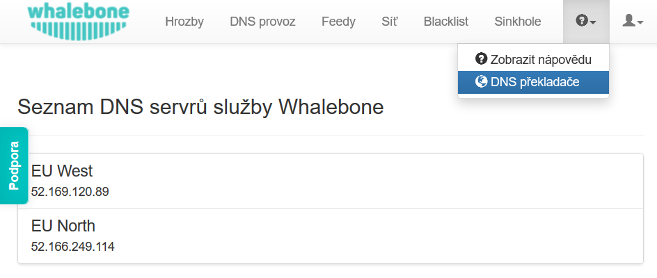

Cloudové DNS resolvery
----------------------

Videonávod krok za krokem si můžete prohlédnout :ref:`zde<Cloudove resolvery video>`.
Whalebone Cloud DNS resolver je služba určená především pro malé nebo střední zákazníky, kteří mohou cloudové resolvery používat jako záložní resolver. Typicky je zaměřena na poskytovatele internetových služeb, kteří mají pouze jeden 
on-premise resolver a pro zajištění vysoké dostupnosti používají cloudové DNS resolvery jako sekundární rekurzivní resolver pro své zákazníky. Jedním z předpokladů je definování veřejné IP adresy 
nebo rozsahy pro přiřazení bezpečnostní politiky coudovému resolveru, aby mohl rozlišovat a poskytovat správné zásady filtrování, které jste nastavili pro svou síť. 

Definice rozsahu veřejné sítě slouží k rozlišení jednotlivých zákazníků a jejich uživatelů. Je nutné zahrnout všechny rozsahy veřejné sítě, které bude resolver DNS používat, i uživatelé přistupující k internetu. Definice slouží k přizpůsobení vzhledu stránky blokování (popsáno později). Jeden zákazník může spravovat více síťových rozsahů, 
tyto rozsahy lze přiřadit lokalitám, aby bylo možné snadno rozlišit jednotlivé síťové zóny při investigaci provozu DNS a incidentech.

.. image:: ./img/client_networks.png
   :align: center

.. warning:: Pokud nevyplníte rozsahy veřejné sítě, budou cloudové resolvery sloužit jako jednoduché DNS resolvery **bez jakéhokoli filtrování**. Pokud používáte místní resolvery, musíte stále zadávat rozsahy sítě, aby se blokovaným uživatelům zobrazovala plně přizpůsobená blokační stránka.

* Do pole **Rozsah** vložte jeden nebo více síťových rozsahů pomocí zápisu <síťová adresa>/<maska>, např: **198.51.100.0/24**. 
* Stisknutím tlačítka **Přidat rozsah IP** přidáte další segmenty sítě.
* Nezapomeňte nové nastavení uložit pomocí tlačítka **Uložit k resolveru**.

.. tip:: Při testování Whalebone (např. přidáním testovací domény na blacklist) nezapomeňte, že mnoho DNS záznamů může být uloženo v cache kdekoli mezi resolverem a uživatelem (včetně prohlížeče, operačního systému nebo forwarderů). Testování ihned po změně konfigurace by proto mohlo selhat a doba, než se ochrana stane aktivní, by se mohla lišit v závislosti na TTL konkrétního záznamu DNS (pokud by všechny mezipaměti po cestě skutečně dodržovaly hodnotu TTL).

Pokud je tato možnost nasazení preferována, měli byste provoz DNS přesměrovat na cloudové resolvery Whalebone. Cloudové resolvery jsou k dispozici anycast IP adrese
**193.32.92.32** a **193.32.92.33**.

IP adresy resolverů jsou dostupné v části **Cloudové resolvery** a v nabídce **Nápověda** → **DNS překladače**.

