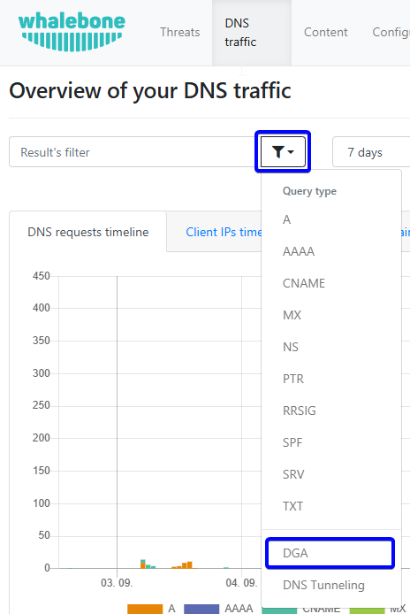
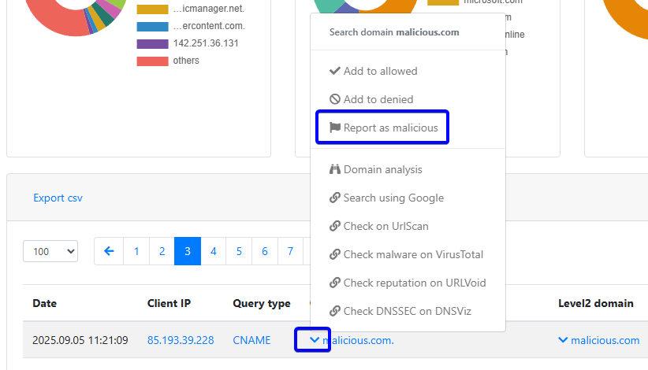
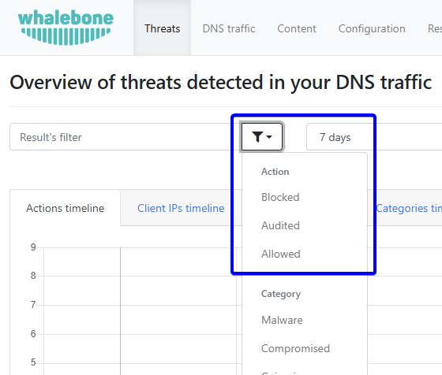
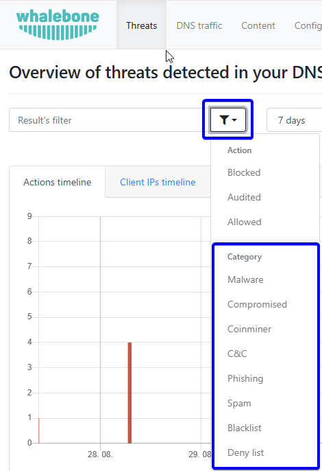

Analýza dat
===========

Whalebone Portal je grafické uživatelské rozhraní, které poskytuje uživateli řadu možností analýzy provozu na DNS resolverech a v síti.

Obsah
-----

Karta **Obsah** zobrazuje přehled zaznamenaného provozu podléhajícího nastavení filtrování obsahu. Pokud nemáte filtr obsahu povolen nebo jej nepoužíváte, nebude na této kartě nic zaznamenáno.

Jak zobrazit všechny dotazy určitého typu
~~~~~~~~~~~~~~~~~~~~~~~~~~~~~~~~~~~~~~~~~

Nejjednodušší způsob, jak vybrat dotazy určitého typu, je kliknout na ikonu **filtr** a vybrat požadovaný typ dotazu. Na výběr je 17 kategorií obsahu, které mj. hahrnují ``Sexuální obsah``, ``Hazardní hry``, ``Audio/video`` a ``Reklama``. Případně můžete kliknout na některou z kategorií zobrazených v koláčovém grafu v části **Kategorie** nebo přímo v grafu zobrazujícím všechna data.

Vyhledávání domény
~~~~~~~~~~~~~~~~~~

Chcete-li vyhledat domény, můžete použít textové pole **Filtr výsledků** a zadat název hledané domény. Dalšími způsoby vyhledávání domény je kliknutí na doménu v sekci **Doména** nebo přímo v seznamu záznamů ve stejném sloupci.

Jak změnit rozsah dat dostupných údajů
~~~~~~~~~~~~~~~~~~~~~~~~~~~~~~~~~~~~~~

Rozsah dat, která lze zobrazit v náhledu portálu, lze změnit několika způsoby. Základní způsob výběru zahrnuje výběr předdefinovaných časových oken 1 nebo 7 dnů z rozevíracího seznamu umístěného vedle **filtru výsledků**. V případě potřeby lze určit konkrétní časový rozsah pomocí oken **Datum a čas zahájení** a **Datum a čas ukončení**.

Kliknutím na koláčové grafy můžete také vyfiltrovat **IP klienta** a **Resolvery**.

Návrh na změnu kategorie
~~~~~~~~~~~~~~~~~~~~~~~~

Může se stát, že některá z domén bude špatně kategorizována. Ověřit do jakých kategorií doména spadá můžete pomocí nástroje **Analýza domény** nacházejícím se v uživatelském menu. Po zadání domény se objeví sekce **Kategorizace obsahu**, kde se zobrazí jednotlivé kategorie, do kterých doména spadá a zároveň se nabízí tlačítko **Navrhnout změnu kategorie**, přes které je možné navrhnout změnu kategorizace. Dále je možné nahlásit doménu jako false positive pomocí tlačítka **Nahlásit jako škodlivou**.

Export do CSV
~~~~~~~~~~~~~

Veškerá data v tabulce se všemi záznamy je možné exportovat do CSV souboru. Sloupce v CSV obsahují datum, IP adresu klienta, název zařízení, doménu a typ kategorie obsahu. Tlačítko pro export se nachází na začátku tabulky se všemi záznamy. Export bude obsahovat všechna data, která jsou aktuálně filtrována na portálu. Tlačítko pro export je k dispozici pouze tehdy, pokud je ve filtrovaných datech maximálně 1 000 000 záznamů.  

DNS Provoz
----------

Záložka **DNS Provoz** obsahuje přehled o provozu, který byl zaznamenán na resolveru. Obsahuje všechny dotazy spolu s některými dalšími informacemi, jako je typ, odpověď a TTL (Time to Live) odpovědi.

.. tip:: Data podléhají de-duplikaci. To znamená, že resolver zaznamenává pouze jedinečné kombinace dotazu, typu dotazu a odpovědi za 24 hodin. Z tohoto důvodu se může stát, že dotaz nebude viditelný na portálu, i když byl vyřešen.

Videoprůvodce krok za krokem si můžete prohlédnout :ref:`zde<Provoz DNS video>`.

Níže budou popsány některé užitečné možnosti filtrace dostupných dat.

Zobrazení dotazů určitého typu
~~~~~~~~~~~~~~~~~~~~~~~~~~~~~~

Nejjednodušším způsobem, jak vybrat dotazy určitého typu, je pomocí zakliknutí ikony **filtr** a zvolení požadovaného typu dotazu. Na výběr jsou možnosti: ``A``, ``AAAA``, ``CNAME``, ``MX``, ``NS``, ``PTR``, ``RRSIG``, ``SPF``, ``SRV`` a ``TXT``.

Zobrazení odpovědí podle typu
~~~~~~~~~~~~~~~~~~~~~~~~~~~~~

V okně **Odpovědi** je možné zvolit požadovaný typ odpověď. Tuto možnost najdete i v seznamu logů ve sloupci **Odpověď**.

Vyhledání domény
~~~~~~~~~~~~~~~~

K vyhledání domén lze využít textové pole **Filtr výsledků**, do kterého lze zadat název hledané domény. Další možnost vyhledání domény je zakliknutí domény v části **Domény 2. řádu**, popř. přímo v seznamu logů ve stejnojmenném sloupci.

Jak změnit časový rozsah událostí
~~~~~~~~~~~~~~~~~~~~~~~~~~~~~~~~~

Rozsah data údajů, které lze zobrazit v náhledu na portálu, lze měnit několika způsoby. Mezi základní způsob výběru se řadí volba předdefinovaných časových oken, 1, 7, 14 nebo 30 dnů, v rozbalovacím seznamu umístěném vedle **filtru výsledků**. V případě potřeby je možné specifikovat konkrétní časové rozmezí pomocí oken **Datum a čas začátku** a **Datum a čas konce**.

Zobrazení DGA (Domain Generation Algorithm) domén
~~~~~~~~~~~~~~~~~~~~~~~~~~~~~~~~~~~~~~~~~~~~~~~~~

Indikace DGA lze vyfiltrovat podobným způsobem jako v případě zobrazení dotazů určitého typu. V tomto případě stačí zvolit poslední záznam v seznamu - **DGA**.

   DGA indications

Nahlášení "false negative"
~~~~~~~~~~~~~~~~~~~~~~~~~~

V některých případech je možné, že nedojde ke správné klasifikaci nebezpečnosti domény. V případě, že budete mít pocit, že by měla být doména blokována a není, je možné ji pomocí tlačítka **Nahlásit jako škodlivou** nahlásit jako škodlivou doménu. Tím dojde k vytvoření požadavku na přezkoumání domény. Tato volba se nacházív tabulce logů pod ikonou šipky u jednotlivých dotazů.

   Nahlášení "false negative"

Export do CSV
~~~~~~~~~~~~~

Data z tabulky se všemi hrozbami je možné exportovat do CSV souboru. V CSV najdete sloupce datum, IP adresu klienta, název zařízení, typ dotazu, dotaz, doménu druhé úrovně, zemi, odpověď, TTL (Time to Live) a třídu. Tlačítko pro export se nachází na začátku tabulky s nezpracovanými daty. Exportovaná data budou obsahovat všechna data, která jsou aktuálně filtrována na portálu. Tlačítko pro export je k dispozici pouze tehdy, pokud je ve filtrovaných datech maximálně 1 000 000 záznamů.

Hrozby
------

Hrozby jsou zvláštní události, při kterých dochází k DNS požadavku na doménu, která se nachází v Whalebone dazabázi. Existují dva typy akce při zjištění hrozby. První je **audit**, která pouze zaznamená doménu, ale přístup je uživateli umožněn. Druhým typem akce je **block** pro zablokování přístupu k dané doméně.

Akce, která má být provedena, závisí na nastavení bezpečnostních politik, které jsou přiřazeny konkrétnímu resolveru. Více informací naleznete v sekci :ref:`Bezpečnostní politiky<Bezpecnostni politiky>`.

Existují některé předkonfigurované filtry, které lze aplikovat na data. Ukázky těchto dotazů jsou zobrazeny níže. Tyto dotazy zobrazují většinu případů použití, ale není zde žádné pevné omezení, protože dostupný vyhledávač je **full-textový** a lze sestavit **jakýkoli** dotaz.

Videoprůvodce krok za krokem si můžete prohlédnout `zde<Typy hrozeb video>`.

Vyhledání událostí typu audit nebo block
~~~~~~~~~~~~~~~~~~~~~~~~~~~~~~~~~~~~~~~~

Existují dvě možnosti filtrování různých typů událostí. První možností je využítí vizuálního filtru. V rámci grafu můžete kliknutím na akci audit, blokování nebo povolení filtrovat a zobrazit pouze případy, ve kterých k dané události došlo. Druhou možností je kliknout vedle pole **Filtr výsledku** na tlačítko **Filtr** a vybrat požadovanou možnost filtrování.

   Filtrování hrozeb

Vyhledání domény
~~~~~~~~~~~~~~~~

Nejjednodušším způsobem vyhledání domény lze pomocí kliknutí na konkrétní doménu v historii logů. Druhou možností je pomocí zadání názvu domény do pole **Filtr výsledků**.

Vyhledání konkrétní IP adresy
~~~~~~~~~~~~~~~~~~~~~~~~~~~~~

Filtrování logů pro konkrétní IP adresy je možné po vybrání zdrojové IP adresy v historii logů. Druhou možností je pomocí zadání názvu domény do pole **Filtr výsledků**.

Vyhledání události na základě kategorie hrozeb
~~~~~~~~~~~~~~~~~~~~~~~~~~~~~~~~~~~~~~~~~~~~~~

Existuje velké množství kategorií hrozeb. Těmito kategoriemi jsou:

* Blacklist
* Blokovaný seznam
* C&C
* Coinminer
* Kompromitované
* Malware
* Phishing
* Spam

.. tip:: Kategorie "Blokovaný seznam" je vlastní seznam, který spravují administrátoři zákazníka pro blokování domén, jež považují za nežádoucí. "Blacklist" je součástí dat o hrozbách Whalebone pro známé domény, které hostují více hrozeb, nebo když nebyla určena přesná kategorie.

Jednoduchým způsobem vyhledání útoků je možné vybráním konkrétní kategorie z koláčových grafů nebo v sezamu logů v sloupci **Kategorie hrozeb**. Další možností je kliknout vedle pole **Filtr výsledku** na tlačítko **Filtr** a vybrat požadovanou možnost filtrování.

   Výběr kategorie hrozby

Jak změnit časový rozsah událostí
~~~~~~~~~~~~~~~~~~~~~~~~~~~~~~~~~

Rozsah data údajů, které lze zobrazit v náhledu na portálu, lze měnit několika způsoby. Mezi základní způsob výběru se řadí volba předdefinovaných časových oken, 1, 7, 14 nebo 30 dní, v rozbalovacím seznamu umístěném vedle **filtru výsledků**. V případě potřeby je možné specifikovat konkrétní časové rozmezí pomocí oken **Datum a čas začátku** a **Datum a čas konce**.

Analýza domény
~~~~~~~~~~~~~~

V případě, že se chcete dozvědět další informace o doméně, o skóre rizokovosti nebo zda spadá do regulační kategorie, podívejte se na video :ref:`zde<Analyza domeny video>`.

Nahlášení "false positive"
~~~~~~~~~~~~~~~~~~~~~~~~~~

V některých případech je možné, že nedojde ke správné klasifikaci nebezpečnosti domény. V případě, že budete mít pocit, že by neměla být doména blokována a není, je možné ji nahlásit pomocí tlačítka **Nahlásit falešnou detekci**. Tím dojde k vytvoření požadavku na přezkoumání domény. Tato volba se nacházív tabulce logů pod ikonou šipky u jednotlivých dotazů.

Fulltextové vyhledávání 
~~~~~~~~~~~~~~~~~~~~~~~

Pro pokročilejší použití lze použít fulltextový filtr a sestavit složený dotaz. Tato pole lze spojovat pomocí logických operátorů. Podporovány jsou ``AND, OR, NOT, <, >`` a zástupný znak ``*``. Řetězce nemusí být obaleny uvozovkami. Příklad syntaxe je následující:

``action: block AND accu:>70 AND (client_ip: 10.20.30.41 OR 10.20.30.40 OR 192.168.*)``
``a NOT geoip.country_name: Germany AND matched_iocs.classification.type: malware AND NOT phishing``

Při spuštění fulltextového dotazu se aktualizuje obsah celého řídicího panelu.

+--------------------------------------+-------------------------------------------------------------------------------------------+--------------------------------------------------------------------------+
| Hrozby                               | Popis                                                                                     |  Příklad hodnoty                                                         |
+======================================+===========================================================================================+==========================================================================+
| ``timestamp``                        | Přesný čas, kdy resolver zaregistroval požadavek                                          | ``2022-10-14T12:28:01.000Z``                                             |
+--------------------------------------+-------------------------------------------------------------------------------------------+--------------------------------------------------------------------------+
| ``client_ip``                        | Zdrojová IP adresa, ze které byl odeslán požadavek                                        | ``192.168.2.3``                                                          |
+--------------------------------------+-------------------------------------------------------------------------------------------+--------------------------------------------------------------------------+
| ``domain``                           | Doména v dotazu DNS                                                                       | ``whalebone.io`` OR ``whale*one.io``                                     |
+--------------------------------------+-------------------------------------------------------------------------------------------+--------------------------------------------------------------------------+
| ``resolver_id``                      | ID resolveru, který zpracoval dotaz                                                       | ``2404``                                                                 |
+--------------------------------------+-------------------------------------------------------------------------------------------+--------------------------------------------------------------------------+
| ``device_id``                        | ID zařízení s HOS klientem, který událost zpracoval                                       | ``MB2A1b4OTDin3Xz6DgftAip72v57e``                                        |
+--------------------------------------+-------------------------------------------------------------------------------------------+--------------------------------------------------------------------------+
| ``geoip.continent_code``             | Kód kontinentu z PHP knihovny geoIP                                                       | ``AF | AN | AS | EU | NA | OC | SA``                                     |
+--------------------------------------+-------------------------------------------------------------------------------------------+--------------------------------------------------------------------------+
| ``geoip.country_code3``              | Kód země z PHP knihovny geoIP                                                             | ``RU | CZ | US | CN | DE | ...``                                         |
+--------------------------------------+-------------------------------------------------------------------------------------------+--------------------------------------------------------------------------+
| ``geoip.country_name``               | Jméno země z PHP knihovny geoIP                                                           | ``Russia``                                                               |
+--------------------------------------+-------------------------------------------------------------------------------------------+--------------------------------------------------------------------------+
| ``ip``                               | IP adresa v DNS odpovědi nebo IP adresa odpovědi, kdyby ji resolver nezablokoval          | ``174.85.249.36`` OR ``SERVFAIL`` OR ``NXDOMAIN``                        |
+--------------------------------------+-------------------------------------------------------------------------------------------+--------------------------------------------------------------------------+
| ``action``                           | Akce, kterou resolver provedl s daným dotazem                                             | ``block | allow | audit``                                                |
+--------------------------------------+-------------------------------------------------------------------------------------------+--------------------------------------------------------------------------+
| ``accu``                             | Skóre domény v době události                                                              |  ``0..100`` < and > operators can be used too                            |
+--------------------------------------+-------------------------------------------------------------------------------------------+--------------------------------------------------------------------------+
| ``matched_iocs.classification.type`` | Typ zranitelnosti                                                                         | ``malware | c&c | phishing | coinminer | spam | compromised | blacklist``|
+--------------------------------------+-------------------------------------------------------------------------------------------+--------------------------------------------------------------------------+

.. tip:: Filtrační operátory jsou umístěny staticky v URL. Proto si můžete vytvořit sadu filtrů předem (například zobrazení na jednotlivé IP adresy) a v případě potřeby je použít. Můžete je uložit do CRM a v případě řešení problémů k nim přistupovat okamžitě. To pomůže ušetřit váš čas, když zákazník požádá o podporu, protože můžete situaci okamžitě ověřit.

Export do CSV
~~~~~~~~~~~~~

Data z tabulky se všemi hrozbami je možné exportovat do CSV souboru. V CSV najdete sloupce datum, akci, IP adresu klienta, název zařízení, zemi, doménu, skóre, kategorii hrozby, název hrozby a název resolveru. Tlačítko pro export se nachází na začátku tabulky se všemi dotazy. Exportovaná data budou obsahovat všechna data, která jsou aktuálně filtrována na portálu. Tlačítko pro export je k dispozici pouze tehdy, pokud je ve filtrovaných datech maximálně 1 000 000 záznamů.