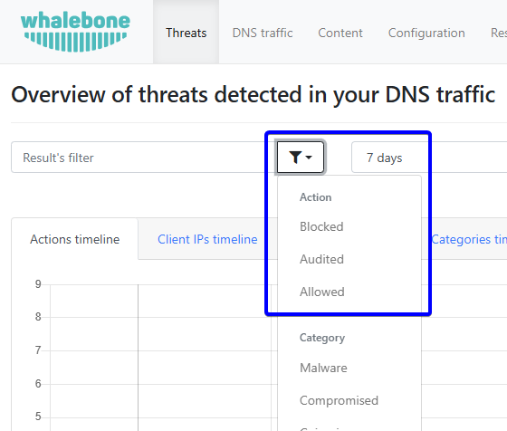

DNS provoz
==========

Záložka ``DNS provoz`` poskytuje přehled veškerého provozu zaznamenaného na resolverech. Obsahuje všechny dotazy spolu s dalšími informacemi, jako je typ dotazu, odpověď a TTL (Time To Live).

.. tip:: Data podléhají deduplikaci. To znamená, že resolver v rámci 24 hodin zaznamenává pouze jedinečné kombinace dotazu, typu dotazu a odpovědi. Z tohoto důvodu se některý dotaz nemusí v portálu zobrazit, i když byl zpracován.

Podrobný videonávod najdete :ref:`zde<DNS traffic video>`.

Možnosti filtrování
~~~~~~~~~~~~~~~~~~~

Tlačítko Filtrovat obsahuje různé možnosti podle typu analyzovaných dat. Pro jednotlivé typy dat jsou dostupné tyto možnosti:

* **IP klienta**: Filtruje data podle konkrétních IP adres klientů.
* **ID zařízení zákazníka**: Filtruje data podle konkrétních ID zařízení zákazníka.
* **Doména**: Filtruje data podle konkrétních názvů domén.
* **Typ dotazu**: Filtruje data podle konkrétních typů dotazů (např. A, AAAA, CNAME).
* **Dotaz**: Filtruje data podle konkrétních DNS dotazů.
* **DNS tunel**: Odfiltruje domény spojené s DNS tunelováním v DNS provozu.
* **DGA**: Odfiltruje data klasifikovaná jako DGA (Domain Generation Algorithm) v DNS provozu.
* **Kód země**: Filtruje data podle konkrétních kódů zemí.
* **Segment**: Filtruje data podle konkrétních segmentů.
* **Brand**: Filtruje data podle konkrétních značek.
* **ID resolveru**: Filtruje data přijatá konkrétními resolvery.
* **Odpověď**: Filtruje data podle konkrétních DNS odpovědí.
* **Protokol**: Filtruje data podle konkrétních protokolů používaných v DNS provozu (např. UDP, TCP, DNS over HTTPS nebo DNS over TLS).
* **Kód EDE**: Filtruje data podle konkrétních kódů Extended DNS Error (EDE) v DNS provozu.

.. only:: Immunity or DNS4GOV

  .. tip:: ID zařízení zákazníka bylo přiřazeno klientem Home Office Security nainstalovaným na zařízení. Seznam zařízení najdete v sekci **Home Office Security** v portálu, která je dostupná v uživatelském menu.

.. only:: Aura or Peacemaker

  .. tip:: ID zařízení zákazníka přiřazuje zákazník pomocí Retail API. Seznam zařízení najdete v sekci **Retail** v portálu.

Kódy Extended DNS Error (EDE)
~~~~~~~~~~~~~~~~~~~~~~~~~~~~~

V DNS protokolu byly kódy Extended DNS Error (EDE) zavedeny v RFC 8914, aby poskytovaly konkrétnější diagnostické informace než tradiční, obecné kódy RCODE, jako jsou SERVFAIL nebo NXDOMAIN. Místo pouhého „selhalo“ kódy EDE říkají proč — například zda selhala validace DNSSEC nebo byl dotaz blokován firewallem. Oficiálně podporovaný seznam kódů EDE najdete v dokumentu `RFC 8914`_. Organizace IANA udržuje rozšířený seznam kódů EDE, který ještě nebyl uznán jako standard v RFC. Seznam organizace IANA je dostupný na `webu IANA`_.

.. _RFC 8914: https://datatracker.ietf.org/doc/html/rfc8914
.. _webu IANA: https://www.iana.org/assignments/dns-parameters/dns-parameters.xhtml#extended-dns-error-codes

.. list-table:: Kompletní seznam kódů EDE
   :header-rows: 1
   :widths: 10 30 60

   * - Kód
     - Název
     - Význam / Běžné použití
   * - 0
     - Other
     - Obecná kategorie pro chyby, které nespadají do jiných kategorií.
   * - 1
     - Unsupported DNSKEY Algorithm
     - Resolver nepodporuje algoritmus použitý pro podepsání zóny.
   * - 2
     - Unsupported DS Digest Type
     - Resolver nepodporuje hashovací algoritmus v DS záznamu.
   * - 3
     - Stale Answer
     - Resolver vrací expirovaná data z cache, protože se nedostane k autoritativnímu zdroji.
   * - 4
     - Forged Answer
     - Resolver má podezření, že odpověď byla pozměněna (např. přes captive portal).
   * - 5
     - DNSSEC Indeterminate
     - Stav DNSSEC je nejasný; validaci nebylo možné dokončit.
   * - 6
     - DNSSEC Bogus
     - Validace DNSSEC selhala (podpisy jsou neplatné).
   * - 7
     - Signature Expired
     - RRSIG pro data dosáhl času expirace.
   * - 8
     - Signature Not Yet Valid
     - Počáteční čas RRSIG je v budoucnosti (zkontrolujte čas serveru).
   * - 9
     - Missing DNSKEY
     - Nebyl nalezen žádný DNSKEY záznam odpovídající DS záznamu.
   * - 10
     - RRSIGs Missing
     - Pro dotazovaná data nebyly nalezeny žádné RRSIG záznamy.
   * - 11
     - No Zone Key Bit Set
     - DNSKEY byl nalezen, ale nebyl nastaven bit „Zone Key“.
   * - 12
     - NSEC Missing Expected
     - Chybí záznamy NSEC/NSEC3 (důkaz neexistence selhal).
   * - 13
     - Cached Error
     - Resolver vrací dříve uloženou chybovou odpověď z cache.
   * - 14
     - Not Ready
     - Server se stále spouští nebo načítá zónu.
   * - 15
     - Blocked
     - Dotaz byl zablokován kvůli lokální politice (např. „Blacklist“).
   * - 16
     - Censored
     - Dotaz byl zablokován z externích právních nebo regulatorních důvodů.
   * - 17
     - Filtered
     - Dotaz byl zablokován filtrem, který není striktně „policy“ ani „censorship“.
   * - 18
     - Prohibited
     - Server odmítá odpovědět tomuto konkrétnímu klientovi.
   * - 19
     - Stale NXDOMAIN Answer
     - Při nedostupnosti serveru se vrací cacheovaná odpověď „Does not exist“.
   * - 20
     - Not Authoritative
     - Očekávalo se, že server je pro zónu autoritativní, ale není.
   * - 21
     - Not Supported
     - Server nepodporuje danou operaci nebo typ dotazu.
   * - 22
     - No Reachable Authority
     - Resolver se nedokázal připojit k žádnému upstream nameserveru.
   * - 23
     - Network Error
     - Na upstreamu došlo k obecné síťové chybě.
   * - 24
     - Invalid Data
     - Autoritativní server poskytl syntakticky neplatná data.
   * - 25
     - Signature Expired before Valid
     - Čas počátku platnosti podpisu je nastaven později než čas expirace, což vytváří logický rozpor, kdy podpis není nikdy platný.
   * - 26
     - Too Early
     - Server odmítl zpracovat dotaz přijatý přes Early Data (0-RTT) kvůli omezení rizika replay útoků. Klient má dotaz zopakovat přes plně navázané spojení.
   * - 27
     - Unsupported NSEC3 Iterations Value
     - Autoritativní zóna vyžaduje tolik iterací hashování NSEC3, že překračují maximální výpočetní limit resolveru.
   * - 28
     - Unable to conform to policy
     - Resolver nemůže splnit konkrétní administrativní politiku nebo požadavky provisioning domény potřebné pro vyřešení dotazu.
   * - 29
     - Synthesized
     - Odpověď byla vytvořena lokálně interní logikou resolveru, nikoliv získána z autoritativního upstream zdroje.
   * - 30
     - Invalid Query Type
     - Dotaz byl odmítnut, protože požadovaný typ Resource Record (QTYPE) je nedefinovaný, rezervovaný nebo není implementací serveru podporován.

Jak nahlásit „False Negative“
~~~~~~~~~~~~~~~~~~~~~~~~~~~~~

V některých případech nemusí být klasifikace skóre domény správná. Pokud se domníváte, že by doména měla být blokována, ale není, můžete ji nahlásit jako škodlivou pomocí tlačítka **Nahlásit jako škodlivou**, čímž zahájíte požadavek na revizi domény. Tato možnost je v tabulce DNS dotazů pod ikonou šipky u každého dotazu.

   Nahlášení false negative

Export CSV
~~~~~~~~~~

Data v CSV souboru obsahují následující údaje:

* datum
* IP adresa klienta
* název zařízení
* typ dotazu
* dotaz
* doména druhé úrovně
* země
* odpověď
* TTL (Time to Live)
* třída
