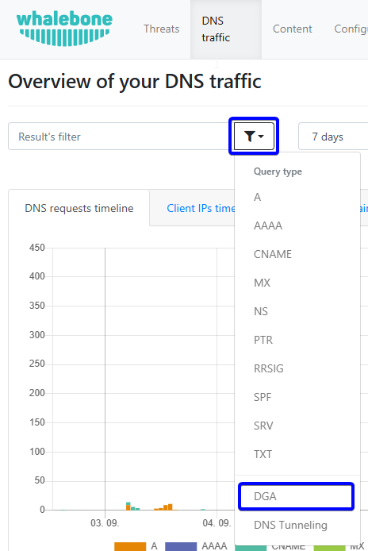

Analýza dat
===========

Whalebone Portal rozlišuje tři typy dat: **Obsah**, **DNS provoz** a **Hrozby**. Každá z těchto kategorií má v portálu vlastní záložku, takže uživatelé mohou snadno procházet a analyzovat data. Všechny tři pohledy mají stejnou strukturu a používají stejné možnosti filtrování, jak je popsáno v následujících sekcích.

Struktura stránky je následující:

* **Filtry**: Umístěné v horní části stránky, umožňují uživatelům filtrovat data podle různých kritérií.
* **Graf s přehledem provozu v čase**: Nachází se pod filtry a poskytuje vizuální zobrazení dat v čase.
* **Koláčové grafy**: Umístěné pod hlavním grafem, ukazují rozložení dat podle různých kategorií.
* **Surová data**: Nachází se ve spodní části stránky a zobrazují data v tabulkové podobě.

Všechny grafy a tabulky jsou interaktivní, takže uživatelé mohou kliknutím na konkrétní prvky data filtrovat. Například kliknutí na konkrétní kategorii v koláčovém grafu odfiltruje data a aktualizuje všechny grafy tak, aby zobrazovaly pouze záznamy patřící do této kategorie.

Detailnější možnosti filtrování jsou dostupné v horní části stránky, kde si uživatelé mohou vybrat konkrétní kritéria. Tyto filtry zahrnují například časové období, typ obsahu, typ dotazu a další. Filtry se aplikují na všechny grafy a tabulky na stránce, což umožňuje analyzovat data podle konkrétních potřeb.

Řádek s filtry obsahuje následující možnosti:

1. **Filtrovat**: Otevře rozbalovací menu s různými možnostmi filtrování podle typu analyzovaných dat.
2. **Načíst filtr**: Umožňuje přístup k uloženým nastavením filtrů pro budoucí použití, takže je lze snadno znovu použít bez nutnosti opětovného nastavování.
3. **Popište filtry, které chcete použít...**: Textové pole, do kterého mohou uživatelé zadat konkrétní kritéria filtrování dat. Může jít o názvy domén, IP adresy nebo jiné relevantní informace. Pole podporuje fulltextové vyhledávání i AI režim, takže dotazy lze vytvářet přirozeným jazykem.
4. **Rychlý výběr časového rozsahu**: Nabízí předdefinovaná časová okna (např. 1 den, 7 dní) pro rychlé filtrování podle běžných časových intervalů.
5. **Výběr data od**: Umožňuje vybrat konkrétní datum a čas, od kterého se mají data filtrovat.
6. **Výběr data do**: Umožňuje filtrovat data do konkrétního data a času.

   Filtry analýzy dat

.. important:: Pokud v portálu nevidíte filtry, znamená to, že k nim nemáte přístup. Zkontrolujte, zda má váš účet odpovídající oprávnění pro přístup k daným datům, tj. filtrování obsahu, DNS provoz nebo hrozby. Názvy oprávnění jsou ``Číst veškerý provoz (obsah, DNS, hrozby)``, ``Provozní obsah``, ``DNS provoz`` a ``Data hrozeb``. Oprávnění uživatelů můžete upravit v sekci **Uživatelé** v portálu, která je dostupná v uživatelském menu.

.. tip:: Výběr data lze provést přímo v grafu, který zobrazuje přehled provozu v čase. Kliknutím a tažením v grafu mohou uživatelé vybrat časový rozsah, který automaticky aktualizuje filtry a zobrazí data za dané období.

   .. figure:: ./img/data-analysis-2.gif
      :alt: Výběr data v grafu
      :align: center

      Výběr data v grafu

Vyhledávací pole **Popište filtry, které chcete použít...** podporuje dotazy v přirozeném jazyce, takže uživatelé mohou vytvářet komplexní filtry pomocí jednoduchého zadání. Uživatel může například zadat dotaz „Zobraz všechny zablokované domény související s hazardními hrami za posledních 7 dní“ nebo „Najdi všechny DNS dotazy z IP adresy 192.168.1.1“. AI režim dotaz interpretuje a použije odpovídající filtry pro zobrazení relevantních dat.

Pokud chcete vytvořit vyhledávací dotaz bez AI podpory, klikněte na tlačítko ``Filtrovat``, vyberte pole, ve kterých chcete hledat, a sestavte dotaz ručně. Například zadání konkrétního názvu domény nebo IP adresy odfiltruje data tak, aby se zobrazily jen záznamy odpovídající kritériím. Všechna pole také podporují zástupný znak ``*``, operátor negace ``!`` a znak ``,`` pro spojení více dotazů, což umožňuje hledání vzorů v datech. Například zadání „example.*“ odfiltruje data tak, aby se zobrazily všechny záznamy s doménami začínajícími na „example.“. Zde je několik příkladů dotazů, které lze ve vyhledávacím poli použít:

* ``*bone.io``: Zobrazí všechny záznamy s doménami končícími na „bone.io“, např. ``bone.io`` a ``whalebone.io``.
* ``whalebone.*``: Zobrazí všechny záznamy s doménami začínajícími na „whalebone.“, např. ``whalebone.io`` a ``whalebone.com``.
* ``*whalebone*``: Zobrazí všechny záznamy obsahující „whalebone“ kdekoliv v doméně, např. ``whalebone.io`` a ``mywhalebone.com``.
* ``!*bone.io``: Zobrazí všechny záznamy, které **neobsahují** domény končící na „bone.io“, např. ``example.com`` a ``test.io``.
* ``!whale*``: Zobrazí všechny záznamy, které **neobsahují** domény začínající na „whale“, např. ``example.com`` a ``test.io``.
* ``!*whalebone*``: Zobrazí všechny záznamy, které **neobsahují** „whalebone“ kdekoliv v doméně, např. ``example.com`` a ``test.io``.
* ``*.io, !whalebone.io``: Zobrazí všechny záznamy s doménami končícími na „.io“, ale neobsahující „whalebone.io“, např. ``example.io`` a ``test.io``, nikoli ``whalebone.io``.

Tlačítka „Přidat do filtru“ v koláčových grafech s top 10 klienty a doménami umožňují rychle přidat všechny položky z grafu do filtrů. Pokud uživatel klikne na „Přidat do filtru“ v grafu top 10 klientů, všechny IP adresy klientů uvedené v grafu se přidají do filtrů, což umožní analyzovat data konkrétně pro tyto klienty.

.. figure:: ./img/data-analysis-5.png
   :alt: Přidat do filtru
   :align: center

   Tlačítko Přidat do filtru v koláčových grafech

Všechny filtry se ukládají v uživatelské relaci a budou použity i při dalším návratu do portálu. To znamená, že pokud uživatel nastaví konkrétní filtry a poté portál opustí nebo přejde do jiné části portálu, po návratu zůstanou filtry aktivní a není nutné je nastavovat znovu.

Surová DNS data lze exportovat do CSV souboru pomocí tlačítka v horní části tabulky. Exportovaná data budou obsahovat všechna data aktuálně odfiltrovaná v portálu. Upozorňujeme, že export je omezen na 1 000 000 záznamů. Pokud potřebujete exportovat více dat, doporučujeme před exportem použít další filtry pro zúžení výsledků nebo využít API pro získání dat.
