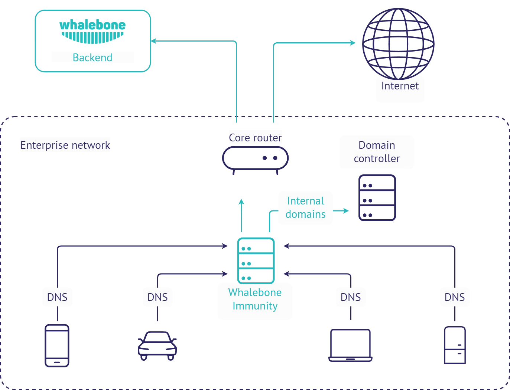

Whalebone Immunity
===================

Lokální DNS forwarder
---------------------

Velmi podobný scénář nasazení jako u lokálního resolveru, avšak Whalebone pouze přeposílá lokální požadavky na předem nakonfigurované resolvery. Tento scénář je velmi užitečný v případě, že existují místní zóny DNS, které musí být klientům k dispozici (např. Active Directory), nebo v případech, kdy je nedávná konfigurace resolveru velmi specifická a musí být zachována.
Toto nasazení má také nižší hardwarové nároky.

.. warning:: Nedoporučujeme předávat požadavky z místního resolveru na cloudové resolvery Whalebone. Taková konfigurace by vedla k duplicitní detekci incidentů, nepřidala by bezpečnost a u klientů by docházelo ke zbytečnému zpoždění požadavků.

