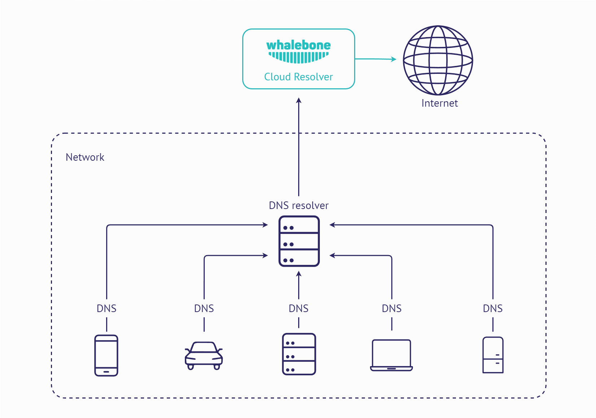
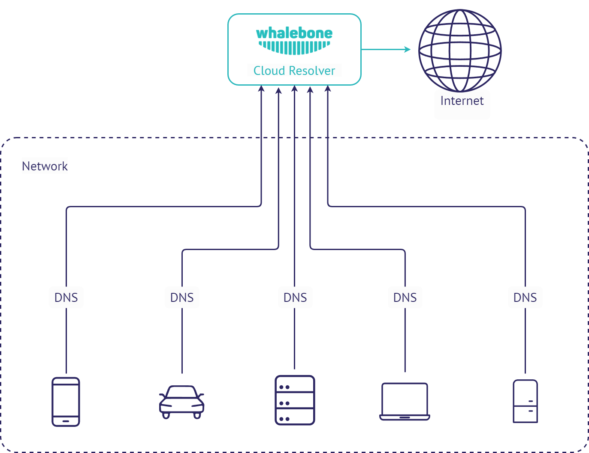
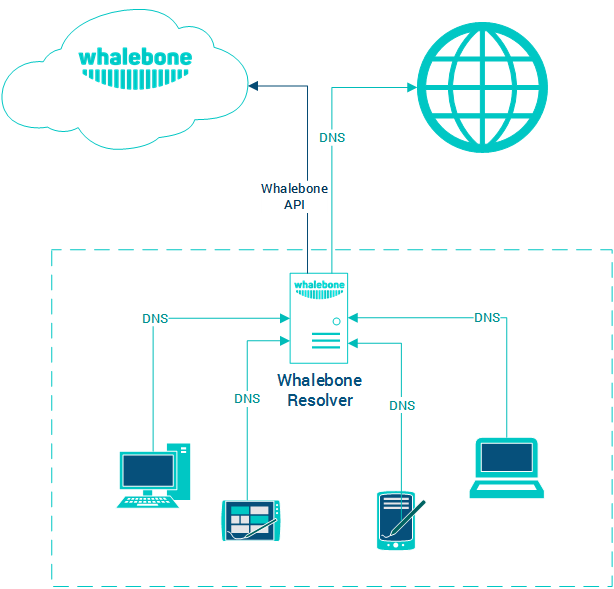

Způsoby nasazení
================

Službu Whalebone je možné nasadit a využívat v různých scénářích, které je mezi sebou možné kombinovat podle požadavků konkrétní sítě. Jedná se o kombinace využití cloudového a lokálního DNS resolveru Whalebone.

.. tip:: Všechny níže zmíněné způsoby nasazení lze navzájem kombinovat. Různé segmenty sítí mohou mít odlišné požadavky a jiné možnosti v provozování infrastruktury.

.. tip:: Pokud narazíte na problémy s nasazením Whalebone do svého prostředí a žádný z navrhovaných scénářů není vhodný, kontaktujte nás a společně navrhneme možnosti řešení vašeho konkrétního požadavku.

Cloud DNS
---------

Jedná se o nejjednodušší variantu nasazení. Pro nasazení stačí úprava konfigurace aktuálních resolverů a jejich nasměrování na cloudové resolvery Whalebone.
Nevýhodou tohoto nasazení je, že v případě detekce incidentu bude k dispozici pouze zdrojová IP adresa resolveru a ne původního zdrojového zařízení. Pokud je ale cílem požadavky blokovat a není důležité jednotlivá zdrojová zařízení rozlišovat, nemusí to být překážkou nasazení.

Cloud DNS (přímé spojení)
-------------------------

Podobný způsob jako přesměrování dotazů z vlastního resolveru na Whalebone cloud, ale dotazy jsou směrovány na cloud přímo ze zdrojových zařízení. Pro konfiguraci zařízení je ideální využít DHCP nebo jiný způsob centrální úpravy nastavení DNS překladačů. Nevýhodou tohoto způsobu nasazení je absence cache na místním resolveru, což bude mít za následek zvýšení latence překladu.
Pokud nejsou jednotlivá zdrojová zařízení schovaná za překladem adres (NAT), tak budou jejich zdrojové IP viditelné v detekovaných incidentech na portálu Whalebone.

Lokální resolver
----------------

Tento způsob zapojení využívá lokálního resolveru Whalebone, který komunikuje skrze API s Whalebone cloudem. DNS překlad ale vykonává přímo a je zcela nezávislý na dostupnosti DNS překladačů Whalebone. Případný výpadek API nemá negativní dopad na dostupnost DNS překladu (samozřejmě ale ovlivní detekční schopnosti).
Hlavní výhodou tohoto způsobu nasazení je viditelnost lokálních IP adres komunikujících zařízení.

Lokální resolver (přesměrování)
-------------------------------

Identický způsob zapojení jako v předchozím případě s tím rozdílem, že lokální resolver Whalebone nepřekládá DNS dotazy sám, ale přesměrovává dotazy na vybrané nadřazené servery. Jedná se o vhodný způsob nasazení, pokud aktuálně spravujete vlastní DNS zóny a potřebujete zajistit kontinuitu jejich překladu.

.. warning:: Nedoporučujeme přesměrovávat dotazy na cloudové resolvery Whalebone. Taková situace by vyústila v duplikaci detekovaných incidentů (jeden z lokálního resolveru, druhý z cloudového) aniž by tato situace přinesla vyšší úroveň zabezpečení.

.. image:: ./img/deployment_lr_fw.png
   :align: center

