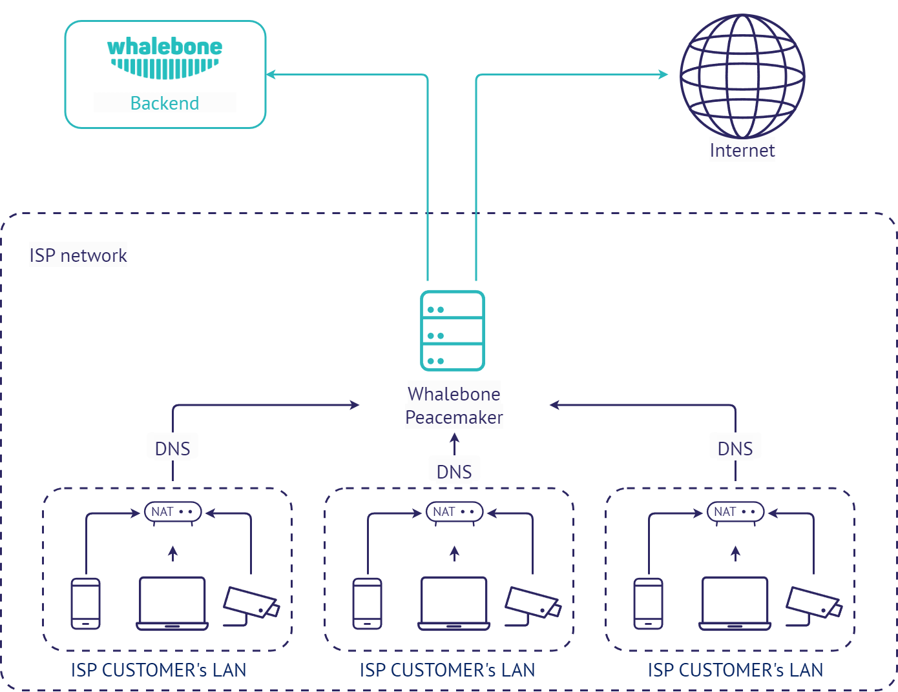

Whalebone Aura
==============

Místní překladač pro telco operátory
----------------------------------------

Tento scénář nasazení využívá lokální resolver Whalebone, který komunikuje s cloudem Whalebone prostřednictvím rozhraní API. Překlad DNS probíhá přímo na resolveru a je zcela nezávislý na dostupnosti cloudu. V případě, že resolver nebude schopen dosáhnout cloudové služby, nebude schopen aktualizovat informace o hrozbách a hlásit případné incidenty.
Hlavní výhodou tohoto nasazení je viditelnost místní sítě a jednotlivých IP adres a nízká latence.

