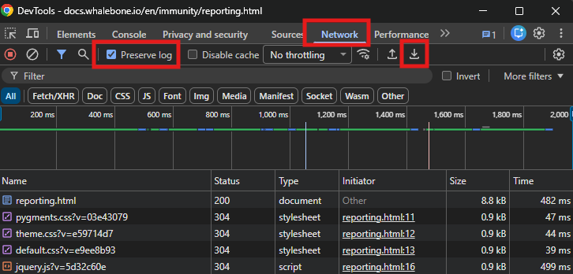
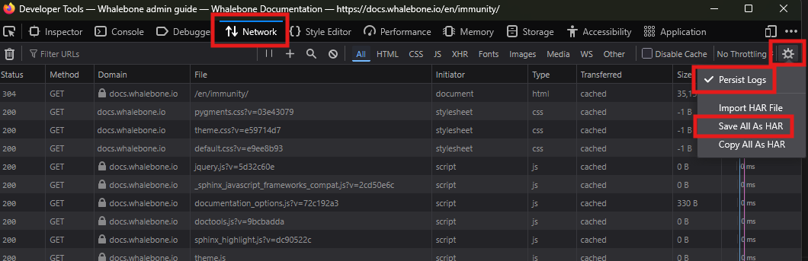
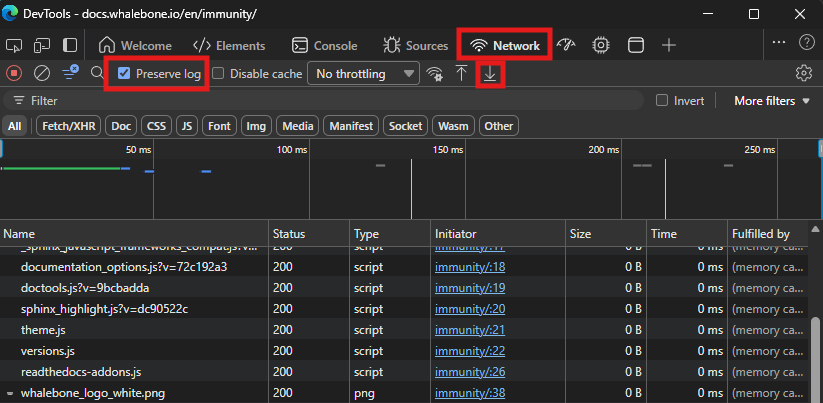

Analýza překladu domén
======================

Může se stát, že se správce setká se situací, kdy překlad DNS není úspěšný. Většinou to nesouvisí s resolverem Whalebone, ale pravděpodobně se jedná o problém s autoritativním serverem. 

Poskytovatelé internetových služeb se často setkávají se stížnostmi, že uživatelé nemohou přistoupit k doméně. V mnoha případech to není chyba poskytovatele. Portál Whalebone správcům poskytne informace pro identifikaci problému.

Analýza se skládá ze čtyř kroků:

**1. krok: Ověřte, zda lokální resolvery Whalebone blokují doménu**

  * Pokud máte lokální resolvery Whalebone, využijte nástroj **Debug překladu domény**, který se nachází přímo v nabídce resolveru pod ikonkou tří teček. Výsledek testu oznámí, jestli je doména blokována, či nikoliv. Pokud došlo k blokaci, máte tři možnosti: přidat doménu do seznamu povolených, nahlásit ji jako falešně pozitivní detekci, nebo ji nechat zablokovanou.

    .. image:: ./img/domain-resolution-analysis-1.png
      :align: center

**2. krok: Prozkoumejte doménu v záložce Hrozby**

  * Zkuste najít postiženou doménu mezi zablokovanými hrozbami. Podobně jako v předchozím kroku máte tři možnosti: přidat doménu do seznamu povolených, nahlásit ji jako falešně pozitivní detekci, nebo ji nechat zablokovanou.

**3. krok: Prozkoumejte doménu v záložce DNS provoz**

  * Pokud nebyla zablokována jako hrozba, přejděte na stránku **DNS provoz** a zkontrolujte, zda se dotaz dostal až k resolveru.
  * Pokud jste v přehledu provozu DNS nenalezli žádné dotazy z IP adresy uživatele, pak uživatel změnil konfiguraci DNS serveru na svém PC nebo domácím routeru tak, aby používal veřejné DNS servery. V takovém případě nejsou DNS dotazy odesílány do Whalebone a Whalebone nezpůsobuje problém s přístupem k doméně.
  * Pokud jste dotaz v přehledu provozu DNS nalezli, můžete se setkat se třemi případy:

    * Doména byla přeložena správně a problémy s přístupem k doméně nejsou způsobeny Whalebone.
    * Byla vrácena odpověď NXDOMAIN. Znamená to, že autoritativní server odpověděl, ale doména nebo subdoména neexistuje.
    * Byla vrácena odpověď SERVFAIL. Znamená to, že nebyla přijata žádná odpověď od nakonfigurovaného autoritativního serveru, nebo autoritativní DNS server nemá pro doménu platné záznamy DNSSEC. Pokud k tomu dojde, přejděte ke Kroku 4.

**4. krok: Prozkoumejte doménu pomocí DNSVIZ**

  * V seznamu domén lze pomocí šipky otevřít seznam nástrojů pro investigaci. Pomocí tohoto seznamu se můžete přesměrovat do nástroje DNSVIZ pro danou doménu, kde můžete analyzovat celý proces překladu včetně validace záznamů DNSSEC.
    
    .. image:: ./img/domain-resolution-analysis-2.png
      :align: center

  * Nástroj DNSVIZ znázorní v grafické podobně, jestli byla DNSSEC validace úspěšná, nebo, že autoritativní server nebyl dosažitelný

**5. krok: Použijte Nástroje pro vývojáře v webovém prohlížeči k získání dalších podrobností o blokované doméně**

  * Pokud doména není blokována, v přehledu DNS provozu nejsou žádné zjevné chyby a nástroj DNSVIZ ukazuje, že je doména platná, můžete použít Nástroje pro vývojáře ve vašem webovém prohlížeči k získání dalších podrobností o síťovém provozu a chybách souvisejících s blokovanou doménou. Hledejte chyby na záložce Konzole a zkontrolujte záložku Síť pro neúspěšné požadavky. Nakonec můžete uložit síťový protokol a kontaktovat podporu Whalebone pro další pomoc. Více informací naleznete v :ref:`průvodci Nástroji pro vývojáře <developer-tools-guide>`.

Videoprůvodce krok za krokem si můžete prohlédnout :ref:`zde <domain-resolution-troubleshooting>`.

Portál Whalebone poskytuje možnost trasovat doménu. Tato funkce je k dispozici v části **Resolvery** pod třemi tečkami každého resolveru. Tato funkce ukazuje, jaké informace jsou předávány resolveru při překladu konkrétní domény.

Videoprůvodce krok za krokem si můžete prohlédnout :ref:`zde <domain-tracing>`.

.. _developer-tools-guide:

Průvodce Nástroji pro vývojáře
==============================

Nástroje pro vývojáře jsou vestavěné funkce moderních webových prohlížečů, které umožňují uživatelům prohlížet a ladit webové stránky. Poskytují různé nástroje pro vývojáře k analýze požadavků a domén zapojených do načítání webové stránky. Tato kapitola poskytuje stručný přehled o tom, jak používat Nástroje pro vývojáře k získání dalších podrobností o síťovém provozu a chybách souvisejících s blokovanými doménami v některých populárních webových prohlížečích. Jakmile shromáždíte síťový protokol, můžete kontaktovat podporu Whalebone pro další pomoc.

.. tip::

  Smažte DNS cache na vašem počítači a domácím routeru před použitím Nástrojů pro vývojáře, abyste zajistili, že zachytáváte čerstvé DNS požadavky. DNS cache na počítači můžete vymazat spuštěním následujícího příkazu v příkazovém řádku nebo terminálu:

    - Na Windows: `ipconfig /flushdns`
    - Na macOS: `sudo killall -HUP mDNSResponder`
    - Na Linuxu: Příkaz se může lišit v závislosti na distribuci a používané DNS službě. Například pro systémy používající systemd-resolved můžete použít: `sudo systemd-resolve --flush-caches`

  Proces vymazání DNS cache na routeru se liší podle výrobce a modelu. Pro konkrétní instrukce se obraťte na dokumentaci vašeho routeru. Obvykle restartování routeru vymaže jeho DNS cache.

Google Chrome
-------------

1. Otevřete Google Chrome.
2. Přejděte na webovou stránku, kde máte problémy s přístupem k doméně.
3. Klikněte na tři tečky v pravém horním rohu a vyberte **Další nástroje** > **Nástroje pro vývojáře**.
4. Přejděte na záložku **Síť**.
5. Zajistěte, aby byla zaškrtnuta možnost **Zachovat protokol**, aby byly zaznamenány všechny síťové požadavky i po obnovení stránky.
6. Načtěte webovou stránku, která obsahuje blokovanou doménu. Pokud například nejde přehrát video, načtěte stránku s videem a zkuste video přehrát.
7. Uložte soubor HAR kliknutím na tlačítko **Exportovat HAR (bez citlivých dat)...** umístěném na panelu nástrojů záložky Síť. Tím se uloží soubor HAR obsahující všechny síťové požadavky a odpovědi.

Mozilla Firefox
---------------

1. Otevřete Mozilla Firefox.
2. Přejděte na webovou stránku, kde máte problémy s přístupem k doméně.
3. Klikněte na tři vodorovné čáry v pravém horním rohu a vyberte **Další nástroje** > **Nástroje pro webové vývojáře**.
4. Přejděte na záložku **Síť**.
5. Zajistěte, aby byla zaškrtnuta možnost **Protokol natrvalo** v menu pod ozubeným kolečkem, aby byly zaznamenány všechny síťové požadavky i po obnovení stránky.
6. Načtěte webovou stránku, která obsahuje blokovanou doménu. Pokud například nejde přehrát video, načtěte stránku s videem a zkuste video přehrát.
7. Uložte soubor HAR kliknutím na tlačítko **Uložit vše jako HAR** umístěném v menu pod ozubeným kolečkem záložky Síť. Tím se uloží soubor HAR obsahující všechny síťové požadavky a odpovědi.

Microsoft Edge
--------------

1. Otevřete Microsoft Edge.
2. Přejděte na webovou stránku, kde máte problémy s přístupem k doméně.
3. Klikněte na tři tečky v pravém horním rohu a vyberte **Další nástroje** > **Vývojářské nástroje**.
4. Přejděte na záložku **Network**.
5. Zajistěte, aby byla zaškrtnuta možnost **Preserve log**, aby byly zaznamenány všechny síťové požadavky i po obnovení stránky.
6. Načtěte webovou stránku, která obsahuje blokovanou doménu. Pokud například nejde přehrát video, načtěte stránku s videem a zkuste video přehrát.
7. Uložte soubor HAR kliknutím na tlačítko **Export HAR (sanitized)...** umístěném na panelu nástrojů záložky Síť. Tím se uloží soubor HAR obsahující všechny síťové požadavky a odpovědi.

