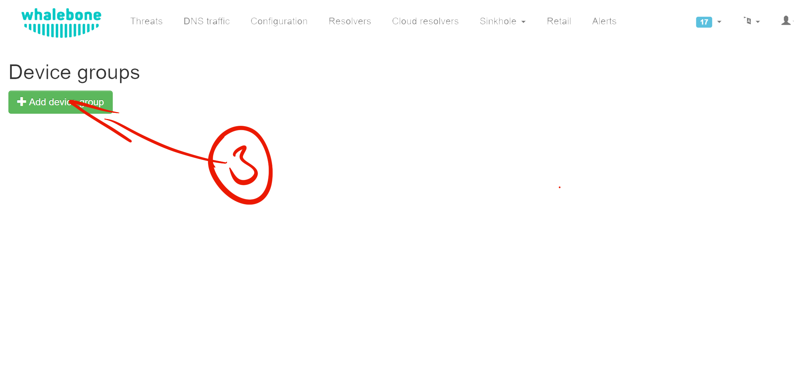
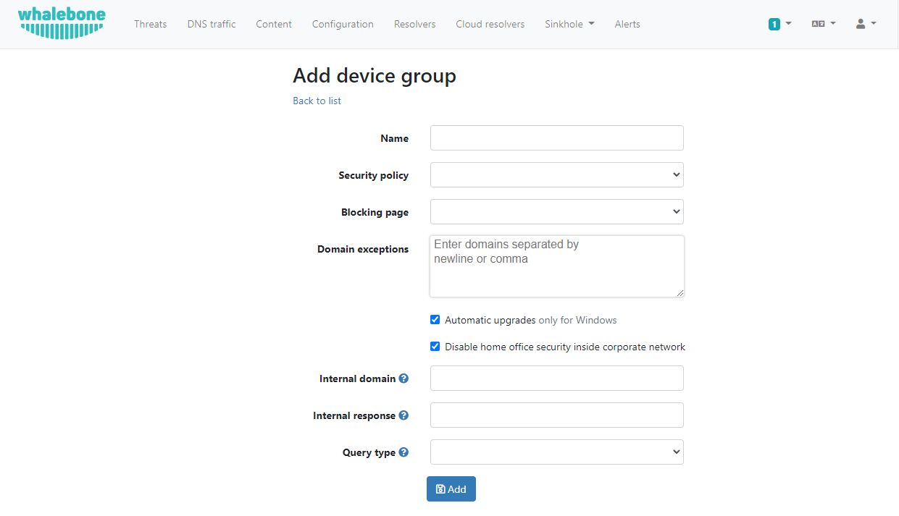
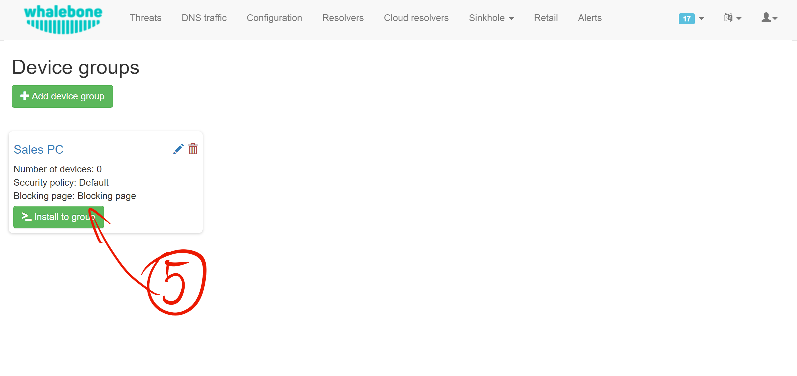
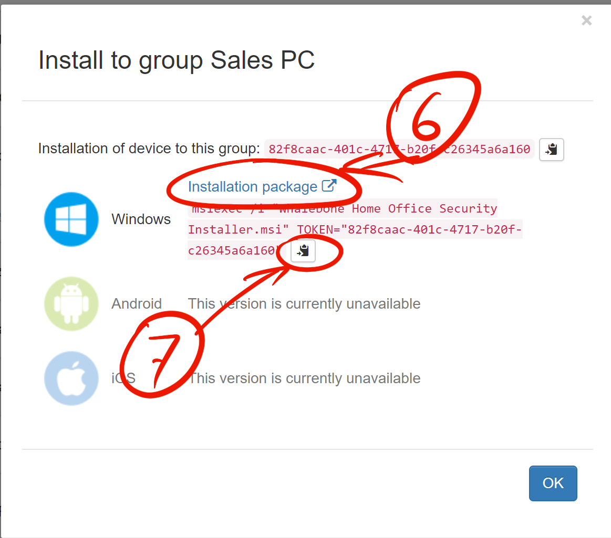

************************
Instalace krok za krokem
************************

Chcete-li nainstalovat HOS do zařízení, musíte jej nejprve nakonfigurovat. Přejděte do **Whalebone Portalu**, přejděte do  (1) **Uživatelského menu** a zde na (2) **Home Office Security**.

.. image:: ./img/hos-sbs-1.png
    :align: center

Skupina **Default** by již měla existovat. Pokud ne, vytvořte ji kliknutím na tlačítko (3) a **+ Vytvořit skupinu**.

* **Název**: Tento údaj by měl jasně identifikovat skupinu zařízení, aby se odlišila od ostatních. Pokud používáte pouze jednu, můžete jeho název ponechat jako Default Group (Výchozí skupina). 
* **Bezpečnostní politika**: Odpovídá zásadám, které vytvoříte v nabídce Konfigurace. Jedná se o soubor pravidel. Na základě zásad se zařízení nebo místní/cloudový resolver rozhoduje, co má při překladu DNS dělat. Tato sada pravidel zůstává v zařízení a je zpočátku aktualizována a později synchronizována. Z tohoto důvodu portál zajišťuje monitorování těchto zařízení.
* **Blokační stránka**: odpovídá stránkám blokování, které vytvoříte v nabídce Konfigurace. 
* **Výjimky na domény**: Služba HOS nebude přesměrovávat žádné dotazy DNS, které obsahují dotaz na doménu na seznamu výjimek. Např. při zadání ``example.com`` bude dotaz DNS vyřešen jako obvykle na resolveru nakonfigurovaném operačním systémem. Stejné pravidlo platí pro dotaz ``subdomena.example.com``.
* **Vypnout HOS uvnitř podnikové sítě**: Po zaškrtnutí této možnosti se zobrazí další 3 textová pole. Konfigurace umožňuje, aby došlo k vypnutí HOS v podnikové sítě na základě procesu dotaz-odpověď. 
    * **Interní doména**: Specifikuje na jakou interní doménu se bude HOS periodicky dotazovat.
    * **Interní odpověď**: HOS po odelsání dotazu na interní doménu očekává odpověď specifikovanou v tomto poli.
    * **Typ dotazu**: Dle zvoleného typu dotazu (A, AAAA a MX) musí být korektně nakonfigurován záznam na interním domain controlleru.  

Po dokončení klikněte na tlačítko **Přidat** a vytvořte tuto skupinu.

Kliknutím na tlačítko (5) **Install to group** se zobrazí pokyny k instalaci a/nebo můžete použít odkaz ke stažení instalačního programu HOS.

Pokud jste si ještě nestáhli instalační program (6). Během stahování instalačního programu zkopírujte instalační příkaz do schránky (7). 

Instalace / aktualizace (Windows 64‑bit):

.. code-block:: shell
    :caption: Instalace / aktualizace (Windows 64‑bit)

    msiexec /i "Whalebone.Home.Office.Security.Installer.msi" TOKEN="60d5806e-07fe-432a-a4ad-7797d82782b3" REGION="eu-01"

Odinstalace (od v2.20.4 vyčistí také ProgramData):

.. code-block:: shell
    msiexec /x "Whalebone.Home.Office.Security.Installer.msi

.. note::
   • Proměnná **REGION** je volitelná. Povolené hodnoty: 
     **eu-01**, **am-01** a **apac-01**.  
   • Instalátor je nyní **pouze 64‑bitový**; 32bitové Windows nejsou podporovány.

Najděte složku, ve které je instalátor umístěn. Měl by to být soubor s názvem **Whalebone.Home.Office.Security.Installer.msi**.

Otevřete příkazový řádek, změňte adresář na složku, kde je instalátor, a vložte (8) příkaz myší (klikněte pravým tlačítkem myši). Spusťte příkaz. To vyžaduje oprávnění správce.

Instalační program má minimální uživatelské rozhraní.

.. image:: ./img/hos-sbs-6.png
    :align: center

.. Tip:: Instalátor skončí s *Error 1602*, pokud chybí nebo je neplatný parametr **TOKEN** či **REGION**.

.. image:: ./img/hos-sbs-7.png
    :align: center

Zařízení je nyní viditelné na Whalebone Portálu.

