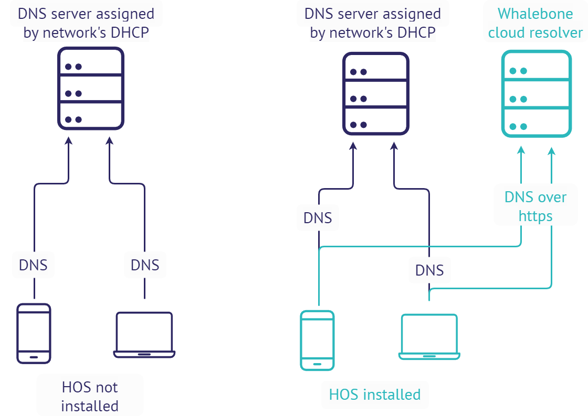

****************************
Přehled Home Office Security
****************************

Whalebone HOS • v 2.20.4 v kostce
--------------------------------

* **Multi‑regionální podpora** – automatický výběr nejbližšího resolveru
  pomocí nového přepínače *REGION* v instalátoru.
* **Plné pokrytí DNS** – chrání HTTPS, SVCB a další typy záznamů
  bez dodatečných úprav.
* **Upřednostnění konektivity** – klient zachová přístup k Internetu
  při hledání nejlepšího resolveru; při selhání automaticky přejde
  na Anycast.
* **Chytřejší ochrana** – služba se pozastaví při detekci VPN.
* **Čistší UI** – hlavní okno startuje skryté; porty tray/UI se
  při obsazení automaticky přepnou na vyšší.
* **Pouze 64‑bit** – 32bitové Windows již nejsou podporovány.

Whalebone Home Office Security (HOS) poskytuje funkci filtrování DNS mimo síť pro stolní počítače a mobilní zařízení. Zachycuje provoz DNS a mění adresu DNS serveru. 
Chrání zařízení před síťovými hrozbami tím, že kontroluje každý paket DNS. V současné době jsou podporována zařízení se systémy Windows, Android a iOS. Podrobné informace o podpoře verzí operačních systémů naleznete níže.

HOS se dodává s instalátorem systému Windows pro nasazení. K provedení instalace není nutná žádná interakce uživatele, instalační program však vyžaduje ``token``.

Výchozí cílový adresář je:

``C:\Program Files (x86)\Whalebone\Home Office Security\``

Pro Android, výchozí cílový adresář je:

``/storage/emulated/0/Android/io.whalebone.securedns.corp/``

Porporované operační systémy
============================

+-----------------+-------------------------------------+
| Windows Desktop | Windows 7 SP1 (64‑bit) nebo novější |
+=================+=====================================+
| Android         | Android 5 nebo vyšší                |
+-----------------+-------------------------------------+
| iOS             | Všechny verze                       |
+-----------------+-------------------------------------+
| MacOS           | MacOS 13.0                          |
+-----------------+-------------------------------------+
| Linux           | Není podporován                     |
+-----------------+-------------------------------------+

.. note:: 32bitové verze Windows (x86) nejsou od v 2.20.4 podporovány.

Systémy se operačním systémem Windows 7 musí být aktuální nebo musí mít nainstalovanou alespoň verzi KB3033929.

Systémy se operačním systémem Windows Server 2016 musí mít vypnuté zabezpečené spouštění (secure boot).

