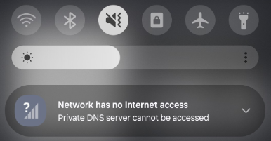

Řešení potíží
=============

Předčasné ukončení MSI
----------------------

* **Možná příčina:** Nedostatečná oprávnění ke spuštění souboru MSI.
* **Řešení:** Spusťte příkazový řádek jako správce.

Chyba "Nepodporovaná architektura"
----------------------------------

* **Možná příčina:** 32bitový operační systém Windows není podporován.
* **Řešení:** Nainstalujte aplikaci na 64bitové operační systémy Windows.

Zařízení není viditelné v Administračním portálu
------------------------------------------------

* **Možná příčina:** Problém se sítí nebo tokenem.
* **Řešení:** Zkontrolujte konektivitu k `hos.whalebone.io <http://hos.whalebone.io>`_ a všem cloudovým resolverům na TCP portu 443. Ověřte token a region zadané během instalace. Seznam resolverů lze získat spuštěním následujícího příkazu: ``dig hos.whalebone.io TXT``.

Interní doména není rozpoznána
------------------------------

* **Možná příčina:** Klient Home Office Security běží i v době, kdy je uživatel v kanceláři. Zařízení je proto připojeno ke cloudovému DNS serveru Whalebone, který nemůže resolverovat interní názvy domén.
* **Řešení:** Povolte a nakonfigurujte funkci "Vypnout home office zabezpečení uvnitř podnikové sítě" ve skupině zařízení uživatele. Pokud již byla povolena a nakonfigurována, ověřte DNS záznam a ujistěte se, že se ze zařízení resolveruje správně.

Politika nebyla aktualizována
-----------------------------

* **Možná příčina:** Prodleva synchronizace je až 4 hodiny.
* **Řešení:** Počkejte na dokončení synchronizačního cyklu.

Interní domény nelze resolverovat
---------------------------------

* **Možná příčina:** Prohlížeč nebo operační systém má domény cachované na základě jejich TTL (Time-to-Live).
* **Řešení:** Vymažte mezipaměť operačního systému i prohlížeče. Zkuste přistoupit k doméně v anonymním okně.

Uživatel má přístup k doménám, které by měly být blokovány (Windows)
--------------------------------------------------------------------

* **Možná příčina:** Služba Windows není spuštěna.
* **Řešení:** Ověřte, zda běží služba Whalebone Home Office Security.

Android hlásí chybu "Network has not Internet access"
-----------------------------------------------------

* **Možná příčina:** Zařízení s Androidem má zapnutou funkci Private DNS.
* **Řešení:** Vypněte Private DNS, protože tato funkce není kompatibilní s Home Office Security.

  .. image:: ./img/hos-troubleshooting-2.png
    :align: center

Umístění logů a konfigurace (Windows)
-------------------------------------

* Instalační složka: ``C:\Program Files\Whalebone\Home Office Security\``
* Logy: ``C:\ProgramData\Whalebone\Home Office Security\Logs``
* Konfigurace: ``C:\ProgramData\Whalebone\Home Office Security\Config``

Technická podpora (Windows)
---------------------------

V případě jakýchkoli problémů s aplikací postupujte následovně:

1. Shromážděte soubory logů ze složky ``C:\ProgramData\Whalebone\Home Office Security\Logs``.
2. Shromážděte konfigurační soubory ze složky ``C:\ProgramData\Whalebone\Home Office Security\Config``.
3. Shromážděte logy Aplikace, Instalace a Systému z Prohlížeče událostí (Event Viewer).
4. Kontaktujte **Podporu Whalebone** s ID vaší organizace, názvem dotčeného zařízení, podrobným popisem problému a všemi shromážděnými logy.

Umístění logů a konfigurace (Android a iOS)
-------------------------------------------

Uživatelé mají přístup k logům a dalším datům pro řešení problémů kliknutím na ikonu ozubeného kola v pravém horním rohu obrazovky.

.. image:: ./img/ios-1.png
   :align: center

Nabídka Řešení problémů (Troubleshooting) otevře podrobný přehled aplikace a nedávné aktivity uživatele. Tlačítko Kontaktovat podporu (Contact Support) shromáždí všechna data a odešle je týmu podpory Whalebone.

.. image:: ./img/ios-2.png
   :align: center
