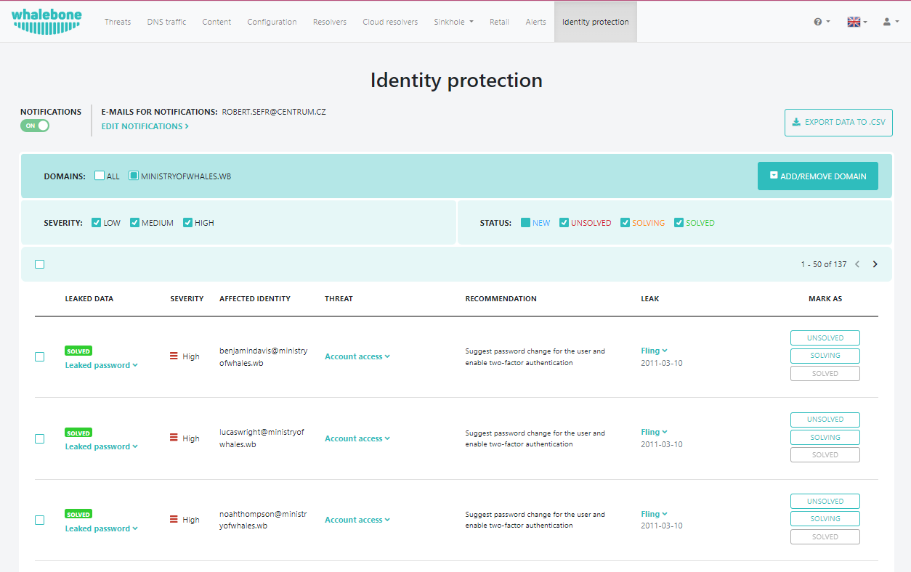
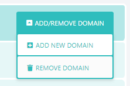
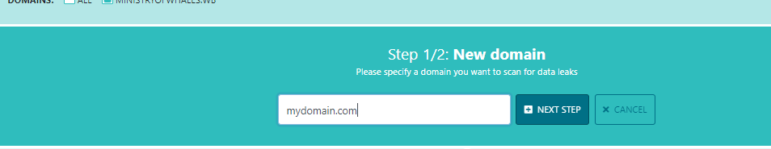
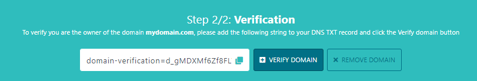
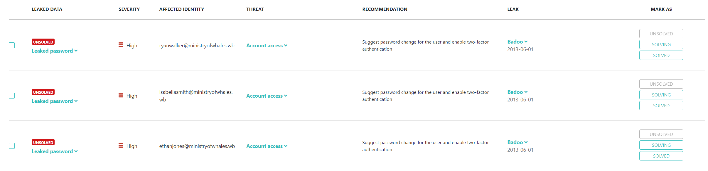
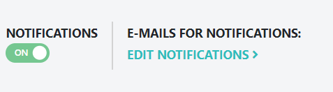
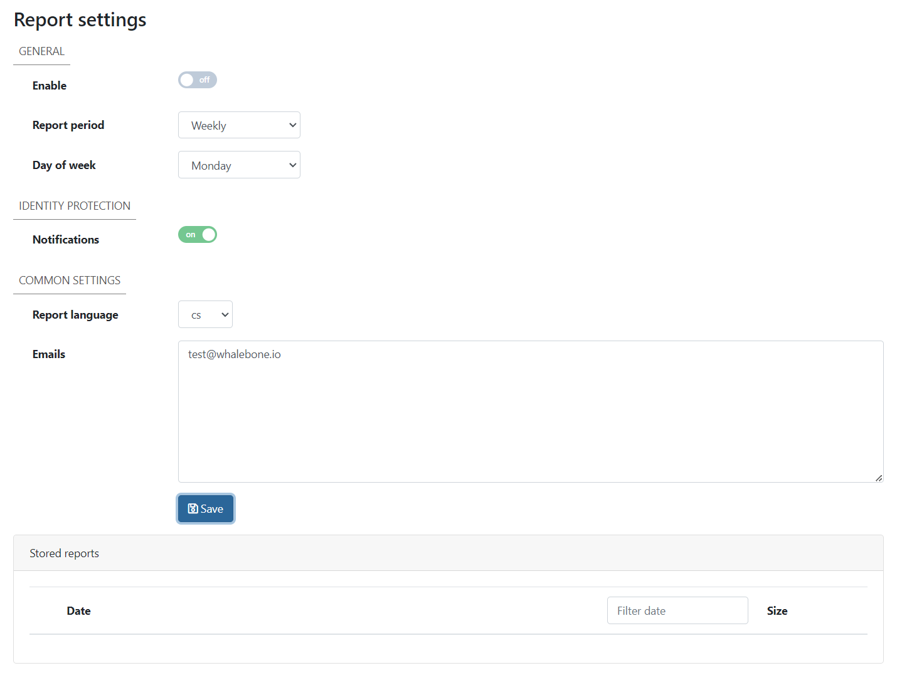

***************************
Přehled Identity Protection
***************************

Whalebone Identity Protection je komplexní řešení určené k ochraně vašich osobních údajů před únikem dat a krádeží identity.

Nastavení domény
================

Chcete-li nastavit ochranu identity pro doménu, kterou vlastníte, klikněte na **Přidat doménu**. Registrovanou doménu můžete také odebrat pomocí tlačítka **Odebrat doménu**.

Do pole zadejte **název domény**, kterou chcete sledovat pomocí funkce Identity Protection.

Zobrazený řetězec pak vložte jako **TXT záznam**na místo, kde je spravována **registrovaná doména**.

Jakmile dojde k automatickému ověření domény pomocí nastaveného TXT záznamu, zobrazí se v portálu jedotlivé záznamy.

Pro každý únik můžete nastavit 3 stavy v závislosti na postupu řešení úniku. Můžete vybrat z **PŘEČTENO**, **V ŘEŠENÍ** a **VYŘEŠENO**. Každý nový únik bude označen jako **NOVÝ**. Úniky můžete také vyfiltrovat pomocí filtrů **ZRANITELNOST** a **STAV**. 

Nastavení oznámení
======================
Pokud chcete být upozorňováni na nové záznamy, přepněte přepínač **NOTIFIKACE** a klikněte na **Upravit notifikace**.

Budete přesměrováni na **Nastavení reportingu**, kde je třeba zapnout **Identity Protection Notifikace** a vložit e-mailové adresy, na které chcete dostávat upozorňení. Pokračujte kliknutím na tlačítko **Uložit**.

Po přidání adres byste je měli vidět zobrazené v části **Emaily pro notifikace:**.

Další informace
===============

Ochrana identity nabízí vícevrstvý přístup k ochraně vaší online identity. Poskytuje proaktivní bezpečnostní opatření.

* **Monitorování úniku dat:** Společnost Whalebone aktivně monitoruje veřejné úniky dat a darkweb, aby zjistila, zda nedošlo k odhalení vašich osobních údajů. To zahrnuje e-mailové adresy, hesla, rodná čísla a další citlivé údaje.
* **Upozornění na únik dat a historie úniků:** Pokud je zjištěn únik dat, který může vést k odhalení vašich údajů, společnost Whalebone vás neprodleně informuje. Budete mít také přístup k obsáhlé historii minulých úniků dat, které vás mohly ovlivnit.
* **Rozdělení úniku dat:** Společnost Whalebone jde nad rámec pouhého oznámení úniku dat. Poskytuje podrobný rozpis uniklých dat, včetně typu odhalených informací a zdroje úniku. To vám umožní pochopit rozsah rizika.
* **Vyhodnocení dopadů:** Whalebone vás o úniku nejen informuje, ale také vyhodnocuje jeho potenciální důsledky pro vás. Toto posouzení vysvětluje, jak by mohly být uniklé informace zneužity a jaká je závažnost rizika.
* **Akční kroky:** Na základě podrobností o úniku informací a posouzení dopadů vám doporučí konkrétní kroky, které můžete podniknout ke zmírnění rizika. Může se jednat o změnu hesel, zapnutí dvoufaktorového ověřování u zranitelných účtů nebo kontaktování příslušných institucí a nahlášení úniku.