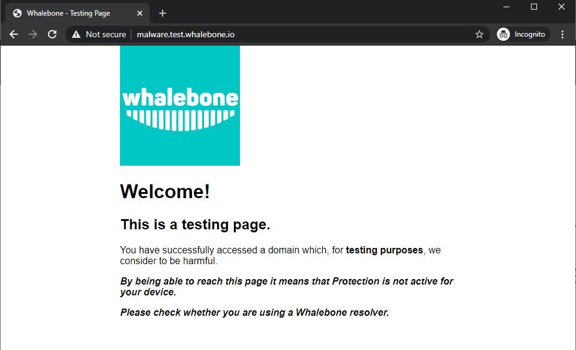

****************
Lokální resolver
****************

Nasazení řešení Whalebone nasazeného jako **lokální resolver** přináší výhodu viditelnosti místních IP adres, které odesílají skutečné požadavky. Pokud pro vás nasazení lokálního řešení není vhodnou volbou, 
podívejte se na :ref:`Cloudové nasazení<Cloudové nasazení>`.

Whalebone resolver je založen na implementaci `Knot Resolveru <https://www.knot-resolver.cz/>`_ vyvinutého CZ.NIC.


Systémové požadavky na lokální resolver
=======================================

Hardwarové a softwarové požadavky
---------------------------------

Lokální nasazení resolveru je podporováno pouze na **výhradně dedikovaném** fyzickém nebo virtuálním stroji, který běží na podporovaném operačním systému a podporuje Docker. Nesplnění těchto požadavků může vést k nesprávnému chování nebo problémům se službou, či překladem adres. Mějte na paměti, že neplnění těchto požadavků ztěžuje diagnostiku v případě problémů s produktem.

Pravidelně kontrolujte a udržujte verze operačního systému a Docker engine aktuální, abyste zajistili stabilitu služby.

* **Operační systém**

  * Operační systém musí podporovat 64bitovou (amd64) architekturu.
  * Lze si vybrat jednu z níže zmíněných distribucí operačního systému Linux. Tato distribuce musí mít aktivní podporu od svého vydavatele.

    * `Red Hat Enterprise Linux (Full support) <https://access.redhat.com/product-life-cycles?product=Red%20Hat%20Enterprise%20Linux>`_
    * `CentOS Stream (Active support) <https://endoflife.date/centos-stream>`_
    * `Debian (Supported by LTS team) <https://wiki.debian.org/LTS/>`_
    * `Ubuntu (Standard support) <https://ubuntu.com/about/release-cycle>`_

* **Docker**

  * Whalebone podporuje a testuje na verzích Dockeru, které jsou podporovány komunitou. Podporované verze najdete `zde <https://endoflife.date/docker-engine>`_.

* **Souborové systémy** 

  * ext4
  * xfs pouze s podporou d_type (ftype=1)

* **Minimální požadavky na hardware**

  * 2 jádra procesoru

  * CPU s podporou architektury amd64 a instrukční sadou x86-64-v2. Níže najdete instrukce pro ověření, zda server podporuje x86-64-v2:

    * Ubuntu, Debian:

      * Spusťte příkaz ``/lib64/ld-linux-x86-64.so.2 --help``.
      * Zkontrolujte, zda se v terminálu vypíše ``x86-64-v2 (supported, searched)``.

    * Red Hat Enterprise Linux, CentOS Stream:

      * Spusťte příkaz ``/lib/ld-linux-x86-64.so.2 --help``.
      * Zkontrolujte, zda se v terminálu vypíše ``x86-64-v2 (supported, searched)``.

  * 4 GB RAM
  * Alespoň 70 GB v oddílu /var

.. warning:: Pozor, Whalebone podporuje pouze nasazení bez desktopových prostředí, jako je GNOME, KDE nebo Xfce, protože ty mohou ovlivnit dostupnou paměť a zpracování DNS na serveru.

Požadavky na nastavení sítě
---------------------------

.. tip:: Whalebone využívá regionální cloudové služby k optimalizaci komunikace mezi klienty a cloudovými komponentami. Region, ke kterému je připojen resolver zákazníka, lze zjistit z URL v Admin Portálu. Například pokud je URL https://portal.eu-01.whalebone.io/en/client-123456, je zákazník registrován v regionu EU-01. Toto je užitečné při nastavování pravidel firewallu v síti zákazníka.

Místní resolver potřebuje otevřené následující výstupní porty:

=========== =========== ======= ==================================== ================================
Směr        Protokol    Port    Cílová doména                        Popis         
=========== =========== ======= ==================================== ================================
Odchozí     UDP         53      Jakákoli                             DNS rekurze
Odchozí     TCP         53      Jakákoli                             DNS rekurze
Odchozí     TCP         443     resolverapi.whalebone.io             Aktualizace databáze hrozeb
Odchozí     TCP         443     resolverapi.eu-01.whalebone.io       Aktualizace databáze hrozeb
Odchozí     TCP         443     resolverapi.apac-01.whalebone.io     Aktualizace databáze hrozeb
Odchozí     TCP         443     resolverapi.am-01.whalebone.io       Aktualizace databáze hrozeb
Odchozí     TCP         443     stream.whalebone.io                  Aktualizace databáze hrozeb
Odchozí     TCP         443     stream.eu-01.whalebone.io            Aktualizace databáze hrozeb
Odchozí     TCP         443     stream.apac-01.whalebone.io          Aktualizace databáze hrozeb
Odchozí     TCP         443     stream.am-01.whalebone.io            Aktualizace databáze hrozeb
Odchozí     TCP         443     logger.whalebone.io                  Logovací stream
Odchozí     TCP         443     logger.eu-01.whalebone.io            Logovací stream
Odchozí     TCP         443     logger.apac-01.whalebone.io          Logovací stream
Odchozí     TCP         443     logger.am-01.whalebone.io            Logovací stream
Odchozí     TCP         443     agentapi.whalebone.io                Správa resolveru
Odchozí     TCP         443     agentapi.eu-01.whalebone.io          Správa resolveru
Odchozí     TCP         443     agentapi.apac-01.whalebone.io        Správa resolveru
Odchozí     TCP         443     agentapi.am-01.whalebone.io          Správa resolveru
Odchozí     TCP         443     transfer.whalebone.io                Sběr dat pro řešení potíží
Odchozí     TCP         443     portal.whalebone.io                  Portál správce
Odchozí     TCP         443     portal.eu-01.whalebone.io            Portál správce
Odchozí     TCP         443     portal.apac-01.whalebone.io          Portál správce
Odchozí     TCP         443     portal.am-01.whalebone.io            Portál správce
Odchozí     TCP         443     harbor.whalebone.io                  Aktualizace resolveru
Odchozí     TCP         443     harbor.eu-01.whalebone.io            Aktualizace resolveru
Odchozí     TCP         443     harbor.apac-01.whalebone.io          Aktualizace resolveru
Odchozí     TCP         443     harbor.am-01.whalebone.io            Aktualizace resolveru
Odchozí     TCP         443     download.docker.com                  Instalační proces
Odchozí     TCP         443     data.iana.org                        DNSSEC klíče
Odchozí     TCP         443     hooks.slack.com                      Sběr dat pro řešení potíží
=========== =========== ======= ==================================== ================================

.. warning:: Bez povolené komunikace na portu 443 s výše uvedenými doménami nebude resolver vůbec nainstalován a instalační skript se přeruší.


Hlavní funkcí resolveru je přijímat dotazy od uživatelů a odpovídat jim na ně, což vyžaduje, aby byly na resolveru otevřeny určité porty pro provoz pocházející z klientské podsítě nebo přicházející do zákaznického rozhraní.


=========== =========== ======= ============================ ==========================================
Směr        Protokol(y) Port    Cílová IP/Doména             Popis         
=========== =========== ======= ============================ ==========================================
Příchozí    TCP+UDP     53      Rozsah(y) podsítě zákazníka  DNS
Příchozí    TCP         853     Rozsah(y) podsítě zákazníka  DNS přes TLS (pokud se používá)
Příchozí    TCP         443     Rozsah(y) podsítě zákazníka  DNS přes HTTPS (pokud se používá)
=========== =========== ======= ============================ ==========================================

Blokační stránky jsou hostovány **přímo** na resolverech, takže musí být použity IP adresy, které jsou přístupné klientům. Klienti pak budou při blokování přesměrováni na IP adresu resolveru. Doporučujeme povolit pouze podsítě přidělené zákazníkům nebo důvěryhodným sítím, jinak by mohly být zneužity k různým útokům nebo neoprávněným uživatelům.

=========== =========== ======= ============================ ==========================================
Směr        Protokol(y) Port    Cílová IP/Doména             Popis         
=========== =========== ======= ============================ ==========================================
Příchozí    TCP         80      Rozsah(y) podsítě zákazníka  Stránka přesměrování/blokování
Příchozí    TCP         443     Rozsah(y) podsítě zákazníka  Stránka přesměrování/blokování
=========== =========== ======= ============================ ==========================================

Procesy resolveru musí komunikovat na localhostu. V případě, že je v provozu nějaký firewall, ujistěte se, že je provoz povolen, tj. ``iptables -A INPUT -s 127.0.0.1 -j ACCEPT``.

=========== =========== ======= ============================ ==========================================
Směr        Protokol(y) Port    Cílová IP/Doména             Popis         
=========== =========== ======= ============================ ==========================================
Příchozí    TCP         ANY     127.0.0.1                    Procesy řešitele
=========== =========== ======= ============================ ==========================================

.. note:: Pro odhad HW požadavků u nasazení vr velkých sítích ISP nebo podnikových sítích se neváhejte obrátit na společnost Whalebone. Lokální resolver Whalebone bude potřebovat přibližně dvojnásobek paměti RAM a procesoru než běžný resolver BIND nebo Unbound.

Instalace nového lokálního resolveru
====================================

Můžete se podívat na videonávod krok za krokem o postupu instalace :ref:`zde<Deployment>`.

V záložce **Resolvery** stiskněte tlačítko **Vytvořit nový**. Zvolte název (identifikátor) nového resolveru. Zadání je čistě informativní a nebude mít vliv na funkčnost.
Po zadání názvu klikněte na tlačítko **Přidat resolver**.
Po kliknutí na tlačítko se zobrazí informativní okno se seznamem podporovaných platforem a **jednořádkovým příkazem pro instalaci**. Příkaz zkopírujte a spusťte na stroji určeném pro místní resolver.
Příkaz spustí instalační skript a předá jednorázový token použitý pro aktivaci resolveru. Stejný příkaz nelze použít opakovaně.

.. image:: ./img/lrv2-create.gif
	:align: center


Po spuštění příkazu probíhá kontrola operačního systému a instalace požadavků. Skript vás bude informovat o průběhu a vytvoří podrobný protokol s názvem ``wb_install.log`` v aktuálním adresáři.
Úspěšné spuštění instalačního skriptu je ukončeno oznámením ``Finální ladění operačního systému`` s hodnotou ``[ OK ]```. Hned po instalaci proběhne také inicializace a může trvat několik minut, než resolver spustí služby.


.. image:: ./img/lrv2-install.gif
   :align: center

.. important:: Procesy resolveru potřebují komunikovat na localhostu. Pokud je aktivní firewall, ujistěte se, že je tato komunikace povolena, např. pomocí příkazu: ``iptables -A INPUT -s 127.0.0.1 -j ACCEPT``.

Ověření správnosti instalace
----------------------------

Whalebone diponuje řadou neškodných testovacích domén, které jsou interně klasifikovány jako testovací domény pro ověření funkčnosti resolveru.
Pomocí těchto domén se můžete ujistit, že Whalebone resolver pracuje správně:

* ``http://malware.test.attacker.online``
* ``http://c2server.test.attacker.online``
* ``http://spam.test.attacker.online``
* ``http://phishing.test.attacker.online``
* ``http://coinminer.test.attacker.online``

Při přístupu na tyto domény by se měla zobrazit podobná blokační stránka podobná s následující:

.. figure:: ./img/blocking-page-default.png
   :alt: Blocking Pages (Default)
   :align: center
   
   Blokační stránka - správná funkce resolveru.

V případě, že narazíte na níže uvedenou stránku, znamená to, že požadavek nebyl zablokován, a tedy není použit resolver Whalebone. 
Zkontrolujte prosím své nastavení a pokud problém přetrvává, kontaktujte prosím podporu.


   
   Blokační stránka - resolver nefunguje správně.


Zabezpečení resolveru
---------------------

Při první instalaci je resolver nakonfigurován jako otevřený resolver. Odpoví na jakýkoli požadavek, který je mu zaslán, bez ohledu na to, odkud požadavek pochází. To je poměrně pohodlné z hlediska dostupnosti služeb, ale může být také rizikem, pokud je služba dostupná z vnějších sítí. Ujistěte se, že jste omezili přístup k místnímu resolveru na portech UDP/53 a TCP/53 pouze z důvěryhodných sítí, jinak může být zneužit k různým DoS útokům.
