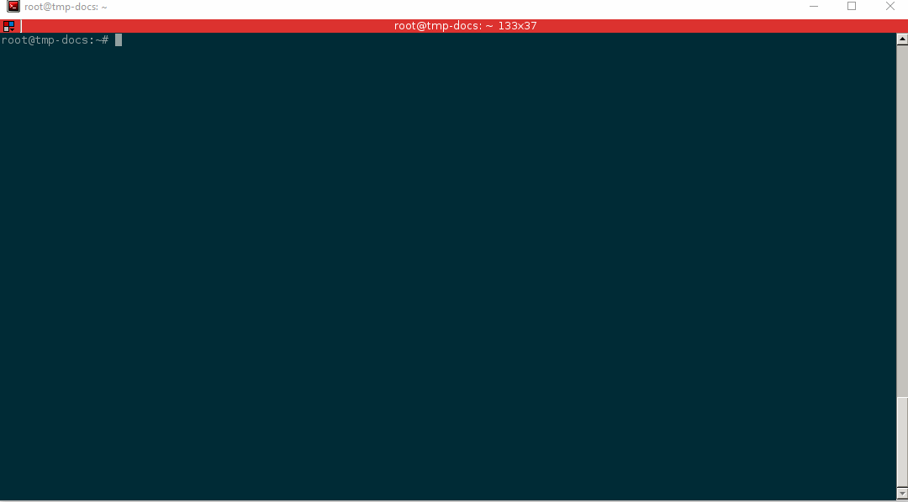
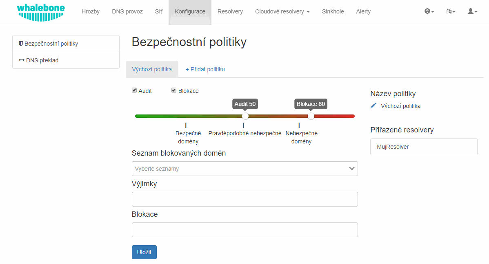
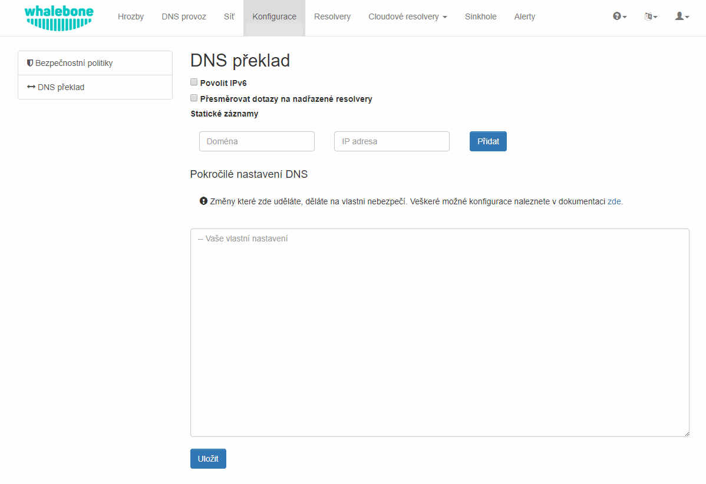

Lokální resolver
================

Lokální Whalebone resolver přináší oproti cloudovým resolverům zásadní výhodu ve viditelnosti konkrétních lokálních IP adres, které na něj posílají dotazy. Whalebone resolver je založen na implementaci `Knot Resolveru <https://www.knot-resolver.cz/>`_ vyvíjeného v laboratořích CZ.NIC. 

Systémové požadavky
-------------------

Lokální resolver předpokládá, že bude provozovován na dedikovaném stroji na čerstvě nainstalovaném a podporovaném operačním systému.

* **Podporované operační systémy** (serverové edice následujících distribucí):

  * Red Hat Enterprise Linux 7
  * CentOS 7
  * Debian 8,9
  * Ubuntu 16.04

* **Doporučené hardwarové zdroje** pro běžný provoz (podporujeme fyzické i virtuální stroje):

  * 2 CPU jádra
  * 4 GB RAM
  * 40 GB HDD

* **Požadavky na síťovou komunikaci** (resolver pro svůj běh vyžaduje následující otevřené porty):
  
  * ``TCP+UDP/53`` do celého internetu pro potřeby DNS překladu
  * ``TCP/8443`` na destinaci ``resolverapi.whalebone.io`` 
  * ``TCP/443`` na destinace ``logger.whalebone.io, agentapi.whalebone.io, portal.whalebone.io``

.. warning:: Bez dostupných portů 8443 a 443 na výše zmíněné destinace instalace resolveru vůbec neproběhne (instalační skript bude přerušen).

S doporučenými hardwarovými prostředky zajistí resolver stabilní a rychlý DNS překlad. Resolver je možné provozovat i s výrazně menšími prostředky, ale to je doporučeno pouze pro testovací účely.

.. note:: Kvůli odhadu sizingu pro větší podnikové a ISP sítě kontaktujte svého dodavatele. Nárůst systémových požadavků oproti standardním DNS resolverům (BIND, Unbound, apod.) se dá očekávat přibližně dvojnásobný na úrovni spotřeby RAM i zatížení CPU.

Instalace nového resolveru
--------------------------

V menu **Resolvery** klikněte na tlačítko **Vytvořit nový**. Zde zvolte název pro nový lokální resolver. Jedná se o čistě informativní údaj, který nemá vliv na fungování resolveru.
Po vyplnění názvu klikněte na tlačítko **Vytvořit resolver** 
Po stisknutí tlačítka se zobrazí informativní okno se seznamem podporovaných platforem a s příkazem pro instalaci, který zkopírujte na cílový stroj a spusťte.
Příkaz se postará o stažení instalačního skriptu, kterému předá jednorázový kód určený pro aktivaci lokálního resolveru (stejný příkaz nelze použít opakovaně).

.. image:: ./img/lrv2-create.gif
   :align: center

Po spuštění příkazu je prováděna kontrola operačního systému a případná instalace závislostí nutných pro běh lokálního resolveru. Skript o svém průběhu interaktivně informuje a zároveň vytváří i detailní log v souboru ``wb_install.log`` v aktuálním adresáři pro případ řešení neočekávaných chyb.
Úspěšný běh instalačního skriptu je zakončen oznámením ``Final tuning of the OS`` s hodnotou ``[ OK ]``. Po instalaci resolveru je na pozadí ještě prováděna jeho inicializace, která může trvat až jednotky minut, než začne resolver poskytovat své služby. 

.. warning:: Lokální resolver je nakonfigurován jako tzv. open resolver. Bude se tedy snažit vyhovět komukoliv, kdo na něj zašle svůj dotaz. To je pohodlné z pohledu zajištění dostupnosti DNS překladu všem klientům na síti, ale je nutné zajistit, aby resolver, resp. port 53 (UDP a TCP), nebyl volně dostupný z Internetu, kvůli možnému zneužití pro DoS útoky.

Bezpečnostní politiky
---------------------

V menu **Konfigurace** a záložce **Bezpečnostní politiky** je možnost definovat chování filtrace DNS provozu na resolverech. Ve výchozím stavu je k dispozici **Výchozí politika**, která je automaticky přiřazována novým resolverům.
V politice je možné definovat několik oblastí:

* **Filtrace nebezpečných domén**

  * Umožňuje provádět akce Audit (logování) nebo Blokaci (přesměrování na blokační stránku) přístupu na nebezpečné domény
  * Jednotlivé akce je možné úplně vypnout - např. vypnout blokaci pro testovací účely
  * Hodnota na posuvníku určuje míru jistoty, že se jedná o nebezpečnou doménu na škále 0 až 100 (0 není riziková doména, 100 je jistě nebezpečná)

* **Seznam blokovaných domén**

  * Seznamy domén, které mají být blokovány za všech okolností
  * Nemusí se jednat o rizikové domény, ale třeba o domény, které musí být blokovány na základě legislativního nařízení
  * O aktualizaci seznamů se stará společnost Whalebone

* **Výjimky**
  
  * Domény, které nebudou za žádných okolností blokovány
  * Výjimka se uplatňuje na danou doménu a všechny její subdomény, např.: výjimka na doménu ``whalebone.io`` se uplatní i na doménu ``docs.whalebone.io``, ale ne naopak

* **Blokace**
  
  * Domény, které budou za všech okolností blokovány (vyšší prioritu mají pouze **Výjimky**)
  * Blokace se uplatňuje na danou doménu a všechny její subdomény, např.: blokace domény ``malware.ninja`` se uplatní i na doménu ``super.malware.ninja``, ale ne naopak 

.. note:: Změny se na resolverech projeví cca do třiceti minut od uložení politik. Uložená změna konfigurace je použita pro přípravu nového balíku s informacemi o hrozbách, který si resolver z cloudu pravidelně stahuje.

Nastavení DNS překladu
----------------------

V menu **Konfigurace** na záložce **DNS překlad** najdete možnosti konfigurace lokálního resolveru. Stránka umožňuje základní nastavení bez nutnosti znalosti konfigurační syntax použitého resolveru. Dále je k dispozici textové pole, které umožňuje zadat jakoukoliv konfiguraci, kterou podporuje `Knot Resolver <https://www.knot-resolver.cz/>`_.

Dostupné možnosti konfigurace:

* **Povolit IPv6**

  * Pokud má stroj IPv6 správně nakonfigurovanou a funkční, je možné aktivovat pro resolver IPv6. V opačném případě může mít aktivace této volby negativní dopad na výkon a latenci.

* **Přesměrovat dotazy na nadřazené resolvery**
  
  * Tato volba umožňuje přesměrovat všechny nebo vybrané dotazy na vybrané nadřazené resolvery nebo autoritativní DNS servery (vhodné např. při přesměrování na doménové řadiče Active Directory)
  
  * **Zakázat DNSSEC validaci**

    * Při aktivaci této volby nebudou odpovědi z přesměrovaných dotazů validovány. Doporučujeme volbu aktivovat, pokud nadřazené servery nemají správně nakonfigurovaný DNSSEC

  * **Všechny dotazy na**

    * Možnost přesměrovat veškeré dotazy na jeden enbop více definovaných resolverů

  * **Následující domény**

    * Umožňuje zvolit konkrétní domény, které budou přesměrovány na definované resolvery
    * Je možné definovat různé resolvery pro různé domény

* **Statické záznamy**

  * Předdefinované odpovědi, které mají být vráceny na vybrané domény
  * Mohou sloužit pro speciální případy jako je monitoring, nebo velmi jednoduchá substituce vytvoření reálných záznamů na autoritativním serveru

* **Pokročilé nastavení DNS**

  * Textové pole pro `plnohodnotnou konfiguraci Knot Reoslveru <https://knot-resolver.readthedocs.io/en/stable/daemon.html#configuration>`_
  * Podporuje Lua skriptování
  * Chybná konfigurace může ohrozit stabilitu, výkon a bezpečnostní funkce resolveru

.. note:: Jakmile uživatel stiskne tlačítko **Uložit**, jsou změny v DNS překladu uloženy a nachystány na aplikaci na cílové resolvery. Samotné nasazení změn je ale nutné provést přímo ze stránky **Resolvery**. Je tedy možné dělat postupně více změn a aplikovat je najednou, aby se minimalizoval počet akcí zasílaných na resolver.