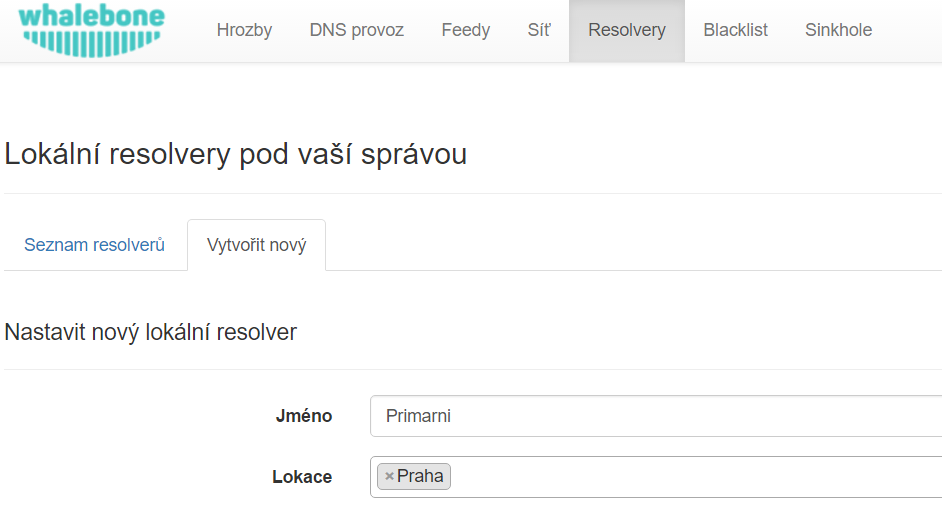
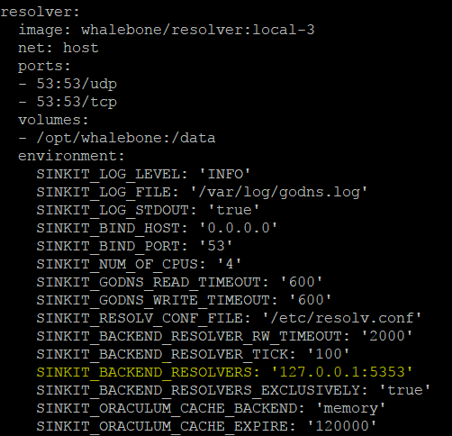

Lokální resolver
================

Lokální Whalebone resolver přináší oproti cloudovým resolverům zásadní výhodu ve viditelnosti konkrétních lokálních IP adres, které na něj posílají dotazy. Cloudový resolver ve většině případů komunikuje pouze s cachujícím resolverem, kterého se dotazují ostatní klienti a nemůže proto při detekci incidentu podat dostatečné množství informací.

Systémové požadavky
-------------------

Lokální resolver předpokládá, že bude provozovován na dedikovaném stroji na čerstvě nainstalovaném a podporovaném operačním systému.

* Podporované operační systémy (serverové edice následujících distribucí):

  * Red Hat Enterprise Linux 7
  * CentOS 7
  * Debian 8
  * Ubuntu 16.04

* Doporučené hardwarové nároky pro běžný provoz (podporujeme fyzické i virtuální stroje):

  * 2 CPU jádra
  * 4 GB RAM
  * 40 GB HDD
  * 1 síťové rozhraní

.. warning:: Stroj s více síťovými rozhraními může zapříčinit problémy se sběrem auditu DNS provozu

* Požadavky na síťovou komunikaci, resolver pro svůj běh vyžaduje následující otevřené porty:
  
  * ``TCP+UDP/53`` do celého internetu pro potřeby DNS překladu
  * ``TCP/8443`` na destinaci ``resolverapi.whalebone.io`` 
  * ``TCP/55555`` na destinaci ``logger.whalebone.io``

.. warning:: Bez dostupných portů 8443 a 55555 nebude resolver schopen provést inicializaci a nezačne poskytovat služby DNS překladu (port 53 na něm bude nedostupný)

S doporučenými hardwarovými prostředky zajistí resolver stabilní a rychlý DNS překlad. Resolver je možné provozovat i s výrazně menšími prostředky, ale to je doporučeno pouze pro testovací účely.

.. tip:: Kvůli odhadu sizingu pro větší podnikové a ISP sítě kontaktujte svého dodavatele. Nárůst systémových požadavků oproti standardním DNS resolverům (BIND, unbound, apod.) se dá očekávat v řádu desítek procent na úrovni spotřeby RAM a přibližně dvojnásobek v případě CPU.

Instalace nového resolveru
--------------------------

V menu ``Resolvery`` vyberte záložku ``Vytvořit nový``. Zde zvolte název pro nový lokální resolver a případně lokaci, kterou obsluhuje. Jedná se o čistě informativní údaje, která nemají přímý vliv na fungování resolveru.
Po vyplnění údaju klikněte na tlačítko ``Vytvořit`` 

Po stiknutí tlačítka ``Vytvořit`` budete přesunuti na seznam dostupných resolverů. Klikněte na zelené tlačítko připomínající prompt.

.. image:: ./img/lr_list.png
   :align: center

Po kliknutí na tlačítko se zobrazí informativní okno se seznamem podporovaných platforem a s příkazem pro instalaci, který zkopírujte na cílový stroj a spusťte.
Příkaz se postará o stažení instalačního skriptu, kterému předá jednorázový kód určený pro aktivaci lokálního resolveru.

.. image:: ./img/lr_install.png
   :align: center

Po spuštění příkazu je prováděna kontrola operačního systému a případná instalace závislostí nutných pro běh lokálního resolveru. Skript o svém průběhu interaktivně informuje a zároveň vytváří i detailní log pro případ řešení neočekávaných chyb.
Úspěšný běh instalačního skriptu je zakončen oznámením ``Installing resolver package`` s hodnotou ``[ OK ]``. Po instalaci resolveru je na pozadí ještě prováděna jeho inicializace, která může trvat až jednotky minut, než začne resolver poskytovat své služby. 

.. image:: ./img/lr_install_script.png
   :align: center

.. warning:: Lokální resolver je nakonfigurován jako tzv. open resolver. Bude se tedy snažit vyhovět komukoliv, kdo na něj zašle svůj dotaz. To je pohodlné z pohledu zajištění dostupnosti DNS překladu všem klientům na síti, ale je nutné zajistit, aby resolver, resp. port 53 (UDP+TCP), nebyl volně dostupný z Internetu.

Konfigurace revezní proxy
-------------------------

Konfiguraci lokálního resolveru jako čisté reverzní proxy bez vlastního překladu je nutné provést v hlavním konfiguračním souboru a po změně restartovat službu.
V jakémkoliv textovém editoru otevřete soubor ``/etc/whalebone/docker-compose.yml`` a najděte parametr ``SINKIT_BACKEND_RESOLVERS``, který je ve výchozím stavu nastaven na hodnotu ``127.0.0.1:5353``. Upravte konfiguraci cílovou adresu existujících překladačů v síti (konfigurace může obsahovat více překladačů oddělených čárkami), např. ``SINKIT_BACKEND_RESOLVERS: '10.20.30.40:53,192.168.1.20:53'``

Po uložení změn v konfiguračním souboru je nutné restartovat služby resolveru (na krátkou chvíli bude nedostupný DNS překlad) následujícím příkazem:

.. code-block:: bash

     cd /etc/whalebone && sudo docker-compose down && sudo docker-compose up -d

Konfigurace firewalld
---------------------

V případě aktivního firewallu firewalld na stroji s resolverem nebo reverzní proxy Whalebone je nutné otevřít port 53/TCP,UDP, aby začala služba odpovídat na dotazy od ostatních strojů. Otevření portů je možné provést následujícími příkazy:

.. code-block:: bash

    firewall-cmd --permanent --add-port=53/tcp
    firewall-cmd --permanent --add-port=53/udp
    firewall-cmd --reload``

