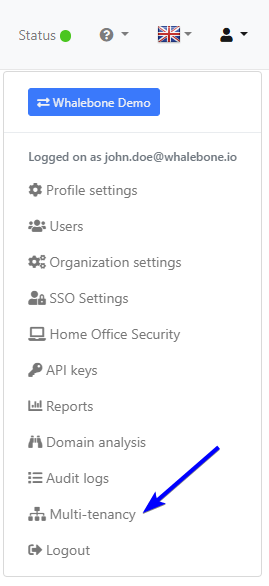
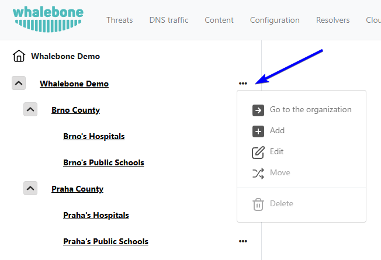

************
Multitenancy
************

.. only:: Aura

    .. warning:: Multitenancy je dostupné pouze pro zákazníky Aura Full a Aura Premium.  

.. only:: Peacemaker

    .. warning:: Multitenancy je dostupné pouze pro zákazníky Peacemaker Profit.  

Multitenancy umožňuje MSP, ISP, CERT a velkým podnikům spravovat více zákaznických prostředí z jednoho místa, přičemž jejich data a konfigurace zůstávají izolované. To zvyšuje efektivitu využití prostředků, zjednodušuje údržbu a snižuje provozní náklady ve srovnání se samostatným provozem prostředí pro každou organizaci.

Hlavní funkce:

* **Vytváření hlavních tenantů a správa podřízených tenantů**: Označte libovolného zákazníka jako hlavního tenanta a vytvářejte podřízené tenanty ručně nebo pomocí API; vazby rodič/potomek lze přejmenovat, přesunout nebo bezpečně smazat díky vestavěným kontrolám resolveru, provozu a zařízení.

* **Vnořená hierarchie tenantů**: Strom libovolné hloubky s přepínačem zákazníků pro okamžitou změnu kontextu.

* **Řízení přístupu na základě rolí (RBAC)**: Tři kaskádové role (Tenant Owner, Tenant Administrator, Tenant Analyst) určují, kdo může v jednotlivých větvích vytvářet, číst, upravovat, mazat, konfigurovat nebo pouze zobrazovat.

* **Pozvánky uživatelů napříč tenanty**: Pozvěte uživatele s plnými právy (Full-Admin) nebo pouze pro čtení (Read-Only), kteří automaticky zdědí práva napříč všemi podřízenými tenanty, nebo jim přiřaďte granulární role pro jednotlivé tenanty.

* **Centrální konzole**: Vyhrazený dashboard, viditelný pro jakéhokoli uživatele s rolí tenanta, umožňuje jedním klikem vytvářet, přesouvat, mazat a exportovat statistiky dotazů na úrovni tenantů do CSV.

* **Správa tenantů pomocí API**: Hromadné vytváření, čtení, aktualizace, mazání, přesuny v hierarchii a volitelné vynucené mazání pro externí provisioning nebo ticketovací systémy.

* **Upozornění o ochraně soukromí**: Trvalé upozornění na stránce Users informuje, že administrátoři poskytovatele služeb mohou zobrazit seznam uživatelů pro správu prostředí.

* **Statistiky tenantů a export do CSV**: Měsíční počty dotazů jsou zobrazeny v konzoli a ke stažení pro jakéhokoli uživatele s rolí tenanta.

.. Povolte tyto funkce, jakmile bude funkce připravena a zveřejněna ve všech regionech:
.. * Děděné politiky: Rodičovští tenanté mohou publikovat blokovací prahové hodnoty, obsahové filtry, regulační seznamy a seznamy Deny/Allow, které se propagují k potomkům.
.. * Prosazení politik a jemné doladění: Označte jakoukoli politiku nebo jednotlivé pravidlo jako Enforced pro její uzamčení, nebo povolte podřízeným tenantům upravovat, sledovat rozdíly a „Obnovit výchozí“.

Administrace tenantů
====================

Administrace tenantů je dostupná z nastavení účtu v pravém horním rohu portálu Whalebone.

Tři tečky vedle každého tenanta v seznamu tenantů otevřou nabídku, kde mohou administrátoři přistoupit k dashboardu tenanta, vytvořit podřízeného tenanta, upravit ho, přesunout do jiné podvětve nebo smazat.

