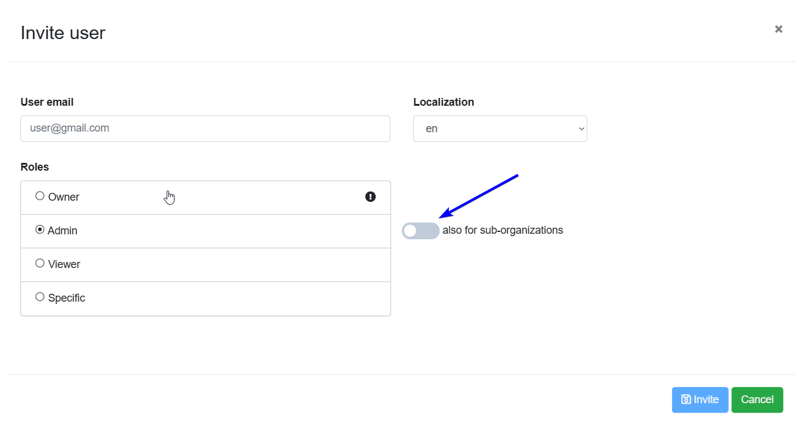
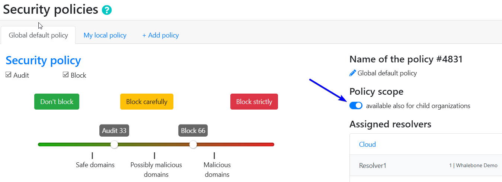
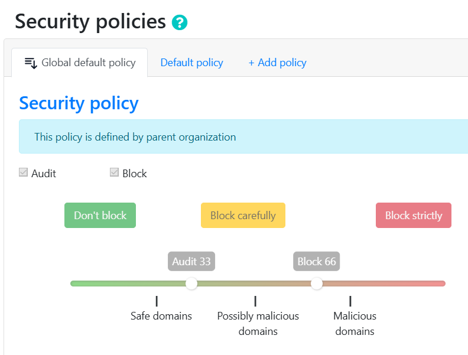

**************
Správa tenantů
**************

.. note:: Správa tenantů je ve výchozím nastavení vypnutá. Pokud ji chcete zapnout, kontaktujte nás prosím prostřednictvím Whalebone Helpdesku.

.. only:: Aura

    .. warning:: Správa tenantů je dostupná pouze pro zákazníky s Aura Full a Aura Premium.  

.. only:: Peacemaker

    .. warning:: Správa tenantů je dostupná pouze pro zákazníky s Peacemaker Profit.  

Správa tenantů umožňuje MSP, ISP, CERT a velkým podnikům spravovat více zákaznických prostředí z jednoho místa, přičemž jejich data a konfigurace zůstávají izolované. To zvyšuje efektivitu využití prostředků, zjednodušuje údržbu a snižuje provozní náklady ve srovnání se samostatným provozem prostředí pro každou organizaci.

Hlavní funkce:

* **Vytváření hlavních tenantů a správa podřízených tenantů**: Označte libovolného zákazníka jako hlavního tenanta a vytvářejte podřízené tenanty; vazby rodič/potomek lze přejmenovat, přesunout nebo bezpečně smazat díky vestavěným kontrolám resolveru, provozu a zařízení.

* **Vnořená hierarchie tenantů**: Strom libovolné hloubky s přepínačem zákazníků pro okamžitou změnu kontextu.

* **Řízení přístupu na základě rolí (RBAC)**: Tři kaskádové role (Tenant Owner, Tenant Administrator, Tenant Analyst) určují, kdo může v jednotlivých větvích vytvářet, číst, upravovat, mazat, konfigurovat nebo pouze zobrazovat.

* **Pozvánky uživatelů napříč tenanty**: Pozvěte uživatele s plnými právy (Full-Admin) nebo pouze pro čtení (Read-Only), kteří automaticky zdědí práva napříč všemi podřízenými tenanty, nebo jim přiřaďte granulární role pro jednotlivé tenanty.

* **Centrální konzole**: Vyhrazený dashboard, viditelný pro jakéhokoli uživatele s rolí tenanta, umožňuje jedním klikem vytvářet, přesouvat, mazat a exportovat statistiky dotazů na úrovni tenantů do CSV.

* **Správa tenantů pomocí API**: Hromadné vytváření, čtení, aktualizace, mazání, přesuny v hierarchii a volitelné vynucené mazání pro externí provisioning nebo ticketovací systémy.

* **Děděné politiky**: Rodičovští tenanté mohou publikovat blokovací prahové hodnoty, obsahové filtry, regulační seznamy a seznamy Deny/Allow, které se propagují k potomkům.

* **Upozornění o ochraně soukromí**: Trvalé upozornění na stránce Users informuje, že administrátoři poskytovatele služeb mohou zobrazit seznam uživatelů pro správu prostředí.

* **Statistiky tenantů a export do CSV**: Měsíční počty dotazů jsou zobrazeny v konzoli a ke stažení pro jakéhokoli uživatele s rolí tenanta.

.. Povolte tyto funkce, jakmile bude funkce připravena a zveřejněna ve všech regionech:
.. * **Prosazení politik a jemné doladění**: Označte jakoukoli politiku nebo jednotlivé pravidlo jako Enforced pro její uzamčení, nebo povolte podřízeným tenantům upravovat, sledovat rozdíly a "Obnovit výchozí".

Administrace tenantů
====================

Administrace tenantů je dostupná z nastavení účtu v pravém horním rohu portálu Whalebone.

.. image:: ./img/multitenancy-1.png
    :align: center

Tři tečky vedle každého tenanta v seznamu tenantů otevřou nabídku, kde mohou administrátoři přistoupit k dashboardu tenanta, vytvořit podřízeného tenanta, upravit ho, přesunout do jiné podvětve nebo smazat.

.. image:: ./img/multitenancy-2.png
    :align: center

Role
====

Následující role jsou k dispozici pro správu tenantů:

* **Tenant Owner**:

    * Úplná kontrola nad tenantem (vytváření, čtení, úpravy, mazání a přesun), včetně vytváření sub-tenantů, správy politik a konfigurace nastavení.

    * Pokud se uživatel s rolí Tenant Owner přepne na zákazníka, chová se jako administrátor zákazníka.

* **Tenant Administrator**:

    * Může spravovat sub-tenanty, politiky a nastavení, ale nemůže mazat.

    * Pokud se uživatel s rolí Tenant Administrator přepne na zákazníka, chová se jako administrátor zákazníka.

* **Tenant Viewer**:

    * Může zobrazit všechny tenanty, informace o tenantech a statistiky, ale nemůže provádět změny.

    * Pokud se uživatel s rolí Tenant Viewer přepne na zákazníka, chová se jako role pouze pro čtení.

Všichni uživatelé s rolí Tenant Owner nebo Tenant Administrator mohou do tenantu zvát další uživatele. Tenant Owner může zvát uživatele s rolí Tenant Owner, Tenant Administrator nebo Tenant Viewer. Tenant Administrator může zvát uživatele s rolí Tenant Administrator nebo Tenant Viewer. Na formuláři pro pozvání je přepínač, který umožňuje pozvanému uživateli spravovat sub-tenanty.

Děděné politiky
===============

Děděné politiky umožňují rodičovským tenantům definovat a publikovat politiky, které jsou automaticky nabízeny sub-tenantům jako výchozí politiky při vytváření nového resolveru nebo registraci podsítě na cloudových resolverech. To zajišťuje jednotné prosazování politik napříč hierarchií tenantů. Zároveň to umožňuje administrátorům na vyšších úrovních spravovat politiky centrálně, čímž se snižuje potřeba opakované konfigurace na úrovni jednotlivých sub-tenantů. Navíc mají administrátoři vždy možnost zvolit zděděnou politiku nebo vytvořit novou s vlastní konfigurací.

    Dědění politik lze pro každou politiku v jejím nastavení povolit nebo zakázat.

    Pokud je politika zděděná, nelze ji na úrovni sub-tenanta upravovat.

Známé limitace
==============

* Děděné politiky nemohou být nastaveny pomocí API.

* Blokovací stránky nepodporují dědičnost a děděné politiky.
