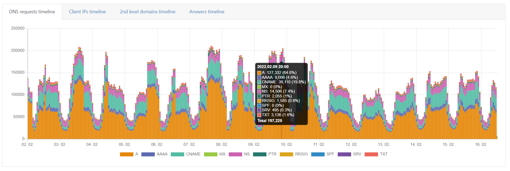

Quickstart
==========

Vytvoření účtu v portálu
------------------------

Po prostupu na URL z aktivačního e-mailu budete vyzváni k nastavení hesla k účtu. Nevyžadujeme žádnou politiku hesel, ale doporučujeme používat jedinečné a netriviální heslo. Neoprávněný přístup by ohrozil soukromí uživatelů a mohlo by dojít k poškození vaší sítě.

.. image:: ./img/password_setup.png
   :align: center

Po nastavení hesla budete vyzváni k přihlášení pomocí uživatelského jména a nově vytvořeného hesla.
.. image:: ./img/login.png
   :align: center

Zobrazeníá DNS provozu
----------------------

Pokud je provoz správně přesměrován na DNS resolvery Whalebone (cloudové nebo místní), bude provoz DNS viditelný v nabídce **DNS provoz**, kde jsou k dispozici jednotlivé dotazy a odpovědi pro další investigaci provozu.
Provoz by měl být viditelný během několika minut poté, co bylo vše správně nastaveno. Pokud nebude provoz zaznamenán ani za několik hodin, neváhejte se obrátit na podporu společnosti Whalebone, která vám pomůže překontrolovat konfiguraci nebo jakýkoli druh problémů s resolvery.

The DNS resolution check could be also done manually on Windows or Linux machines through ``nslookup`` tool. Set the Whalebone resolver IP and try to resolve an existing domain name.

.. sourcecode:: bash
   
   localhost:~$ nslookup whalebone.io
   Server:         193.32.92.32
   Address:        193.32.92.32#53

   Non-authoritative answer:
   Name:   whalebone.io
   Address: 75.2.70.75
   Name:   whalebone.io
   Address: 99.83.190.102
