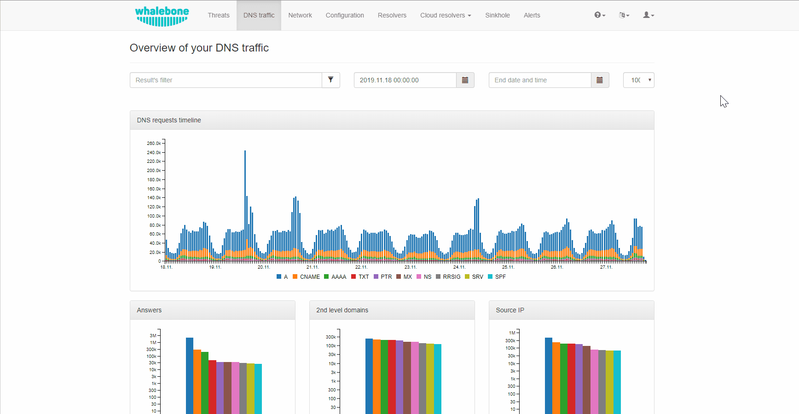

.. _header-n233:

Reporty
=======

Možnosti zasílání repotů lze nakonfigurovat v rozevírací nabídce pod účtem uživatele.
Mezi možnosti, které lze nastavit, patří četnost, s jakou jsou hlášení doručována, preferovaný den v týdnu, jazyk a příjemci.

.. note:: Výchozím příjemcem je vlastník účtu a zprávy jsou doručovány na jeho příslušnou registrovanou e-mailovou adresu.

Alerty
======

Alerting Whalebone poskytuje upozorňovat v reálném čase na klíčové informace, jako je stav resolveru, stav řešení, využití hardwaru, a také informuje o zásadních bezpečnostních incidentech a mnoha dalších.
Všechny tyto informace lze předávat prostřednictvím několika kanálů, např. e-mailu, slacku, syslogu nebo webhooku. Nová upozornění lze vytvářet z předdefinovaných šablon a upozornění lze následně přizpůsobit úpravou jejich parametrů.
Videoprůvodce krok za krokem si můžete prohlédnout :ref:`zde<Alerty video>`.

.. note:: Chcete-li zapnout upozornění, musíte mu nejprve přiřadit cíl. Kliknutím na název výstrahy ji podrobně rozbalíte a v rámečku vyberete cíl. Kliknutím na adresy lze vybrat více cílů.

.. note:: Pokud je kanálem upozornění syslog, je ve výchozím nastavení jako protokol transportní vrstvy podporován protokol TCP nebo TLS.

.. tip:: Whalebone používá regionální cloudové služby k optimalizaci komunikace mezi klienty a cloudovými komponentami. Region, ke kterému je připojen resolver zákazníka, lze nalézt v URL adrese účet v administrátorském portálu. Například pokud je URL adresa https://portal.eu-01.whalebone.io/en/client-123456, je účet registrován v regionu EU-01. To je užitečné při nastavování pravidel firewallu v síti zákazníka. Někteří zákazníci mohou používat prostředí Legacy, ve kterém bude URL adresa účtu https://portal.whalebone.io/en/client-123456.

Syslog nebo Webhook upozornění jsou odesílána z IP adres uvedených v tabulce níže. Pokud vyberete jeden z těchto kanálů, ujistěte se, že na svém firewallu povolíte příchozí TCP provoz, abyste mohli zprávu přijímat.

+----------------+---------------------------------+
| Region         | IP adresa                       |
+================+=================================+
| AM-01          | 34.174.88.243                   |
+----------------+---------------------------------+
| APAC-01        | 34.126.172.166                  |
+----------------+---------------------------------+
| EU-01          | 34.140.218.91                   |
+----------------+---------------------------------+
| Legacy         | 159.100.247.142, 159.100.247.58 |
+----------------+---------------------------------+

DNS provoz - Phishing na základě podobné domény (Homografický útok)
~~~~~~~~~~~~~~~~~~~~~~~~~~~~~~~~~~~~~~~~~~~~~~~~~~~~~~~~~~~~~~~~~~~
Toto upozornění je odesláno, když je zjištěn možný homografický útok pro zadanou doménu.
Parametry:

* **DOMAIN**: Doména, která se má sledovat z hlediska možných útoků homografů (jedno upozornění může sledovat pouze jednu doménu).

* **DISTANCE**: Počet znaků, které se mohou lišit v doméně phishingu (výchozí=1)

* **DOMAIN_WILDCARD_IGNORE**: Tento seznam domén oddělených čárkou ve výstraze ignorujte.  V případě, že je DISTANCE větší než 1, bude detekce probíhat u domén, které podporují globální i regionální formáty nejvyšší úrovně. Doporučujeme přidávat legitimní domény na bílé seznamy, abyste se vyhnuli zbytečným poplachům. (Výchozí hodnota=žádná)

DNS provoz - počet unikátních dotazů
~~~~~~~~~~~~~~~~~~~~~~~~~~~~~~~~~~~~
Toto upozornění se odešle, když je dosaženo prahové hodnoty pro filtrované jedinečné protokoly DNS.
Parametry:

* **MINUTES**: Časový rámec - časové okno (Výchozí=15)

* **TRESHOLD**: Prahová hodnota - počet událostí v časovém rámci pro spuštění výstrahy, jedná se o percentuální změnu (Výchozí=100).

* **QUERY_TYPE**: Filtrovat podle typu dotazu DNS (Výchozí=*)

* **RESPONSE_TYPE**: Filtrovat podle odpovědi DNS (Výchozí=*)

DNS provoz - počet unikátních požadavků z IP
~~~~~~~~~~~~~~~~~~~~~~~~~~~~~~~~~~~~~~~~~~~~~~

Toto upozornění se spustí, když jedna zdrojová IP adresa dosáhne limitu jedinečných požadavků s definovanými atributy.
Parametry:

* **MINUTES**: časové okno v minutách (výchozí=15)

* **TRESHOLD**: počet událostí v časovém rozmezí pro spuštění výstrahy, jedná se o percentuální změnu (výchozí=100).

* **QUERY_TYPE**: (Výchozí=*): filtruje podle typu dotazu DNS.

* **RESPONSE_TYPE**: Filtrovat podle odpovědi DNS (Výchozí=*)

* **IP_WILDCARD**: Zahrnout do výstrahy pouze tyto IP adresy oddělené čárkou (Výchozí=*)

* **IP_WILDCARD_IGNORE**: Ignorovat tyto domény oddělené čárkou ve výstraze (Výchozí=žádná)

* **DOMAIN_WILDCARD**: Do upozornění zahrne pouze tyto domény oddělené čárkou(Výchozí=*)

* **DOMAIN_WILDCARD_IGNORE**: Ignorovat tyto domény oddělené čárkou v upozornění (Výchozí=žádná)

* **DGA**: Filtrování podle algoritmu generování domén - pouze s DGA, pouze bez DGA nebo obojí (Výchozí=*)
   

DNS provoz - procentuální nárůst dotazů
~~~~~~~~~~~~~~~~~~~~~~~~~~~~~~~~~~~~~~~~~~~~~~
Toto upozornění se odešle, pokud je počet záznamů o provozu DNS procentuálně vyšší za nastavené časové období.
Parametry:

* **MINUTES**: Časový rámec - časové okno (výchozí=15)

* **PERCENT**: Procentuální nárůst (např. 200 %) - rozdíl mezi dvěma intervaly (Výchozí=50)

* **QUERY_TYPE**: (Výchozí=*): Filtruje podle typu dotazu DNS.

* **RESPONSE_TYPE**: Filtrovat podle odpovědi DNS (Výchozí=*)

Hrozby - nově blokovaná doména
~~~~~~~~~~~~~~~~~~~~~~~~~~~~~~~~~~~~~~~~~~~~~~
Toto upozornění se odešle, pokud resolver v zadaném časovém období zjistí nově zablokovanou hrozbu.
Parametry:

* **DAYS**: Počet dní ve kterých budou vyhledávány nově blokované domény (výchozí=30)

* **DOMAIN_WILDCARD**: Do upozornění zahrne pouze tyto domény oddělené čárkou(Výchozí=*)

Hrozby - počet za časový interval
~~~~~~~~~~~~~~~~~~~~~~~~~~~~~~~~~~~~~~~~~~~~~~
Toto upozornění se odešle, pokud je procento záznamů o hrozbě vyšší za nastavené časové období.
Parametry:
* **MINUTES**: časové okno v minutách (výchozí=15)

* **TRESHOLD**: počet událostí v časovém rozmezí pro spuštění výstrahy, jedná se o percentuální změnu (výchozí=100).

* **LOG_TYPE**: (Výchozí=*): filtruje podle typu akce (audit/block)

Hrozby - událost detekce
~~~~~~~~~~~~~~~~~~~~~~~~~~~~~~~~~~~~~~~~~~~~~~
Toto upozornění je odesláno v případě nové položky na stránce hrozeb podle zadaného typu hrozby a provedené akce.
Parametry:

* **LOG_TYPE**: (Výchozí=*): filtruje podle typu akce (audit/block)

* **THREAT_TYPE**: (Výchozí=*): filtruje podle typu detekované hrozby

Resolver - Nedostatek systémových požadavků
~~~~~~~~~~~~~~~~~~~~~~~~~~~~~~~~~~~~~~~~~~~
Toto upozornění je odesláno, když místní agent resolveru zjistí, že využití hardwaru vzrostlo nad definovanou mezní hodnotu. 
Parametry jsou vyjádřeny v procentech využití v porovnání s celkovými prostředky. Jako příklad lze uvést, že chcete být upozorněni, když hostitel využívá 80 % celkového diskového prostoru, 
nastavte hodnotu THRESHOLD_HDD na 80.  
Parameters:

* **THRESHOLD_CPU**: (Výchozí hodnota=80): Využití procesoru.

* **THRESHOLD_MEMORY**: Využití paměti RAM (výchozí=90)

* **THRESHOLD_HDD**: Využití pevného disku (výchozí=80)

Resolver - Výpadek komunikace s cloudem
~~~~~~~~~~~~~~~~~~~~~~~~~~~~~~~~~~~~~~~
Toto upozornění je odesláno, když backend neobdrží žádnou zprávu od místního agenta resolveru po dobu delší než 20 minut.

Resolver - Výpadek překladu
~~~~~~~~~~~~~~~~~~~~~~~~~~~~~~~~~~~~~~~~~~~~~~
Resolver pravidelně provádí kontroly, aby otestoval funkčnost překladu známých domén. Google.com, facebook.com, microsoft.com a apple.com jsou kontrolovány každou minutu. 
Výchozí nastavení parametrů je velmi přísné, takže i když se rozlišení jedné ze čtyř domén během desetiminutového intervalu nezdaří, je odesláno upozornění. 
Parametry:

* **TRESHOLD**: počet událostí, které musí nastat během časového intervalu, aby se výstraha spustila (výchozí=1)

* **MINUTY**: časový rámec v minutách (Výchozí=10)

