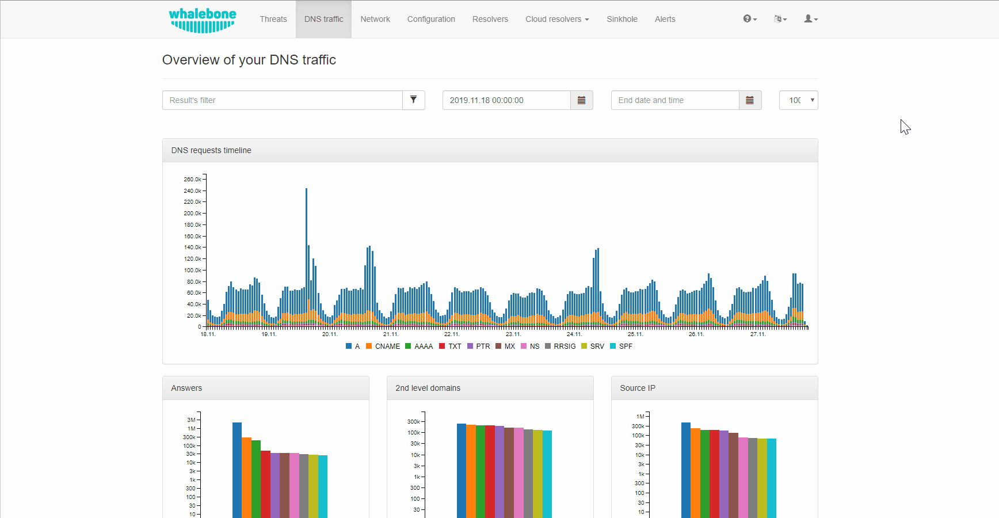

Reporty
=======

Reporty lze nakonfigurovat v rozbalovací nabídce pod účtem uživatele. Přizpůsobit lze frekvenci doručování reportů, preferovaný den v týdnu, jazyk a příjemce.

.. note:: Výchozím příjemcem je vlastník účtu a reporty jsou doručovány na jeho registrovanou e-mailovou adresu.

