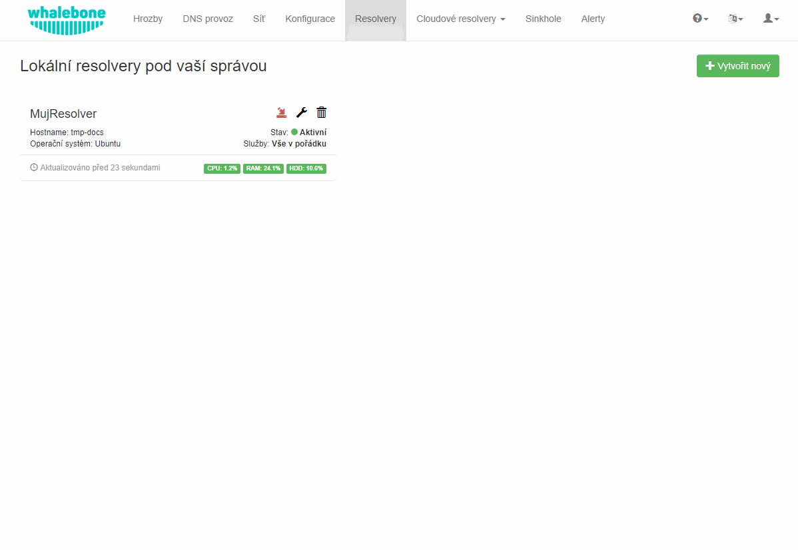
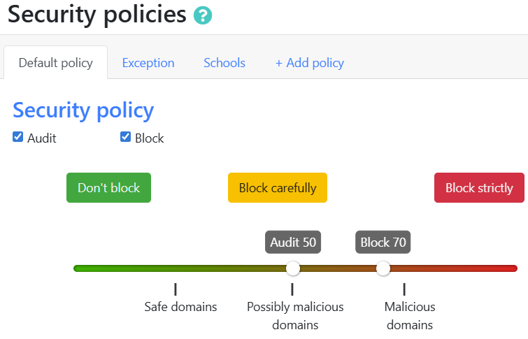
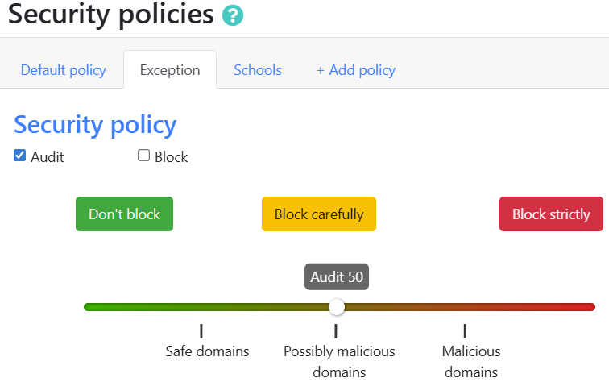
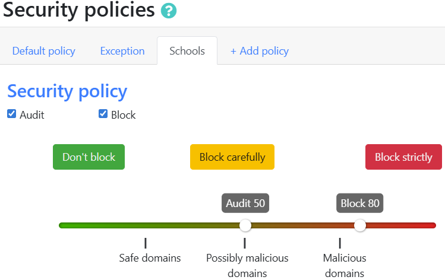
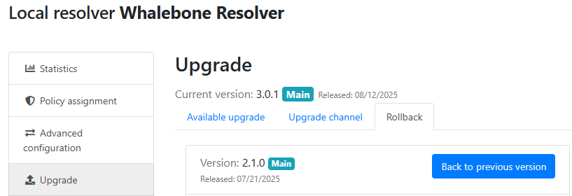

Správa resolveru
================

V záložce **Resolvery** je přehled vytvořených resolverů. Správce může upravovat konfiguraci, nasazovat aktualizace, instalovat nové resolvery a sledovat detailní provozní a výkonnostní metriky každého resolveru.

Přehled resolverů
-----------------

Na stránce **Lokální resolvery pod vaší správou** jsou dlaždice s podrobnostmi o jednotlivých resolverech. Každá dlaždice obsahuje název resolveru a jeho ID, **Hostname**, **Verzi**, jednu či více IP adres, indikátor **Stav:** s barevnou tečkou a aktuální využití zdrojů (**CPU**, **RAM** a **HDD**). Pod dlaždicí je časová značka **Aktualizováno před {N} sekundami**.

Resolver se může nacházet v jednom z těchto stavů:

* **Aktivní**: Tento stav se očekává v produkčních prostředích a signalizuje, že vše běží správně.
* **Problém s překladem**: Resolver není schopen překládat požadavky DNS.
* **Nedostupný**: Resolver ztratil spojení se službou Whalebone Cloud. Tento stav nemá vliv na překlad DNS, nicméně resolver nemůže získávat aktualizace databáze hrozeb a nemusí reagovat na změny zásad nebo konfigurace iniciované z portálu.
* **Upgrading**: Resolveru byl vydán příkaz k aktualizaci. Tento stav by neměl přetrvávat déle než několik minut.
* **Není nainstalován**: Resolver ještě nebyl nainstalován.

Nad dlaždicemi resolverů je pět grafových záložek agregujících metriky napříč všemi lokálními resolvery:

* **Časy odezvy** — rozdělení latence DNS dotazů do skupin (1 ms / 10 ms / 50 ms / 100 ms / 250 ms / 500 ms / 1000 ms / 1500 ms / pomalé).
* **Celkový provoz** — absolutní objem dotazů v čase.
* **Celkový provoz %** — relativní podíl na resolver.
* **Denní provoz** — celkový denní počet požadavků.
* **Měsíční medián počtu dotazů** — měsíční mediánové hodnoty pro plánování kapacity.

.. note:: Pokud zatím nemáte žádný nainstalovaný resolver, na stránce se zobrazí výzva **Vytvořit nový**. Postup instalace najdete v sekci :doc:`local_resolver`.

Akce nad resolverem
~~~~~~~~~~~~~~~~~~~

Každá dlaždice resolveru má v pravém horním rohu nabídku se třemi tečkami (tooltip **Další akce**) obsahující následující akce:

* **Upravit resolver** — otevře detail resolveru (lze také kliknout na název resolveru).
* **Vyčistit cache pro doménu** — vyprázdní záznamy keše resolveru pro zadanou doménu.
* **Vyčistit cache resolveru** — vyprázdní celou DNS keš na resolveru.
* **Trace domény** — spustí trasování překladu domény z tohoto resolveru.
* **Je doména blokovaná?** — ověří, zda by zadaná doména byla blokována stávající politikou.
* **Změnit jméno** — přejmenuje resolver v portálu.
* **Smazat resolver** — odstraní resolver z portálu. Tato akce neodinstaluje software na hostiteli; viz :doc:`uninstalling`.

Nahrání konfigurace
-------------------

Pokud došlo ke změnám konfigurace, které mají vliv na překlad DNS, je třeba následně **Nahrát konfiguraci**. Jinak se změny neprojeví. V případě, že jsou k dispozici nějaké změny konfigurace, které lze nasadit, bude na kartě resolveru viditelná **červená ikona** se šipkou vpravo. Po kliknutí na ni bude webová stránka požádána o potvrzení a v pravém horním rohu bude oznámeno úspěšné nasazení.

.. note:: Pokud nasazení skončilo chybou, zkuste akci zopakovat. Důvodem chyby může být krátkodobý výpadek komunikace mezi cloudem a resolverem.

Na následující animaci uvidíte nahrání konfigurace na resolver.

Detail resolveru
----------------

Kliknutím na název resolveru (nebo na **Upravit resolver** v nabídce na dlaždici) se otevře detail resolveru s nadpisem **Lokální resolver {jméno}**. V pravém horním rohu je tlačítko **Zpět na resolvery**. V levém menu je šest sekcí:

* :ref:`statistiky`
* :ref:`prirazeni-politik`
* :ref:`nastaveni-dns-prekladu`
* :ref:`aktualizace`
* :ref:`log-akci`
* :ref:`integrace`

Pravý sloupec zobrazuje **Hostname**, **Rozhraní** s přiřazenými IP adresami, **Platformu** (operační systém) a **Verzi**.

.. _statistiky:

Statistiky
~~~~~~~~~~

Výchozí pohled při otevření detailu resolveru. Obsahuje živé provozní grafy:

* **Doby odezvy resolveru** — dotazy rozdělené podle latence (1 ms / 10 ms / 50 ms / 100 ms / 250 ms / 500 ms / 1000 ms / 1500 ms / pomalé).
* **Health OK / Health fail** — procento úspěšných kontrol zdraví v rámci pozorovaného intervalu.
* **Zatížení CPU** — využití procesoru na hostiteli resolveru.
* **Využití RAM / Využití swapu / Zaplnění disku** — metriky paměťové zátěže.
* **Počet zápisů / Počet čtení** — diskové vstupně-výstupní operace.
* **Zapsáno Bytů / Přečteno Bytů** — propustnost diskového I/O.
* **Paketů přijato / Paketů odesláno** — počítadla síťových paketů.
* **Bytů přijato / Bytů odesláno** — síťová propustnost.

.. _prirazeni-politik:

Přiřazení politik
~~~~~~~~~~~~~~~~~

Pohled **Přiřazení politik** sdružuje tři související nastavení.

Nastavení blokační stránky
""""""""""""""""""""""""""

* **Umístění blokační stránky** — výběr mezi **Whalebone Cloud** (blokační stránky obsluhované Whalebone) a **Lokální na resolveru** (blokační stránky obsluhované z hostitele resolveru). Při volbě **Lokální na resolveru** se zobrazí dvě další pole:

  * **IPv4 pro blokační stránku** — IPv4 adresa pro blokační stránku. Měla by být nastavena na veřejnou IP adresu resolveru.
  * **IPv6 pro blokační stránku** — IPv6 adresa pro blokační stránku. Měla by být nastavena na veřejnou IP adresu resolveru.

.. tip:: Blokační stránky jsou umístěny **přímo** na resolverech, takže je třeba použít IP adresy, které jsou inzerovány klientům. Klienti pak budou při blokování přesměrováni na IP adresu resolveru. Zajistěte, aby byly na firewallu přístupné porty 80 a 443.

Párování politik
""""""""""""""""

Volba **Vybrat politiku podle IP** určuje, podle čeho resolver rozhoduje, jakou politiku aplikovat na DNS dotaz:

* **Klienta** — přiřazení podle IP adresy klienta. Použijte, pokud chcete politiky řízené IP rozsahy klientských zařízení (například odlišné politiky pro různé podsítě koncových uživatelů).
* **Resolveru** — přiřazení podle IP adresy resolveru. Použijte, pokud se klienti dostávají k Whalebone prostřednictvím vlastního DNS serveru a politika má být určena podle IP tohoto serveru.

Tabulka přiřazení politik
"""""""""""""""""""""""""

Zásady zabezpečení a obsahu lze granulárním způsobem přiřadit různým segmentům sítě. Tabulka **Přiřazení politik** má sloupce **Rozsah**, **Politika** a **Možnosti**. Výchozí řádek **Tato politika platí pro všechny nedefinované rozsahy** je vždy přítomen a používá **Výchozí politiku**. Nastavení se vztahuje na jednotlivé resolvery a lze je nakonfigurovat v části **Resolvery** → ``Název resolveru`` → **Přiřazení politik**.

.. note:: Konfigurace se vztahuje **na každý resolver zvlášť**. V případě, že chcete konfiguraci použít pro více resolverů, upravte konfiguraci u všech resolverů.

Politiky lze aplikovat přidáním rozsahů IP. Nový řádek přidáte tlačítkem **+ Přidat rozsah**:

.. image:: ./img/add-policy.PNG
   :align: center

Pro lepší pochopení uvažujme příklad s rozsahem sítě ``10.10.0.0/16``.

Vytvořili jsme 3 různé politiky:

* **Default**: Tuto politiku chceme použít pro celou síť. Jedná se o nejobecnější politiku.
* **Exception**: Politika pro konkrétní segment v síti, který bude mít vypnuté veškeré zabezpečení a filtrování obsahu.
* **Schools**: Politika pro 2 různé podsítě, které byly přiřazeny školnímu prostředí. V tomto případě jsme zvolili přísnější blokování.

   Výchozí politika

   Politika s vypnutým zabezpečením a filtrováním obsahu

   Politika s přísnějším blokováním

.. note:: Výchozí politika je aplikována na všechny nedefinované rozsahy. V případě různých politik ovlivňujících stejný rozsah se použije ta granulárnější.

Shrňme požadavky do následující tabulky:

========================= ===============================
**Bezpečnostní politika** **Síťový rozsah**
========================= ===============================
Default                   10.10.0.0/16
Exception                 10.10.10.0/24
Schools                   10.10.20.0/24 a 10.10.40.0/24
========================= ===============================

Následující obrázek ukazuje proces přiřazování politik k rozsahům:

.. image:: ./img/policy_task.png
   :align: center

.. note:: Po přidání politik k rozsahům je nutné kliknout na **Uložit k resolveru**, aby se změny projevily. Poté budou změny ověřeny a vyskakovací zpráva poskytne další informace.

Pro přidání dalších položek ke stávajícímu přiřazení lze přidat nový rozsah sítě pomocí **nového řádku** jako oddělovače.

V návaznosti na předchozí příklad, kdy bychom chtěli přidat podsíť ``10.10.30.0/24`` do bezpečnostní politiky **Exception**, tuto podsíť přidáme jako nový rozsah k existující politice:

.. image:: ./img/add-range.gif
   :align: center

Pro každý přidaný rozsah IP adres je v rozevírací nabídce uvedena přiřazená blokační stránka.

.. figure:: ./img/blocking-page-assign.png
   :alt: Přiřazení blokační stránky k adresnímu rozsahu
   :align: center

   Přiřazení blokační stránky k adresnímu rozsahu

.. important:: První položka v **Přiřazení politik** je považována za výchozí. V případě, že klient přistupuje k resolveru z nedefinovaného rozsahu IP, bude spadat pod politiku a blokační stránku z této výchozí položky.

.. note:: Po provedení potřebných změn v nastavení blokační stránky zkontrolujte, zda je třeba nové nastavení nahrát na resolvery.

.. _nastaveni-dns-prekladu:

Nastavení DNS překladu
~~~~~~~~~~~~~~~~~~~~~~

Pohled **Nastavení DNS překladu** (v anglické verzi portálu *Advanced configuration*) zpřístupňuje technická nastavení na úrovni resolveru.

* **Vyberte konfiguraci DNS překladu** — vyberte profil DNS překladu, který se má použít na tento resolver. Profily se definují v sekci :doc:`dns_resolution`. Výchozím profilem je **Výchozí DNS překlad**.

V sekci **Expertní nastavení** (ve výchozím stavu sbalená) lze přepsat následující výchozí hodnoty:

* **Vypnout logování DNS** — když je zapnuto, resolver nezaznamenává lokální záznamy dotazů. Používejte pouze pokud to vyžaduje objem logů nebo požadavky na soukromí; mnoho funkcí (Hrozby, Obsah) na těchto záznamech závisí.
* **Upravit velikost, při které se rotují logy** — přepíše výchozí velikost pro rotaci log souborů resolveru.
* **Syslog** — tlačítkem **+ Přidat** (tooltip *Přidat syslog*) přidá jeden či více vzdálených syslog cílů, na které bude resolver přeposílat logy. Dostupné log soubory a formáty popisuje sekce :doc:`syslog_integration`.
* **Počet procesů Resolveru** — přepíše počet pracovních procesů pro překlad na hostiteli.
* **Naslouchat na všech IP adresách** — je-li zapnuto (výchozí), resolver naslouchá na všech IP adresách všech rozhraní hostitele. Vypněte pro omezení naslouchání pouze na vybranou podmnožinu (konfiguruje se přes Whalebone podporu).

Kliknutím na **Uložit** uložíte změny. Stejně jako u jiných změn konfigurace je vyžadováno nasazení na resolver.

.. _aktualizace:

Aktualizace
~~~~~~~~~~~

Pohled **Aktualizace** zobrazuje aktuální verzi resolveru a datum vydání ve tvaru *Současná verze: {n}  Vydáno: {datum}* a je rozdělen do tří podzáložek.

**Dostupné aktualizace**
    Ukazuje, zda je dostupná novější verze v aktuálním kanálu. Pokud je resolver aktuální, zobrazí se zpráva **Používáte nejnovější verzi a zatím nejsou k dispozici žádné nové aktualizace.** Když je dostupná aktualizace, lze ji z této záložky spustit.

**Upgradovat verzi**
    Umožňuje přepínat mezi podporovanými vydavatelskými kanály resolveru. Existují tři kanály:

    .. list-table::
       :header-rows: 1
       :widths: 15 25 60

       * - Kanál
         - Stav
         - Klíčové vlastnosti
       * - **Verze 3**
         - **Aktuální kanál** — hlavní podporovaná verze, nové funkce jsou průběžně přidávány.
         - **SafeSearch** — když je zapnuta filtrace některé z kategorií *Pro dospělé*, *Zbraně*, *Zneužívání dětí*, *Drogy*, *Terorismus* nebo *Násilí*, resolver odpovídá na dotazy Google, YouTube, Bing, DuckDuckGo a Ecosia pomocí IP/CNAME adres SafeSearch a zobrazí se tak pouze bezpečné a filtrované výsledky. **Ochrana proti DDoS** — konfigurovatelné omezení rychlosti (rate-limiting), které blokuje DNS-amplification útoky na UDP/53 a brání jednomu klientovi v zahlcení resolveru. Nadbytečné dotazy jsou zahozeny a legitimní dotazy jsou nadále odbaveny v maximální rychlosti. (Nedostupné pro DoH/DoT.) Při vysokém vytížení CPU automaticky zpomaluje náročné klienty a tím chrání celkový výkon resolveru. **Statické DNS záznamy** — ve verzi 3 přibyla podpora záznamů SRV; záznamy A, AAAA, CNAME, TXT byly podporovány již dříve. Zahrnuje všechny funkce verze 2.
       * - **Verze 2**
         - Průběžné bezpečnostní záplaty a opravy chyb; žádné nové funkce.
         - **Komplexní informace o hrozbách**: verze 1.0.96 a starší narazily na omezení kvůli velikosti databáze. Aktualizace umožňuje přístup ke kompletním aktualizacím o nově vznikajících hrozbách a škodlivých doménách. **Integrace s Active Directory**: obohacuje protokoly o názvy hostitelů zařízení prostřednictvím zpětného vyhledávání DNS (*volitelný modul*).
       * - **Verze 1**
         - Tato větev již nedostává záplaty ani podporu.
         - Upgradujte na verzi 2, abyste i nadále dostávali bezpečnostní záplaty, nebo přejděte na verzi 3, abyste měli k dispozici nejnovější funkce.

    Pro přechod mezi kanály klikněte na **Přepnout na tuto verzi** na kartě požadovaného kanálu.

    .. note:: Funkce **Ochrana proti DDoS** a **Statické DNS záznamy** se nastavují v souboru YAML naším týmem technických konzultantů. Pro konfiguraci těchto funkcí je vám tým k dispozici na support@whalebone.io.

**Vrácení změn**
    Pokud nedávná aktualizace nepřinesla očekávaný výsledek, lze v této záložce znovu aplikovat předchozí verzi. Pokud pro resolver není zaznamenána žádná předchozí verze, zobrazí se zpráva **Žádná verze k dispozici**.

.. _log-akci:

Log akcí
~~~~~~~~

Chronologický záznam všech akcí provedených na tomto resolveru — vytvoření, nasazení konfigurace, aktualizace, návraty atd. Každý záznam obsahuje časové razítko (např. *2026.05.15 13:53:54* a pod ním relativní *pár sekund*), typ akce (např. ``Create``) a výsledek (např. *Akce úspěšně skončila*). Tento pohled využijete při ladění neúspěšných nasazení nebo pro potvrzení, kdy se změna skutečně dostala k resolveru.

.. _integrace:

Integrace
~~~~~~~~~

Pohled **Integrace** sdružuje volitelné funkce, které obohacují chování resolveru o data z vašeho prostředí. V současnosti je k dispozici jedna integrace na záložce **Vyhledání názvu zařízení**.

Vyhledání názvu zařízení
""""""""""""""""""""""""

Obohacuje DNS logy o názvy zařízení získané z PTR záznamů na vašich autoritativních DNS serverech. Konceptuální přehled najdete v sekci :doc:`active_directory`.

.. note:: Tato funkce vyžaduje nejnovější verzi resolveru. Pokud je nainstalovaná verze starší, zobrazí portál upozornění s odkazem na aktualizaci.

.. important:: Veškeré změny nastavení integrací vyžadují nahrání politik na resolver ze stránky **Resolvery**.

K dispozici jsou následující pole:

* **Zaznamenat názvy zařízení do síťového provozu** — hlavní přepínač zapnutí/vypnutí integrace. Nápověda: *"Povolte vyhledávání názvů zařízení pomocí záznamů PTR na vašich místních autoritativních jmenných serverech."*
* **Segmentace sítě** — zvolte, zda má resolver používat jediný seznam autoritativních DNS serverů (**Ne** — *"použijte autoritativní jmenný server(y) uvedený níže pro vyhledávání názvu zařízení"*), nebo používat autoritativní DNS servery podle jednotlivých síťových segmentů konfigurovaných v sekci :doc:`dns_resolution` (**Ano** — *"použijte autoritativní jmenné servery podle nastavení Překlad DNS"*).
* **Autoritativní jmenné servery** — seznam IP adres používaných pro reverzní (PTR) vyhledávání při volbě **Segmentace sítě: Ne**. Další jmenné servery se používají, pokud vyprší časový limit požadavků na předchozí.

V sekci **Pokročilé nastavení** (rozbalovací) jsou dostupná tato pole:

* **Časový limit reverzního dotazu DNS** — časový limit jednoho dotazu v milisekundách (výchozí ``500``).
* **Úspěch Počáteční kapacita mezipaměti** — počet položek, pro které je při inicializaci vyhrazena paměť v keši úspěšných odpovědí (výchozí ``1000``).
* **Úspěch Kapacita mezipaměti max** — maximální počet položek v keši úspěšných odpovědí; doporučená hodnota je 110 % očekávaných zařízení v síti. Po dosažení této kapacity je náhodný předmět vyřazen. (výchozí ``10000``).
* **Úspěch Kapacita mezipaměti TTL** — minimální alternativní TTL keše pro úspěšné PTR odpovědi, v minutách (výchozí ``10``).
* **Selhání Počáteční kapacita mezipaměti** — počet položek, pro které je při inicializaci vyhrazena paměť v keši neúspěšných odpovědí (výchozí ``1000``).
* **Porucha Kapacita mezipaměti max** — maximální počet položek v keši neúspěšných odpovědí; při zaplnění se náhodná položka vyřadí (výchozí ``10000``). *Pozn.: portál zde používá "Porucha", jinde "Selhání" — jde o nekonzistenci na straně portálu.*
* **TTL mezipaměti selhání** — počet minut, po které jsou neúspěšné PTR dotazy uchovávány před opětovným pokusem (výchozí ``10``).

Kliknutím na **Uložit** uložíte změny.
