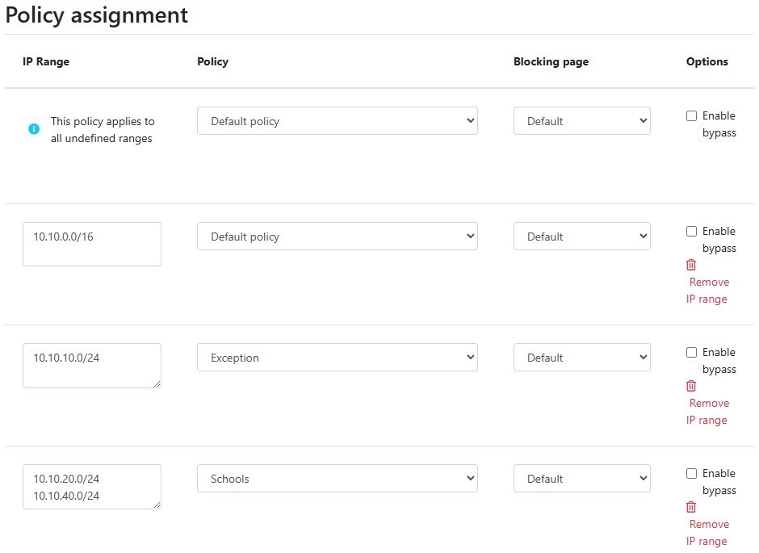

Správa resolveru
===================

V záložce **Resolvery** je přehled vytvořených resolverů. Správce může upravovat konfiguraci, nasazovat aktualizace a instalovat nové resolvery.

Přehled resolverů
------------------

V hlavním přehledu resolverů jsou dlaždice s podrobnostmi o resolveru. Přehled obsahuje informace o operačním systému a zdrojích jako využití CPU, paměti a HDD. Je zde také stav komunikačního kanálu mezi resolverem a cloudem označený barevnou tečkou.

Resolver se může nacházet v jednom z těchto stavů:

* **Aktivní** - Tento stav se očekává v produkčních prostředích a signalizuje, že vše běží správně. 
* **Problém s překladem** - Resolver není schopen překládat požadavky DNS.
* **Nedostupný** - Resolver ztratil spojení se službou Whalebone Cloud. Tento stav nemá vliv na překlad DNS, nicméně resolver nemůže získávat aktualizace databáze hrozeb a nemusí reagovat na změny zásad nebo konfigurace iniciované z portálu.
* **Upgrading** - Resolveru byl vydán příkaz k aktualizaci. Tento stav by neměl přetrvávat déle než několik minut.
* **Není nainstalován** - Resolver ještě nebyl nainstalován. 

Nahrání konfigurace
--------------------

Pokud došlo ke změnám konfigurace, které mají vliv na překlad DNS, je třeba následně **Nahrát konfiguraci**. Jinak se změny neprojeví. V případě, že jsou k dispozici nějaké změny konfigurace, které lze nasadit, bude na kartě resolveru viditelná **červená ikona** se šipkou vpravo. Po kliknutí na ni bude webová stránka požádána o potvrzení a v pravém horním rohu bude oznámeno úspěšné nasazení.

.. note:: Pokud nasazení skončilo chybou, zkuste akci zopakovat. Důvodem chyby může být krátkodobý výpadek komunikace mezi cloudem a resolverem.

.. image:: ./img/lrv2-deployconfig.gif
   :align: center

   Nahrání konfigrurace.

Nastevení bezpečnostní politky pro jednotlivé segmenty
------------------------------------------------------

Zásady zabezpečení a obsahu lze granulárním způsobem přiřadit různým segmentům sítě. 

Nastavení se vztahuje na jednotlivé resolvery a lze je nakonfigurovat v části **Resolvery** → ``Název resolveru`` → **Přiřazení politik**. 

.. note:: Konfigurace se vztahuje na zvlášť **pro každý resolver**. V případě, že chcete konfiguraci použít pro více resolverů, upravte konfiguraci u všech resolverů. 

Bezpečnostní politiky lze aplikovat přidáním rozsahů IP ve vstupních oknech:

.. image:: ./img/add-policy.PNG
   :align: center

   Přiřazení bezpečnostní politiky.
   
Pro lepší pochopení uvažujme příklad s rozsahem sítě ``10.10.0.0/16``. 
Vytvořili jsme 3 různé politiky:

Pro lepší pochopení uvažujme příklad s rozsahem sítě ``10.10.0.0/16``. 

Vytvořili jsme 3 různé zásady: 

* **Default**: zásada, kterou chceme použít pro celou síť, jedná se o nejobecnější zásadu.
* **Exception**: zásada, která musí být použita na konkrétní segment v síti, který bude mít zakázáno veškeré zabezpečení a filtrování obsahu.
* **School**: zásada, kterou chceme použít na 2 různé podsítě, které byly přiřazeny školnímu prostředí. V tomto případě jsme zvolili přísnější blokování.
.. image:: ./img/policies-example.png
   :align: center

.. note:: První možnost nastavení zásad je pro všechny nedefinované rozsahy. V případě různých zásad ovlivňujících stejný rozsah se použije ta, která je více granulární.

Shrňme požadavky do následující tabulky:

========================= ===============================
**Bezpečnostní politika** **Síťový rozsah**
========================= ===============================
Default                   10.10.0.0/16
Exception                 10.10.10.0/24
School                    10.10.20.0/24 a 10.10.40.0/24
========================= ===============================

Následující obrázek ukazuje proces přiřazování bezpečnostních politik k rozsahům.

.. note::  Po přidání politik k rozsahům je nutné kliknout na **Uložit do resolveru**, aby se přidání projevilo. Poté budou změny ověřeny a vyskakovací zpráva poskytne další informace.

Pro přiřazení dalších položek ke stávajícímu přiřazení lze přidat nový rozsah sítí pomocí **enteru** jako oddělovače.
V návaznosti na předchozí příklad bychom v případě, že bychom chtěli přidat podsíť ``10.10.30.0/24`` do bezpečnostní politiky **Exception**:

.. image:: ./img/add-range.gif
   :align: center

Konfigurace blokačních stránek
-------------------------

Podobně jako zásady zabezpečení lze k určitým rozsahům přiřadit i různé blokační stránky.

Prvním krokem je v detailu **Lokálního resolveru** v záložce **Přiřazení politik** v části **Nastavení blokační stránky**. Jsou dostupná dvě pole, do kterých je třeba vyplnit adresy IPv4 a IPv6 blokačních stránek.

.. tip:: Blokační stránky jsou umístěny **přímo** na resolverech, takže je třeba použít IP adresy, které jsou inzerovány klientům. Klienti pak budou při blokování přesměrováni na IP adresu resolveru. Zajistěte, aby byly na firewallu přístupné porty 80 a 443.

Pro každý přidaný rozsah IP adres je v rozevírací nabídce uvedena přiřazená blokační stránka. 

.. figure:: ./img/blocking-page-assign.png
   :alt: Přiřazení blokační stránky k adresnímu rozsahu.
   :align: center
   

.. important:: První položka v **Policy Assignment** je považována za Default/Fallback. V případě, že klient přistupuje k resolveru z nedefinovaného rozsahu IP bude spadat pod politiku a blokační stránků z daného defaultního rozsahu.

.. note:: Po provedení potřebných změn v nastavení stránky blokování zkontrolujte, zda je třeba resolvery znovu nasadit.  

Aktualizace/obnovení resolveru
------------------------------------

Po vydání nové verze resolveru se v rozhraní pro správu resolveru zobrazí **červená ikona upgradu**.

.. image:: ./img/upgrade.png
   :align: center

Po kliknutí na ikonu **Upgrade** se vybere příslušná nabídka a zobrazí se důležité informace o nové verzi.

Z této nabídky lze zahájit aktualizaci resolveru.

V případě, že instalace nové verze nepřinese očekávaný výsledek, je možné se kdykoli vrátit k předchozí verzi na kartě **Vrácení změn**:

.. image:: ./img/rollback.png
   :align: center
