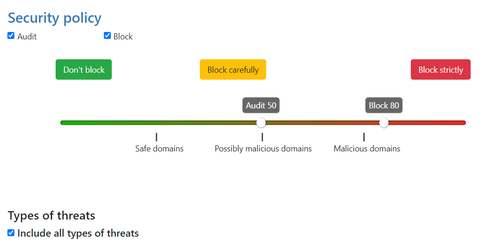
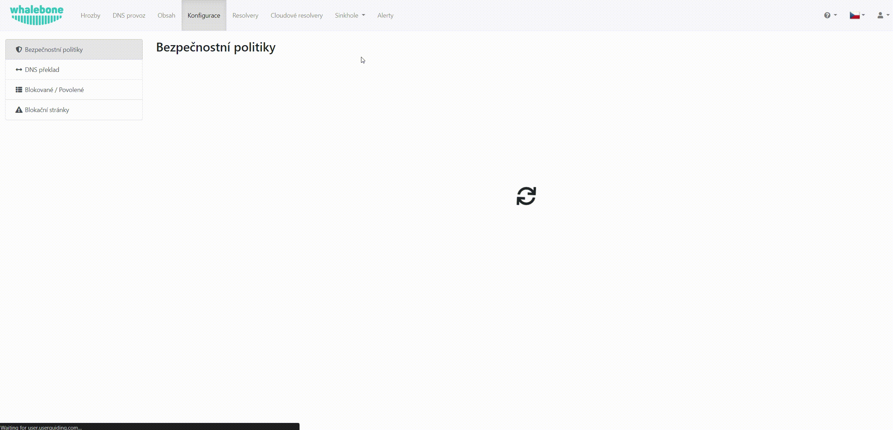
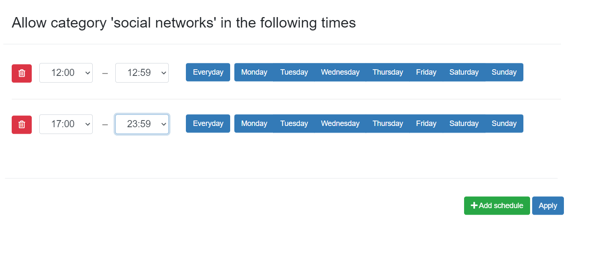

Bezpečnostní politiky
=====================

Videoprůvodce základní konfigurací bezpečnostních politiky krok za krokem si můžete prohlédnout `zde. <https://docs.whalebone.io/cs/latest/video_guides.html#basic-configuration>`_

Videoprůvodce krok za krokem s hlubším vysvětlením jak nastavovat bezpečnostní politiky naleznete `zde. <https://docs.whalebone.io/cs/latest/video_guides.html#security-policies>`_

Chcete-li pomocí Whalebone provádět filtraci provozu, musíte nakonfigurovat bezpečnostní politiku. Při instalaci je Whalebone dodáván s **výchozí** bezpečnostní politikou, která je nastavena tak, aby zahrnovala všechny typy hrozeb a nastavuje prahové hodnoty na hodnotu **80/50**. Tato politika se také automaticky aplikuje na každý nově nainstalovaný resolver. 
V každé politice lze nakonfigurovat několik možností:

Prahové hodnoty pro filtrování škodlivých domén
----------------------------------------------
Každá doména v naší databázi hrozeb má určitou hodnotu skóre. Skóre vyjadřuje, jak škodlivá je podle nás daná doména. V zásadách upravujete dvě hodnoty související se skóre:

* **Blokace** - Domény se skóre vyšším nebo rovným této hodnotě budou Whalebone resolverem blokovány a na požadavek klienta bude odpovězeno IP adresou blokující stránky. 
* **Audit** - Domény se skóre vyšším nebo rovným této hodnotě, ale nižším, než je prahová hodnota pro blokování, budou monitorovány. Požadavek na překlad bude povolen a odpověď bude doručena buď z mezipaměti, nebo provedením úplné rekurze DNS. Požadavky však budou logovány v panelu hrozeb pro případné pozdější prošetření.
Jednotlivé akce lze vypnout - např. vypnout blokování pro účely testování.

Hodnoty posuvníku definují pravděpodobnost, že daná doména je škodlivá, na stupnici od **0** do **100**, přičemž **100** je nejškodlivější.

.. tip:: V základním nastavením je prahová hodnota pro blokaci nastavena na **80**, což je bezpečné i pro větší sítě s volnější politikou vůči uživatelům. Pro restriktivnější politiku doporučujeme nastavit práh pro blokování na **70-75**, ve velmi restriktivních sítích dokonce až na **60**. Audit má čistě informativní charakter, nicméně příliš nízké nastavení prahu může vést k příliš velkému počtu zaznamenaných incidentů.

K dispozici jsou předkonfigurované zásady, které pokrývají nejběžnější případy. Jedná se o tyto případy: Tyto případy jsou následující: **Neblokovat**, **Blokovat opatrně** a **Blokovat striktně**.

* Nastavení **Blokovat opatrně** upřednostňuje nízkou míru falešně pozitivních výsledků a je vhodné pro poskytovatele internetových služeb.
* Nastavení **Blokovat striktně** maximalizuje míru detekce a je vhodné pro většinu firemních nasazení. 
* Nastavení **Neblokovat** zcela vypne blokování a způsobí, že Whalebone bude pracovat v transparentním/permisivním režimu, kdy bude incidenty pouze zaznamenávat (kontrolovat), ale nebude je aktivně blokovat.

Další politiky můžete nakonfigurovat kliknutím na kartu **Přidat politiku**. Nejprve vyberete, na které ze stávajících zásad má být nová zásada založena. Poté klikněte na tlačítko s tužkou pod položkou **Název zásady**, abyste ji zřetelně odlišili od ostatních.
Poté můžete upravit citlivost blokování a auditu, přidat seznamy odmítnutí nebo nastavit regulační filtrování. Nová zásada se uloží až po kliknutí na tlačítko **Uložit**.

.. tip:: Zásada není aktivní, pokud není přiřazena některým resolverům (místním nebo cloudovým). Chcete-li zahájit vynucování zásad, přejděte do části **Resolvery** → **Přiřazení politik** a přiřaďte je konkrétní **podsíti** nebo **resolveru**.

Typy hrozeb
-----------

Ve výchozím nastavení jsou zahrnuty všechny typy hrozeb. Pokud chcete některé z nich vyloučit, můžete tak učinit zrušením zaškrtnutí políčka **zahrnout všechny typy hrozeb**. V rozevírací nabídce nyní můžete vybrat konkrétní kategorie kontrolovaných/blokovaných hrozeb. K dispozici jsou tyto kategorie: **blacklist**, **c&c**, **coinminer**, **compromised**, **malware**, **phishing** a **spam**.

Úplný seznam toho, co jednotlivé kategorie zahrnují, naleznete níže: 

* **C&C (Command and Control)**: domény, které usnadňují komunikaci botnetu a koordinují jeho činnost. Botnet je síť infikovaných počítačů, které jsou řízeny jako skupina. 
* **Malware**: domény, které hostují a distribuují jakýkoli druh škodlivého kódu.
* **Phishing**: domény, jejichž cílem je oklamat uživatele a získat z nich citlivé informace, jako jsou údaje o kreditních kartách, přihlašovací údaje atd.
* **Blacklist**: domény, o kterých je známo, že slouží k více nekalým účelům současně nebo po určitou dobu.
* **Spam**: domény, které jsou spojeny s šířením nevyžádaných e-mailů a podvodných schémat.
* **Kompromitované**: jinak legitimní domény, které byly napadeny hackery a jsou dočasně používány ke škodlivým účelům.
* **Coinminer**: domény, které přebírají výpočetní a energetické zdroje pro nevyžádanou těžbu kryptoměn.

.. note:: Veškeré změny v zásadách zabezpečení se na resolvery aplikují přibližně za 2-3 minuty. Uložená konfigurace se používá při přípravě balíčku dat o hrozbách pro resolvery, které tyto balíčky v pravidelných intervalech stahují a aplikují.

Povolené
-----------

  * Domény, které nebudou nikdy blokovány (pokud nejsou také přítomny v seznamu domén podléhajícím právnímu omezení).
  * Seznam povolených domén má při vyhodnocování způsobu překladu domény druhou nejvyšší prioritu.
  * Seznam povolených se použije na doménu a všechny subdomény, např.: povolená doména ``whalebone.io`` povolí také ``docs.whalebone.io``, ale ne naopak.
  * Seznam lze nakonfigurovat na kartě **Blokované / Povolené** na levé straně stránky **Konfigurace**.
  * Jeden seznam může obsahovat až 10 000 domén.

Blokované
----------

  * Domény, které budou vždy blokovány (pokud se stejná doména nenachází také v seznamu povolených domén).
  * Seznam deny se vztahuje na doménu a všechny subdomény, např.: zakázaná doména ``malware.ninja`` bude zakázána také ``super.malware.ninja``, ale ne naopak.
  * Seznam lze nakonfigurovat na kartě **Blokované / Povolené** na levé straně stránky **Konfigurace**.
  * Jeden seznam může obsahovat až 10 000 domén.

Seznamy podporují zásadu `Lex specialis derogat legi generali`, podle níž má specifičtější seznam domén přednost před obecnějším seznamem domén. Tímto způsobem můžete mít celou doménu ``malware.ninja`` v seznamu Deny. 
ale pokud máte doménu ``friendly.malware.ninja`` v seznamu Allow, bude mít tato doména přednost a komunikace s touto stránkou bude fungovat jako výjimka a resolver ji povolí.

.. warning:: Po vytvoření seznamu povolených nebo zakázaných položek je třeba jej přiřadit ke konkrétní zásadě zabezpečení, jinak se změny neprojeví.

Právní omezení
--------------

  * Integrovaný seznam domén, které musí být použity, aby byly v souladu s regulačními omezeními dané země.
  * Příklady těchto domén zahrnují případy nelegálního hazardu nebo dětské pornografie. 
  * Domény na seznamu regulačních omezení budou vždy blokovány, pokud je tento seznam použit v zásadách zabezpečení.
  * Mají nejvyšší prioritu a jejich filtrování nelze zrušit. Ani přidání domény do seznamu povolených domén nezpůsobí, že ji resolver přestane blokovat.
     

.. warning:: Každá země má jiné seznamy domén podléhající právnímu omezení. V případě nasazení ve více zemích lze použít různé zásady, aby bylo možné uplatnit správná regulační omezení.

Obshahová filtrace
------------------

  Jednotlivé kategorie obsahu lze použít na úrovni jednotlivých politik. To je užitečné v případě, že různé segmenty sítí mají různé požadavky. Například v případě školního prostředí lze povolit všechny kategorie **Pro dospělé** a omezit přístup k příslušnému obsahu.

  K dispozici je rozmanitá sada kategorií filtrování obsahu:

* **Sexuální obsah**: Sexuální a pornografický materiál,
* **Gambling**: hry a činnosti zahrnující sázení peněz,
* **Zbraně**: zbraně a stránky týkající se zbraní,
* **Audio-video**: služby streamování audia a videa,
* **Hry**: online hry a herní webové stránky,
* **Chat**: aplikace pro zasílání rychlých zpráv a chatování,
* **Sociální sítě**: stránky a aplikace sociálních sítí,
* **Zneužívání dětí**: webové stránky týkající se zneužívání dětí, šíření dětské pornografie,
* **Drogy**: webové stránky týkající se drog včetně alkoholu a tabáku,
* **Rasismus**: obsah související s rasismem a xenofobií,
* **Násilí**: explicitní násilí a gore,
* **Terorismus**: domény spojené s podporou terorismu,
* **Reklamy**: bannery, kontextové reklamy a další reklamní systémy,
* **Těžba kryptoměn**: domény spojené s těžbou kryptoměn,
* **DoH**: DNS přes HTTPS. Jedná se o domény, které zajišťují obfuskaci požadavků DNS v provozu HTTP,
* **P2P**: domény spojené s peer to peer sítěmi, kde uživatelé sdílejí multimediální obsah,
* **Sledování**: webové a e-mailové sledovací systémy.

Filtr obsahu lze použít i pro konkrétní denní dobu. Po zaškrtnutí určité kategorie se vedle ní zobrazí ikona hodin. Pokud na ikonu hodin kliknete, můžete pro tuto kategorii přidat nový plán. Pro stejnou kategorii může být aktivních více rozvrhů. Takto můžete povolit přístup k sociálním sítím pouze během polední přestávky a po skončení pracovní doby. Nastavení dokončete kliknutím na tlačítko **Použít** a **Uložit** zásady zabezpečení.
   

.. note:: Použitím plánu **povolíte** přístup k doménám z dané kategorie obsahu v daném časovém období.