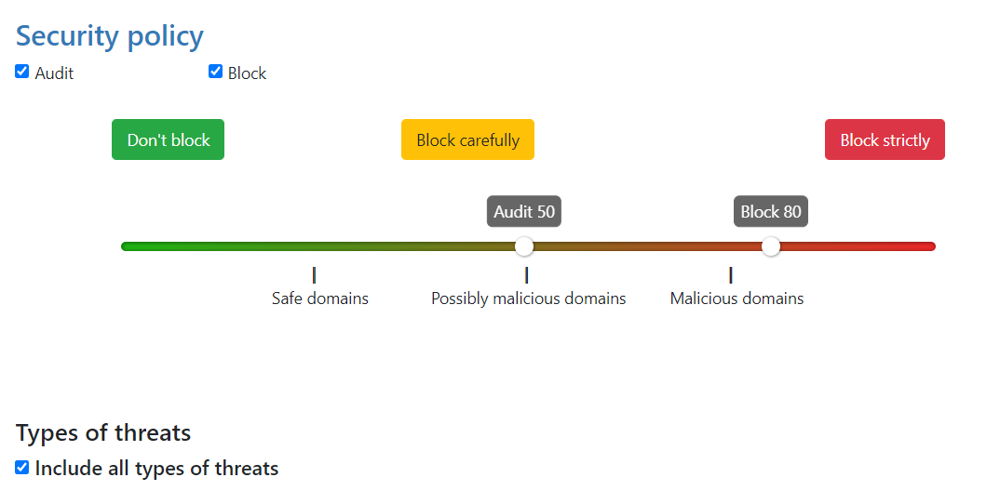
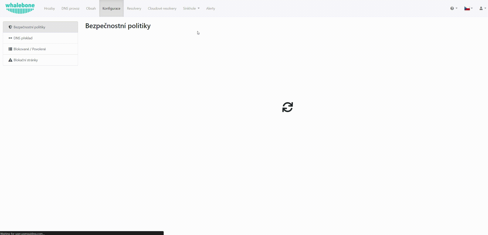
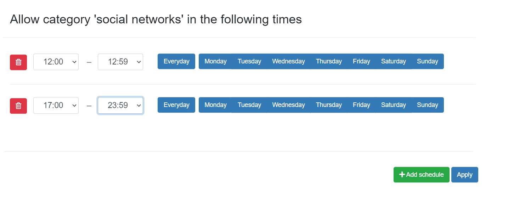

.. _Bezpecnostni politiky:

Bezpečnostní politiky
=====================

Videoprůvodce základní konfigurací bezpečnostních politik krok za krokem si můžete prohlédnout zde: :ref:`zde<Zakladni konfigurace video>`.

Videoprůvodce krok za krokem s hlubším vysvětlením jak nastavovat bezpečnostní politiky naleznete :ref:`zde<Bezpecnostni politiky video>`.

Chcete-li pomocí Whalebone provádět filtraci provozu, musíte nakonfigurovat bezpečnostní politiku. Při instalaci je Whalebone dodáván s **Výchozí politikou**, která je nastavena tak, aby zahrnovala všechny typy hrozeb a nastavuje prahové hodnoty na hodnotu **80/50**. Tato politika se také automaticky aplikuje na každý nově nainstalovaný resolver.

Bezpečnostní politiky se spravují v sekci **Konfigurace** → **Bezpečnostní politiky**. Každá politika je zobrazena na vlastní kartě; novou vytvoříte kliknutím na **+ Přidat politiku**. Pravý sloupec u každé politiky obsahuje:

* **Název politiky #{ID}** — editovatelný název politiky. Číselné ID za znakem ``#`` je interní identifikátor; uvádějte jej při kontaktování podpory ohledně konkrétní politiky.
* **Typ politiky** — přepínač **k dispozici i pro dceřiné organizace**, který zpřístupní politiku tenantům pod aktuální organizací. Model dědičnosti popisuje sekce :doc:`multitenancy`.
* **Přiřazené resolvery** — seznam resolverů (lokálních i cloudových), které tuto politiku aktuálně používají, s odkazem na detail každého resolveru.

V každé politice lze nakonfigurovat několik možností:

Prahové hodnoty pro filtrování škodlivých domén
-----------------------------------------------
Každá doména v naší databázi hrozeb má určitou hodnotu skóre. Skóre vyjadřuje, jak škodlivá je podle nás daná doména. V zásadách upravujete dvě hodnoty související se skóre:

* **Blokace** - Domény se skóre vyšším nebo rovným této hodnotě budou Whalebone resolverem blokovány a na požadavek klienta bude odpovězeno IP adresou blokující stránky.
* **Audit** - Domény se skóre vyšším nebo rovným této hodnotě, ale nižším, než je prahová hodnota pro blokování, budou monitorovány. Požadavek na překlad bude povolen a odpověď bude doručena buď z mezipaměti, nebo provedením úplné rekurze DNS. Požadavky však budou logovány v panelu hrozeb pro případné pozdější prošetření.

Každý krok lze samostatně zapnout nebo vypnout pomocí zaškrtávacích polí **Audit** a **Blokace** nad posuvníkem prahových hodnot. Vypnutím **Blokace** například spustíte politiku v režimu pouze pro audit při ladění prahových hodnot. Aktuálně nastavené hodnoty jsou vedle posuvníku zobrazeny jako popisky **Audit {hodnota}** a **Blokace {hodnota}**; pod osou jsou vyznačeny zóny **Bezpečné domény**, **Pravděpodobně nebezpečné domény** a **Nebezpečné domény**.

Hodnoty posuvníku definují pravděpodobnost, že daná doména je škodlivá, na stupnici od **0** do **100**, přičemž **100** je nejškodlivější.

.. tip:: V základním nastavením je prahová hodnota pro blokaci nastavena na **80**, což je bezpečné i pro větší sítě s volnější politikou vůči uživatelům. Pro restriktivnější politiku doporučujeme nastavit práh pro blokování na **70-75**, ve velmi restriktivních sítích dokonce až na **60**. Audit má čistě informativní charakter, nicméně příliš nízké nastavení prahu může vést k příliš velkému počtu zaznamenaných incidentů.

K dispozici jsou předkonfigurované zásady, které pokrývají nejběžnější případy. Jedná se o tyto případy: **Neblokovat**, **Blokovat opatrně** a **Blokovat striktně**.

* Nastavení **Blokovat opatrně** upřednostňuje nízkou míru falešně pozitivních výsledků a je vhodné pro poskytovatele internetových služeb.
* Nastavení **Blokovat striktně** maximalizuje míru detekce a je vhodné pro většinu firemních nasazení.
* Nastavení **Neblokovat** zcela vypne blokování a způsobí, že Whalebone bude pracovat v transparentním/permisivním režimu, kdy bude incidenty pouze zaznamenávat (auditovat), ale nebude je aktivně blokovat.

Další politiky můžete nakonfigurovat kliknutím na kartu **+ Přidat politiku**. Nejprve vyberete, na které ze stávajících zásad má být nová zásada založena. Poté klikněte na tlačítko s tužkou pod položkou **Název politiky**, abyste ji zřetelně odlišili od ostatních.
Poté můžete upravit citlivost blokování a auditu, přidat seznamy odmítnutí nebo nastavit regulační filtrování. Nová zásada se uloží až po kliknutí na tlačítko **Uložit**.

.. tip:: Zásada není aktivní, pokud není přiřazena některým resolverům (místním nebo cloudovým). Chcete-li zahájit vynucování zásad, přejděte do části **Resolvery** → **Přiřazení politik** a přiřaďte je konkrétní **podsíti** nebo **resolveru**.

.. _Typy hrozeb video:

Typy hrozeb
-----------

Ve výchozím nastavení jsou zahrnuty všechny typy hrozeb. Pokud chcete některé z nich vyloučit, můžete tak učinit zrušením zaškrtnutí políčka **Zahrnout všechny typy hrozeb**. V rozevírací nabídce nyní můžete vybrat konkrétní kategorie kontrolovaných/blokovaných hrozeb. K dispozici jsou tyto kategorie: **blacklist**, **c&c**, **coinminer**, **compromised**, **malware**, **phishing** a **spam**.

Úplný seznam toho, co jednotlivé kategorie zahrnují, naleznete níže:

* **C&C (Command and Control)**: domény, které usnadňují komunikaci botnetu a koordinují jeho činnost. Botnet je síť infikovaných počítačů, které jsou řízeny jako skupina.
* **Malware**: domény, které hostují a distribuují jakýkoli druh škodlivého kódu.
* **Phishing**: domény, jejichž cílem je oklamat uživatele a získat z nich citlivé informace, jako jsou údaje o kreditních kartách, přihlašovací údaje atd.
* **Blacklist**: domény, o kterých je známo, že slouží k více nekalým účelům současně nebo po určitou dobu.
* **Spam**: domény, které jsou spojeny s šířením nevyžádaných e-mailů a podvodných schémat.
* **Kompromitované**: jinak legitimní domény, které byly napadeny hackery a jsou dočasně používány ke škodlivým účelům.
* **Coinminer**: domény, které přebírají výpočetní a energetické zdroje pro nevyžádanou těžbu kryptoměn.

.. note:: Veškeré změny v zásadách zabezpečení se na resolvery aplikují přibližně za 2-3 minuty. Uložená konfigurace se používá při přípravě balíčku dat o hrozbách pro resolvery, které tyto balíčky v pravidelných intervalech stahují a aplikují.

Individuální seznamy povolených a blokovaných domén
---------------------------------------------------

V politice se nastavují dvě skupiny vlastních seznamů domén: **Povolené** (allow lists) a **Blokované** (deny lists). Samotné seznamy se spravují na samostatné podstránce **Blokované / Povolené** (viz níže), zde v politice se vybírá, které z existujících seznamů se na ni mají vztahovat.

Povolené
~~~~~~~~

* Domény, které nebudou nikdy blokovány (pokud nejsou také přítomny v seznamu domén podléhajícím zákonné regulaci).
* Seznam **Povolené** má při vyhodnocování způsobu překladu domény druhou nejvyšší prioritu.
* Seznam se použije na doménu a všechny subdomény, např.: povolená doména ``whalebone.io`` povolí také ``docs.whalebone.io``, ale ne naopak.
* Seznam lze nakonfigurovat na samostatné podstránce **Blokované / Povolené** v levém menu sekce **Konfigurace** (sloupec **Povolené** v pravé části podstránky).
* Jeden seznam může obsahovat až 10 000 domén. Pro větší feedy kontaktujte `support <mailto:support@whalebone.io>`_ kvůli aktivaci funkce **Soukromé zdroje**.

Blokované
~~~~~~~~~

* Domény, které budou vždy blokovány (pokud se stejná doména nenachází také v seznamu **Povolené**).
* Seznam **Blokované** se vztahuje na doménu a všechny subdomény, např.: zakázaná doména ``malware.ninja`` bude zakázána také ``super.malware.ninja``, ale ne naopak.
* Seznam lze nakonfigurovat na samostatné podstránce **Blokované / Povolené** v levém menu sekce **Konfigurace** (sloupec **Blokované** v levé části podstránky).
* Jeden seznam může obsahovat až 10 000 domén. Pro větší feedy kontaktujte `support <mailto:support@whalebone.io>`_ kvůli aktivaci funkce **Soukromé zdroje**.

Každá karta seznamu zobrazuje **Počet domén v seznamu** a kolik politik na něj aktuálně odkazuje (odznak **"1× použito"**, **"2× použito"** …), takže snadno odhalíte nepoužívané seznamy.

Seznamy podporují zásadu `Lex specialis derogat legi generali`, podle níž má specifičtější seznam domén přednost před obecnějším seznamem domén. Tímto způsobem můžete mít celou doménu ``malware.ninja`` v seznamu **Blokované**,
ale pokud máte doménu ``friendly.malware.ninja`` v seznamu **Povolené**, bude mít tato doména přednost a komunikace s touto stránkou bude fungovat jako výjimka a resolver ji povolí.

.. warning:: Po vytvoření seznamu **Povolené** nebo **Blokované** je třeba jej přiřadit ke konkrétní zásadě zabezpečení, jinak se změny neprojeví.

Zákonné regulace
----------------

* Integrovaný seznam domén, které musí být použity, aby byly v souladu s regulačními omezeními dané země.
* Příklady těchto domén zahrnují případy nelegálního hazardu nebo dětské pornografie.
* Domény na seznamu zákonných regulací budou vždy blokovány, pokud je tento seznam použit v zásadách zabezpečení.
* Mají nejvyšší prioritu a jejich filtrování nelze zrušit. Ani přidání domény do seznamu **Povolené** nezpůsobí, že ji resolver přestane blokovat.

.. warning:: Každá země má jiné seznamy zákonných regulací. V případě nasazení ve více zemích lze použít různé zásady, aby bylo možné uplatnit správné **Zákonné regulace**.

Obsahová filtrace
-----------------

Jednotlivé kategorie obsahu lze použít na úrovni jednotlivých politik. To je užitečné v případě, že různé segmenty sítí mají různé požadavky. Například v případě školního prostředí lze povolit všechny kategorie **Pro dospělé** a omezit přístup k příslušnému obsahu.

V portálu jsou kategorie uspořádány do čtyř skupin, které lze přepínat jako celek nebo jednotlivě po kategoriích:

* **Kriminalita** — Drogy, Násilí, Rasismus, Terorismus, Zneužívání dětí.
* **Nechtěné** — DoH, P2P, Reklamy, Sledování, Těžba kryptoměn, VPN a proxy služby.
* **Pro dospělé** — Gambling, Sexuální obsah, Zbraně.
* **Zábava** — Audio/video, Chat, Hry, Sociální sítě.

K dispozici je rozmanitá sada kategorií filtrování obsahu:

* **Sexuální obsah**: Erotický a pornografický obsah,
* **Gambling**: hry a aktivity s prvky sázek,
* **Zbraně**: stránky o zbraních,
* **Audio/video**: streamovací služby,
* **Hry**: online hry a herní stránky,
* **Chat**: aplikace pro chat a instant messaging,
* **Sociální sítě**: různé druhy sociálních sítí a aplikací,
* **Zneužívání dětí**: domény spojené se zneužíváním dětí,
* **Drogy**: stránky týkající se drog, včetně alkoholu a tabákových výrobků,
* **Rasismus**: obsah spojený s rasismem a xenofobií,
* **Násilí**: explicitní násilí a krev,
* **Terorismus**: domény spojené s podporou terorismu,
* **Reklamy**: bannery, kontextové reklamy a celé reklamní systémy,
* **Těžba kryptoměn**: domény spojené s těžbou kryptoměn,
* **DoH**: DNS přes HTTPS — domény poskytující obfuskaci DNS dotazů v HTTP provozu,
* **P2P**: peer to peer sítě,
* **Sledování**: systémy sledování mailu a pohybu po Webu,
* **VPN a proxy služby**: webové stránky a služby poskytující VPN nebo anonymizační proxy.

Bezpečné vyhledávání
^^^^^^^^^^^^^^^^^^^^

Nejznámější vyhledávače nabízejí možnost bezpečného vyhledávání — filtrování výsledků bezpečných pro děti. Bezpečné vyhledávání je automaticky zapnuto, pokud je povoleno filtrování pro jednu z následujících kategorií obsahu:

* Sexuální obsah (Pro dospělé)
* Zbraně (Pro dospělé)
* Zneužívání dětí (Kriminalita)
* Drogy (Kriminalita)
* Terorismus (Kriminalita)
* Násilí (Kriminalita)

Podporovány jsou následující vyhledávače:

* Google
* YouTube
* Bing
* DuckDuckGo
* Ecosia

Plánovač filtrování
^^^^^^^^^^^^^^^^^^^

Filtr obsahu lze použít i pro konkrétní denní dobu. Po zaškrtnutí určité kategorie se vedle ní zobrazí ikona hodin a odkaz **Povolit kategorii '{název}' v následujících časech**. Pokud na něj kliknete, můžete pro tuto kategorii přidat nový plán. Pro stejnou kategorii může být aktivních více rozvrhů. Takto můžete povolit přístup k sociálním sítím pouze během polední přestávky a po skončení pracovní doby. Nastavení dokončete kliknutím na tlačítko **Použít** a **Uložit** zásady zabezpečení.

.. note:: Použitím plánu **povolíte** přístup k doménám z dané kategorie obsahu v daném časovém období.

Pořadí vykonávání filtrů
------------------------

Všechny dříve zmíněné filtry jsou aplikovány jeden po druhém. Níže najdete seznam filtrů seřazený podle priority od nejvyšší po nejnižší, tj. jak jimi postupně prochází DNS dotazy:

#. Zákonné regulace
#. Blokované
#. Povolené
#. Obsahová filtrace
#. Blokování domény podle prahové hodnoty
#. Audit domény podle prahové hodnoty

.. note:: Jak je uvedeno v kapitolách **Povolené** a **Blokované**, specifičtější doména, např. ``friendly.malware.ninja``, může být povolena i v případě, že je obecnější doména, např. ``malware.ninja``, blokována.
