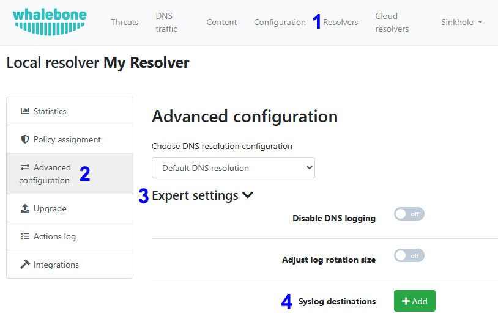

==================
Syslog integrace
==================

Integrace syslogu ve Whalebone poskytuje spolehlivý export bezpečnostních a provozních dat v reálném čase přímo z každého lokálního resolveru Whalebone do průmyslově standardních SIEM nástrojů, jako jsou Splunk, Elastic nebo jakékoliv kompatibilní externí řešení pro správu logů. Tato schopnost umožňuje organizacím centralizovat sběr logů, korelovat události DNS zabezpečení s dalšími zdroji dat a vytvářet automatizované detekční a reakční workflow. Streamováním událostí ve standardním formátu syslog je zajištěna bezproblémová integrace do stávající monitorovací infrastruktury a současně je podporována compliance, auditní požadavky a pokročilá analýza hrozeb.

Integraci syslogu lze povolit v Admin Portálu v sekci Resolvers > Edit resolver > Advanced Configuration > Expert settings.

Požadavky
---------

* Resolver s povolenou integrací syslogu může otevřít spojení k cílovému externímu řešení pro správu logů na portu uvedeném v nastavení resolveru. Protokol je ve výchozím nastavení UDP.

Logovací soubory
----------------

Administrátoři mají možnost určit, jaký typ dat chtějí exportovat. Popis jednotlivých logovacích souborů je uveden níže:

* **content.log**: Domény blokované obsahovým filtrem.

* **debug.log**: Dodatečná ladicí data. Tento soubor obsahuje data pouze v případě, že je ladicí režim povolen technikem Whalebone.

* **metrics.log**: Metriky týkající se operačního systému, využití disku, využití CPU, využití paměti, statistik běhu Dockeru a jednotlivých služeb Whalebone.

* **passivedns.log**: Veškerý DNS provoz.

* **whalebone.log**: Všechny detekované hrozby.

* **agent/agent-docker-connector.log**: Seznam odstraněných Docker kontejnerů. Docker kontejnery jsou odstraňovány nebo nahrazovány během aktualizací nebo změn konfigurace.

* **agent/agent-lr-agent.log**: Přehled komunikace a detailní konfigurace získané z Whalebone cloudu.

* **agent/agent-main.log**: Zprávy o kontrolách stavu souvisejících se službou lr-agent.

* **agent/agent-status.log**: Stav služby, která přijímá aktualizace konfigurace z Whalebone cloudu.

.. note:: Nejvýznamnější logovací soubory jsou content.log, passivedns.log a whalebone.log. Ostatní slouží především k řešení potíží techniky Whalebone.

Příklady
--------

Zde jsou některé příklady nejčastěji používaných logovacích souborů content.log, passivedns.log a whalebone.log:

content.log
^^^^^^^^^^^

.. code-block:: python

    {
        "timestamp": "2025/06/12 06:44:27.049917",
        "action": "block",
        "server_ip": "192.168.0.10",
        "client_ip": "192.168.10.41",
        "domain": "whalebone.com",
        "ioc": "whalebone.com",
        "identity": "wb-default-policy",
        "mobile_client_id": "",
        "device_id": "",
        "content_types": [
            "social-networks"
         ],
        "legal_types": [],
        "app_blocked_intersect": [],
        "scheduled_filter": [],
        "scheduled_internet": "false",
        "policy_name": "",
        "policy_group_id": "",
        "policy_tags": "",
        "pin": "0",
        "region": "eu-01",
        "segment_id": "",
        "brand_id": "",
        "subscription_id": "",
        "answer": "SINKHOLE_IP",
        "sinkhole_type": "1",
        "port": "56121",
        "type": "A",
        "rcode": "0",
        "matrix": {
            "accuracy_audit": "false",
            "accuracy_block": "false",
            "content": "true",
            "advertisement": "false",
            "legal": "false",
            "whitelist": "false",
            "blacklist": "false",
            "bypass": "false",
            "apps_blocked": "false",
            "apps_allowed": "false"
        }
    }

Pole v souboru content.log s vysvětleními a možnými hodnotami:

- **timestamp [string]** : Datum a čas, kdy k události došlo.

- **action [string]**: Akce provedená resolverem.
    - "block": DNS požadavek byl zablokován a klient obdržel odpověď s IP adresou blokační stránky.
    - "allow": DNS dotaz byl povolen na základě požadavku uživatele o obejití blokační stránky.

- **server_ip [string]**: IP adresa resolveru, který zpracoval DNS požadavek.

- **client_ip [string]**: IP adresa klienta, který odeslal DNS požadavek.

- **domain [string]**: Název dotazované domény.

- **ioc [string]**: Indikátor kompromitace (Indicator of Compromise) obsahující konkrétní doménu, která vyvolala bezpečnostní událost.

- **identity [string]**: Interní identifikátor pro IP adresu nebo rozsah IP, který je vázán na konkrétní politiku (např. "wb-default-policy" nebo jakýkoli jiný unikátní název politiky).

- **mobile_client_id [string]**: Identifikátor mobilního klienta parsovaný z TLS, používaný v rámci Home Office Security.

- **device_id [string]**: ID zařízení využívajícího Home Office Security.

- **content_types [array]** : Kategorie obsahu, do kterých doména spadá.
    - "porn"
    - "gambling"
    - "sexual-content"
    - "weapons"
    - "child-abuse"
    - "drugs"
    - "racism"
    - "terrorism"
    - "violence"
    - "audio-video"
    - "chat"
    - "games"
    - "social-networks"
    - "advertisement"
    - "coinminer"
    - "doh"
    - "p2p"
    - "tracking"
    - "vpn-proxies"
    - "freemail"
    - "alcohol-cigarettes"

- **legal_types [array]**: Identifikátory zákonných omezení, která vyvolala zablokování.

- **app_blocked_intersect [array]**: Konkrétní aplikace, které byly v rámci aktuálního požadavku zablokovány (např. "discord", "netflix").

- **scheduled_filter [array]**: Kategorie obsahu, které byly dotazovány a mají nastaveno plánované povolení.

- **scheduled_internet [string]**: Booleovská hodnota indikující, zda je v současné době přístup k internetu omezen na základě předdefinovaného časového plánu.

- **policy_name [string]**: Název zvolené politiky pro daný požadavek.

- **policy_group_id [string]**: ID zvolené politiky pro daný požadavek.

- **policy_tags [string]**: Označení zvolené politiky pro účely seskupování a filtrování požadavků.

- **pin [string]**: Numerická hodnota často používaná ke sledování pokusů o obejití nebo specifických příznaků politiky; výchozí hodnota je "0".

- **region [string]**: Region nasazení u zákazníka.
    - "eu-01"
    - "apac-01"
    - "am-01"
    - "": Hlavní (původní) region.  

- **segment_id [string]**: Identifikátor pro konkrétní síť nebo zákaznický segment.

- **brand_id [string]**: Identifikátor pro konkrétní značku v multi-tenantním prostředí nebo v prostředí white-label.

- **subscription_id [string]**: Identifikátor předplatného uživatele nebo organizace.

- **answer [string]**: Odpověď poskytnutá uživateli v DNS záznamu.
    - "SINKHOLE_IP": IP adresa blokační stránky.

- **sinkhole_type**: Typ použitého sinkhole mechanismu.

- **port [string]**: Číslo portu klienta pro DNS požadavek.

- **type [string]**: Typ DNS záznamu (např. "A", "AAAA", "CNAME").

- **rcode [string]**: Návratový kód DNS v odpovědi.

- **matrix [object]**: Booleovské hodnoty pro resolver k určení akce.
    - "accuracy_audit": "true", pokud skóre přesnosti domény dosáhlo prahu pro audit (záznam bez blokování), jinak "false".
    - "accuracy_block": "true", pokud skóre přesnosti dosáhlo prahu pro bezpečnostní zablokování.
    - "content": "true", pokud dotaz spadá pod filtrování obsahu, jinak "false".
    - "advertisement": "true", pokud dotaz spadá pod filtrování reklamního obsahu, jinak "false".
    - "legal": "true", pokud dotaz podléhá regulačním omezením, jinak "false".
    - "whitelist": "true", pokud je doména z dotazu na seznamu povolených, jinak "false".
    - "blacklist": "true", pokud je doména z dotazu na seznamu zakázaných, jinak "false".
    - "bypass": "true", pokud uživatel obešel zablokování dotazu, jinak "false".
    - "apps_blocked": "true", pokud dotaz spadá pod pravidla pro blokování na úrovni aplikací, jinak "false".
    - "apps_allowed": "true", pokud dotaz spadá pod pravidla pro povolení na úrovni aplikací, jinak "false".

passivedns.log
^^^^^^^^^^^^^^

.. code-block:: python

    {
        "response_time": "2025-07-24T06:16:50.140828Z",
        "client": "192.168.10.41",
        "server": "192.168.0.10",
        "class": "IN",
        "type": "A",
        "query_port": 39170,
        "response_port": 53,
        "query": "whalebone.com.",
        "answer": "3.33.251.168",
        "identity": "wb-default-policy",
        "ttl": 1,
        "rcode": 0,
        "ede_code": -1,
        "protocol": "UDP",
        "region": "eu-01",
        "rtt": 0
    }

Pole v souboru passivedns.log s vysvětleními a možnými hodnotami:

- **response_time [string]**: Datum a čas, kdy byla odeslána odpověď.

- **client [string]**: IP adresa klienta, který odeslal DNS požadavek.

- **server [string]**: IP adresa resolveru, který zpracoval DNS požadavek.

- **class [string]**: Třída DNS požadavku, obvykle "IN".

- **type [string]**: Typ DNS záznamu (např. "A", "AAAA", "CNAME").

- **query_port [number]**: Číslo portu klienta pro DNS požadavek.

- **response_port [number]**: Číslo portu serveru pro DNS odpověď.

- **query [string]**: Název dotazované domény.

- **answer [string]**: IP adresa vrácená v DNS odpovědi.

- **identity [string]**: Interní identifikátor pro IP adresu nebo rozsah IP, který je vázán na konkrétní politiku (např. "wb-default-policy" nebo jakýkoli jiný unikátní název politiky).

- **ttl [number]**: Hodnota Time To Live pro DNS záznam, udávající, jak dlouho může být záznam uchován v mezipaměti.

- **rcode [number]**: Návratový kód DNS v odpovědi.

- **ede_code [number]**: Rozšířený kód chyby DNS (Extended DNS Error), který poskytuje dodatečné informace o DNS odpovědi; "-1", pokud není kód poskytnut.

- **protocol [string]**: Protokol použitý pro DNS požadavek.
    - "UDP"
    - "TCP"
    - "DOT"
    - "DOH"
    - "QUIC"

- **region [string]**: Region nasazení u zákazníka.
    - "eu-01"
    - "apac-01"
    - "am-01"
    - "": Hlavní (původní) region.

- **rtt [number]**: Doba odezvy DNS; výchozí hodnota je "0", pokud je neznámá.

whalebone.log
^^^^^^^^^^^^^

.. code-block:: python

    {
        "timestamp": "2025/08/18 13:07:20.460737",
        "action": "block",
        "server_ip": "192.168.0.10",
        "client_ip": "192.168.10.41",
        "domain": "spam.test.attacker.online",
        "ioc": "spam.test.attacker.online",
        "identity": "wb-default-policy",
        "mobile_client_id": "",
        "device_id": "",
        "accuracy": "100",
        "threat_types": [
            "spam"
        ],
        "app_blocked_intersect": [],
        "scheduled_internet": "false",
        "policy_name": "",
        "policy_group_id": "",
        "policy_tags": "",
        "pin": "0",
        "region": "eu-01",
        "segment_id": "",
        "brand_id": "",
        "subscription_id": "",
        "answer": "SINKHOLE_IP",
        "sinkhole_type": "8",
        "port": "63559",
        "type": "HTTPS",
        "rcode": "0",
        "matrix": {
            "accuracy_audit": "true",
            "accuracy_block": "true",
            "content": "false",
            "advertisement": "false",
            "legal": "false",
            "whitelist": "false",
            "blacklist": "false",
            "bypass": "false",
            "apps_blocked": "false",
            "apps_allowed": "false"
        }
    }

Pole v souboru whalebone.log s vysvětleními a možnými hodnotami:

- **timestamp [string]**: Datum a čas, kdy k události došlo.

- **action [string]**: Akce provedená resolverem.
    - "block": DNS požadavek byl zablokován a klient obdržel odpověď s IP adresou blokační stránky.
    - "audit": DNS požadavek byl zaznamenán pro účely auditu. Tento typ akce se používá pro monitorování a analýzu provozu bez ovlivnění běžného chování klientů.
    - "allow": DNS dotaz byl povolen na základě požadavku uživatele o obejití blokační stránky.

- **server_ip [string]**: IP adresa resolveru, který zpracoval DNS požadavek.

- **client_ip [string]**: IP adresa klienta, který odeslal DNS požadavek.

- **domain [string]**: Název dotazované domény.

- **ioc [string]**: Indikátor kompromitace (Indicator of Compromise) obsahující konkrétní doménu, která vyvolala bezpečnostní událost.

- **identity [string]**: Interní identifikátor pro IP adresu nebo rozsah IP, který je vázán na konkrétní politiku (např. "wb-default-policy" nebo jakýkoli jiný unikátní název politiky).

- **mobile_client_id [string]**: Identifikátor mobilního klienta parsovaný z TLS, používaný v rámci Home Office Security.

- **device_id [string]**: ID zařízení využívajícího Home Office Security.

- **accuracy [string]**: Hodnota od 0 do 100 představující úroveň důvěry, že doména je skutečně škodlivá. Je založena na více faktorech, jako je konsenzus bezpečnostních dodavatelů, objem provozu napříč resolvery Whalebone, podezřelé vzorce komunikace a výsledky interního výzkumu.

- **threat_types [array]**: Kategorie zjištěných hrozeb.
    - "malware"
    - "phishing"
    - "c2c"
    - "spam"
    - "blacklist"
    - "coinminer"
    - "compromised"

- **app_blocked_intersect [array]**: Konkrétní aplikace, které byly v rámci aktuálního požadavku zablokovány (např. "discord", "netflix").

- **scheduled_internet [string]**: Booleovská hodnota indikující, zda je v současné době přístup k internetu omezen na základě předdefinovaného časového plánu.

- **policy_name [string]**: Název zvolené politiky pro daný požadavek.

- **policy_group_id [string]**: ID zvolené politiky pro daný požadavek.

- **policy_tags [string]**: Označení zvolené politiky pro účely seskupování a filtrování požadavků.

- **pin [string]**: Numerická hodnota často používaná ke sledování pokusů o obejití nebo specifických příznaků politiky; výchozí hodnota je "0".

- **region [string]**: Region nasazení u zákazníka.
    - "eu-01"
    - "apac-01"
    - "am-01"
    - "": Hlavní (původní) region.

- **segment_id [string]**: Identifikátor pro konkrétní síť nebo zákaznický segment.

- **brand_id [string]**: Identifikátor pro konkrétní značku v multi-tenantním prostředí nebo v prostředí white-label.

- **subscription_id [string]**: Identifikátor předplatného uživatele nebo organizace.

- **answer [string]**: Odpověď poskytnutá uživateli v DNS záznamu.
    - "SINKHOLE_IP": IP adresa blokační stránky.

- **sinkhole_type [string]**: Identifikátor sinkhole mechanismu použitého pro blokování.

- **port [string]**: Číslo portu klienta pro DNS požadavek.

- **type [string]**: Typ DNS záznamu (např. "A", "AAAA", "CNAME", "HTTPS").

- **rcode [string]**: Návratový kód DNS v odpovědi.

- **matrix [object]**: Booleovské hodnoty pro resolver k určení akce.
    - "accuracy_audit": "true", pokud skóre přesnosti domény dosáhlo prahu pro audit (záznam bez blokování), jinak "false".
    - "accuracy_block": "true", pokud skóre přesnosti dosáhlo prahu pro bezpečnostní zablokování, jinak "false".
    - "content": "true", pokud dotaz spadá pod filtrování obsahu, jinak "false".
    - "advertisement": "true", pokud dotaz spadá pod filtrování reklamního obsahu, jinak "false".
    - "legal": "true", pokud dotaz podléhá regulačním omezením, jinak "false".
    - "whitelist": "true", pokud je doména z dotazu na seznamu povolených, jinak "false".
    - "blacklist": "true", pokud je doména z dotazu na seznamu zakázaných, jinak "false".
    - "bypass": "true", pokud uživatel obešel zablokování dotazu, jinak "false".
    - "apps_blocked": "true", pokud dotaz spadá pod pravidla pro blokování na úrovni aplikací, jinak "false".
    - "apps_allowed": "true", pokud dotaz spadá pod pravidla pro povolení na úrovni aplikací, jinak "false".

Limitatace
----------

* Integrace syslogu používá protokol UDP. Pokud chcete použít protokol TCP nebo TLS, obraťte se prosím na Whalebone HelpDesk.
