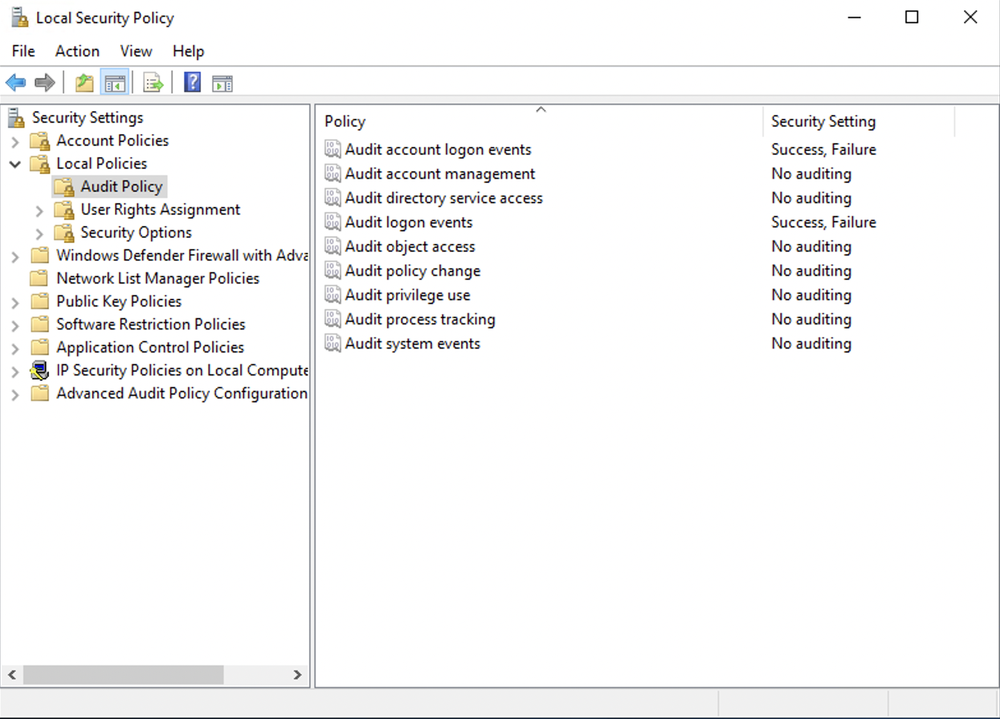
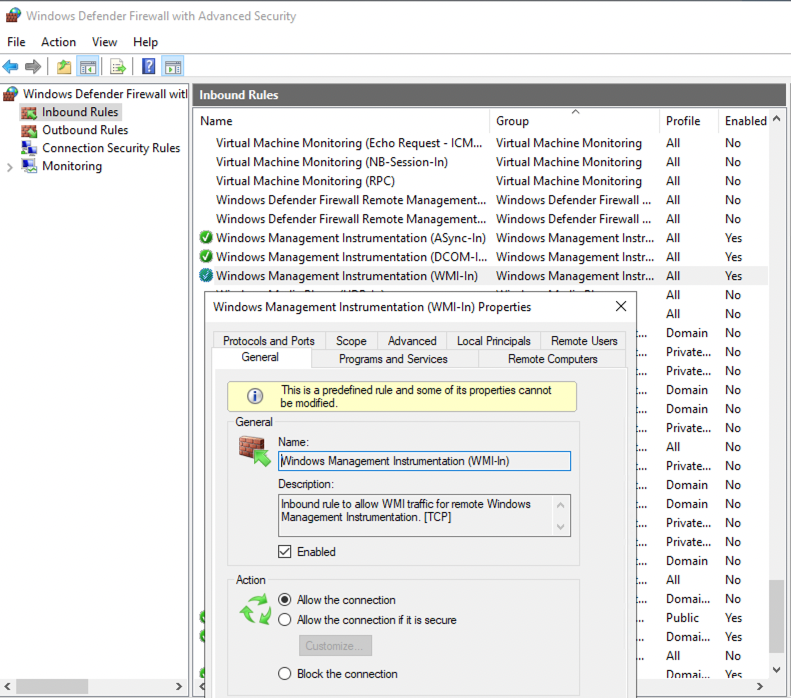
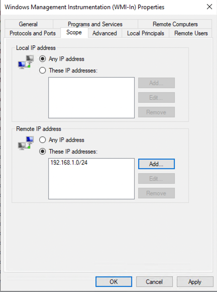
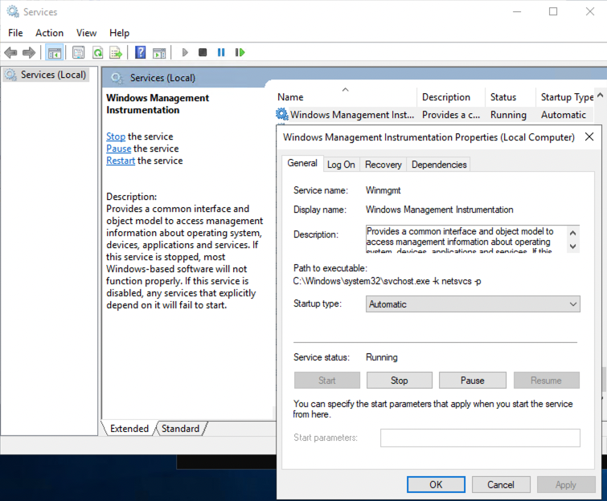
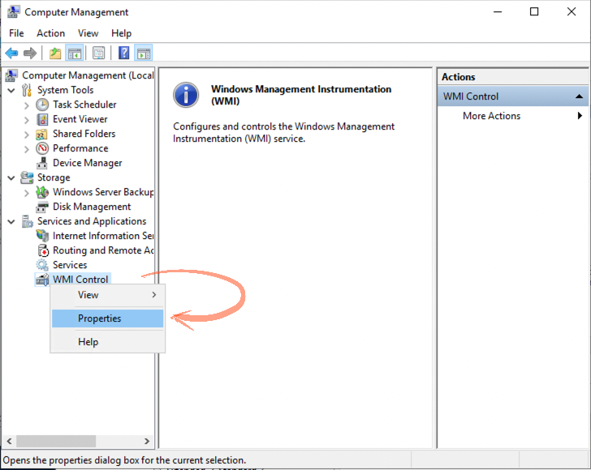
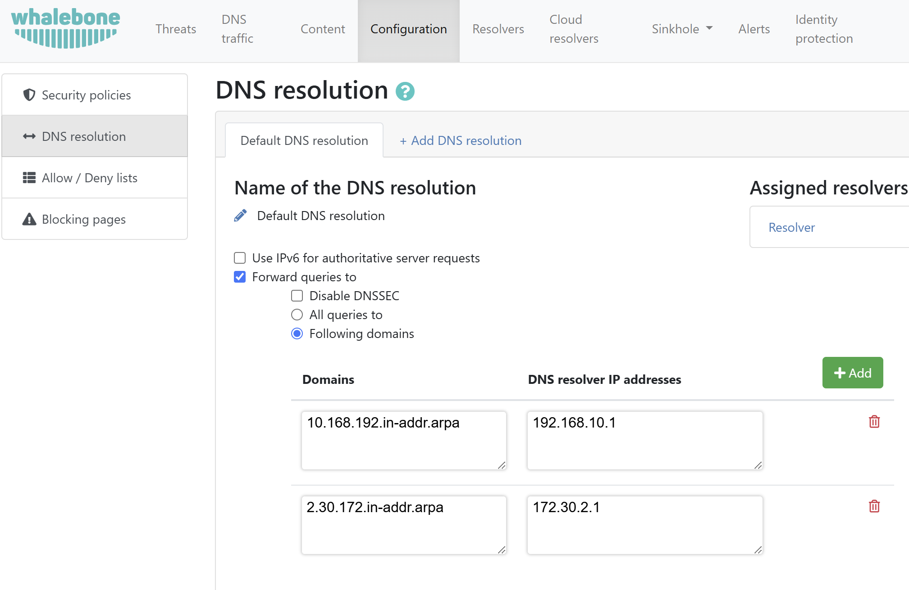
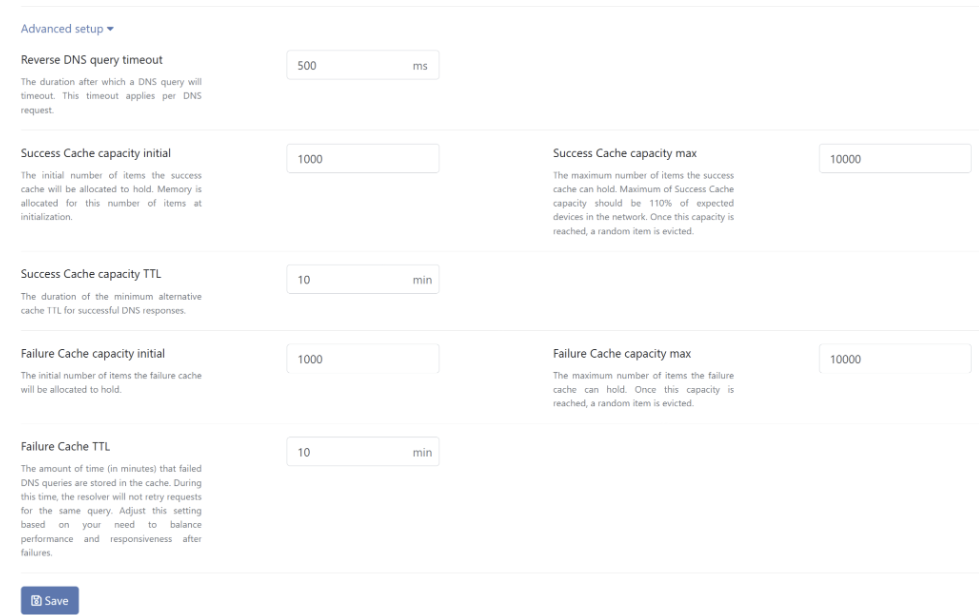

============================
Active Directory Integration
============================

DNS lookup integration
======================

In order to get the device name visibility in the logs Whalebone |product| can be easily integrated with Active Directory.
Visibility to device name speeds up the analysis and troubleshooting since the administrator does not have to look up for the device name in the DHCP logs.

How it works?
=============

Once configured, Whalebone resolver asks the authoritative name server for the device name using PTR record. A PTR (Pointer) record is a type of DNS record used to map an IP address to a domain name, essentially performing a reverse DNS lookup. Unlike A or AAAA records, which resolve domain names to IP addresses, a PTR record provides the human-readable domain name associated with a given IP address.

DNS lookup integration can be simply done in a few steps.
Head to the Whalebone portal -> Resolvers

Click on the resolver you would like to integrate and then head to the Integrations tab on the left of the page.

   

Turn the Log device names in your network slider to the On position.

   

Add  your Authoritative nameservers

   

If you have multiple controllers you can press on the + sign and add a secondary.

   

If your network is segmented and each IP range or network segment is associated with a different name server, you can leverage the Network segmentation feature.

   

By enabling this option, resolver starts to query itself for the PTR records (in order to enrich the logs for the device hostname).

Association of IP ranges with the particular name server is then set up in the DNS resolution settings.

Note: Do not forget that PTR records are entered in the reverse way. See the screenshots below for examples.

This will require you to define specific Name servers for specific domain requests.
You can set these up under DNS resolution settings.

Click on the Go to the DNS resolution settings and set up your desired forwarding rules.

   

   
In the Advanced setup you can configure specific behaviors.

Defaults are the recommended values, but they can be adjusted to your specific needs.
Once satisfied with the settings you can click on the Save button on the bottom of the page to save the configuration.
The settings will still need to be applied on the resolver as indicated by the message that will pop up at the top of the page.

.. image:: ./img/ad-integration-9.png
   :align: center

Head back to the Resolvers page and apply the configuration on the resolver by pressing the apply configuration button next to your resolver.

.. image:: ./img/ad-integration-10.png
   :align: center

What is a PTR Record?
=====================

A **PTR (Pointer) record** is a type of DNS record used to map an IP address to a domain name, essentially performing a **reverse DNS lookup**. Unlike A or AAAA records, which resolve domain names to IP addresses, a PTR record provides the human-readable domain name associated with a given IP address.

Common Uses of PTR Records
--------------------------

PTR records are commonly used for:

- **Email servers**: Ensuring proper reverse DNS resolution for spam filtering.
- **Network troubleshooting**: Identifying hosts by domain names instead of just IP addresses.
- **Logging and monitoring**: Making logs more readable by showing domain names instead of raw IP addresses.

How the DNS Resolver Enriches Logs
----------------------------------

DNS resolvers can enhance log data by performing **reverse DNS lookups** on queried IP addresses. If an IP address appears in a DNS query or response, the resolver may try to resolve its PTR record to display a domain name in the logs.

This enrichment provides several benefits:

- **Better context in logs**: For example, displaying `example.com` instead of `192.168.1.10`.
- **Enhanced security monitoring**: Makes it easier to recognize malicious domains.
- **Simplified troubleshooting**: Helps when analyzing traffic patterns.

Important Note
--------------

PTR records are **not visible** in DNS traffic logs. The resolver performs reverse lookups **separately** from the actual DNS queries made by clients. This means:

- Logs may display domain names for certain IP addresses.
- These lookups are **not part of the original DNS transaction**.

.. toctree::
   :maxdepth: 1

   active_directory_secondary