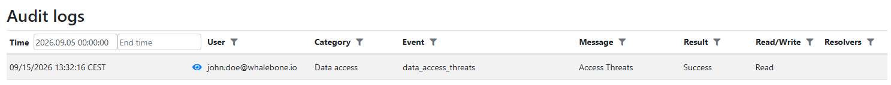

**********
Audit Logs
**********

The Audit Log feature provides visibility and traceability into administrative activity across the Whalebone platform. Administrators can access the main audit trail directly in the Admin Portal by navigating to the top-right menu and selecting Audit Logs. Access to audit logs is secured and restricted using Role-Based Access Control (RBAC).

Logged Events
=============

The audit trail captures actions performed both through the Admin Portal interface and via public API integrations. Logged activities include:

* User Authentication and Authorization: Sign-ins, access events, and related session activities.
* Administrative and Configuration Changes: System-level actions, policy changes, and configuration updates made within the portal.

Filtering and Viewing Event Details
===================================

Within the Admin Portal, administrators can browse and filter logged events. Administrators can apply filters based on event types, user identities, timestamps, and other relevant criteria to narrow down the displayed events. Clicking the eye icon next to an individual event provides detailed information, including the action performed, the actor, and the outcome.

   Example of viewing events in the Audit Logs.

.. figure:: ./img/audit-logs-2.png
   :alt: Audit Logs Event Details
   :align: center

   Example of viewing detailed information for a specific event in the Audit Logs.

API Access
==========

The audit logs can also be accessed programmatically via the Whalebone public API. This allows for integration with external monitoring and logging systems, enabling automated analysis and alerting based on audit events. API access to audit logs is subject to the same RBAC restrictions as the Admin Portal, ensuring that only authorized users can retrieve sensitive audit information. The API documentation is available in :ref:`API Integration<API Integration>`.
