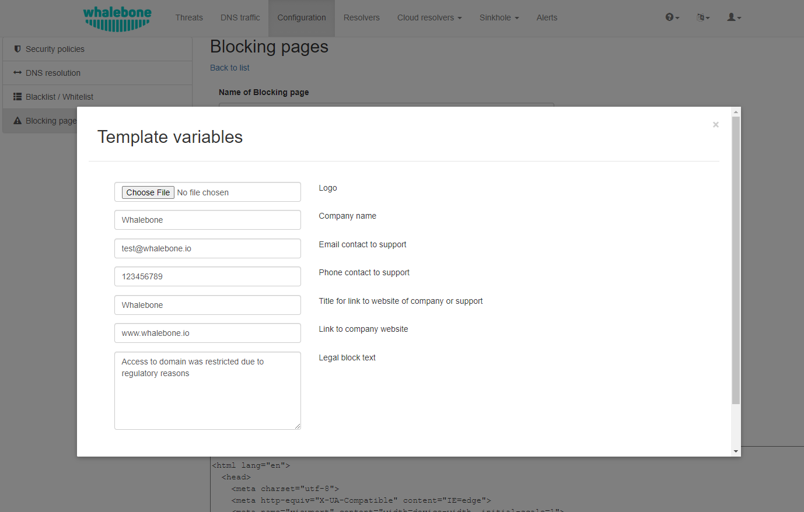

**************
Blocking Pages
**************

When access to a domain is blocked, the resolvers respond to clients with the IP address of a **blocking page**, where users are informed that they cannot access the given page and the reason why access was blocked. Whalebone provides a sample template for blocking pages, which can be fully customized. The template code is written to be compatible with the widest possible range of browsers.

Different versions of **blocking pages** can be assigned to different network segments under **Resolvers** → **Policy Assignment**.

Configuration → Blocking pages list view
========================================

The list of all blocking pages is available under **Configuration** → **Blocking pages**. The page shows one card per blocking page and a **Create Blocking page** button to add a new one. Each card displays:

* The blocking-page name (clicking it opens the editor).
* **Bypass** indicator — a checkmark if the page exposes a bypass feature (tooltip: *"This Blocking page has bypass feature available"*).
* **Locales** — the language codes the page is configured for (for example, ``en``).
* **Resolvers** — list of resolvers currently serving this page, with a deep link to each resolver's detail page.
* A pencil icon to open the editor directly.

.. figure:: ./img/blocking-pages-overview.png
   :alt: Overview of blocking pages
   :align: center

   Overview of blocking pages

Whalebone offers four variants of blocking pages:

* **Security**: displayed when access is blocked due to security reasons
* **Blacklist**: displayed when access is blocked by administrators
* **Legal**: displayed when access is regulated based on law or court order
* **Content**: displayed when access is blocked due to the domain's content

Furthermore, each version can exist in different language mutations. The language of the blocking page is determined by the language of the browser accessing it.

.. figure:: ./img/blocking-pages.png
   :alt: Blocking pages
   :align: center

   Blocking pages

The blocking page settings provide the following options:

1. Using a template: When using a template, the entered information is inserted directly into the template code. This is the fastest and simplest way to customize the blocking page. Blocking page settings can be made by clicking the **Magic Wand** button. Using a template will overwrite the previous configuration.

2. Default blocking page localization: This option allows you to customize the default language of the blocking page. If a browser does not state its preferred language, the "default" language acts as a fallback mechanism. The default locale is marked with an asterisk (\*) symbol next to the language type.

3. Deleting blocking page localization: A locale can be deleted by clicking the **Trash** icon.

Each version of the blocking page (Security, Blacklist, Legal, and Content) can be further customized by editing the HTML code. Clicking on each version reveals an editor that allows you to make any desired changes.

The editor also exposes a **"Validation"** interface, which analyzes the final HTML code and checks for allowed features. The check is based on the `id` of specific elements. More information and requirements for each feature can be found by clicking the respective labels.

.. note:: Each blocking page version has unique characteristics that can be selected. For example, the **Security** blocking page may include a **Bypass Blocking** button, which is not available in the **Regulation** and **Blacklist** page versions.

After editing and saving changes to the blocking pages, it is important that they are applied to the individual resolvers.

.. tip:: Blocking pages are displayed directly from the web server on the resolver. The pages are expected as a single file, so all other resources (CSS, images, scripts) must either be directly embedded into the HTML code or be available from a publicly accessible web server. The resolver does not provide any option to insert other content.

You can view a video tutorial :ref:`here<Blocking page configuration video>`.

Signing Blocking Pages with a Certificate Authority
===================================================

For deployments where you have control over the workstations, which is typically a corporate environment with Group Policy, you can insert a custom certificate authority (CA) used by the resolvers into their trusted CA stores. This causes browsers to go directly to the blocking page without displaying a certificate warning. The resolver essentially performs a **man-in-the-middle attack** every time it performs a redirect to the blocking page and provides its own certificate for the blocked domain.

.. important:: This functionality applies only to blocking pages hosted on local resolvers (On-premise). If you are using blocking pages hosted on Whalebone Cloud, this configuration is not applicable.

Prerequisites
-------------

To ensure the blocking page is accessible to clients, you must verify that the following network requirements are met:

* The resolver must have **open incoming TCP ports 80 and 443** for all client subnets.

* For a complete list of network requirements, please refer to the `Server Performance Requirements <https://docs.whalebone.io/en/immunity/local_resolver.html#network-requirements>`_ in our documentation.

Admin Portal Configuration
--------------------------

Make sure that each local resolver is configured to host the blocking page locally (On-premise):

1. Navigate to **Resolvers** menu in the admin Portal.

2. Select the specific resolver and go to the **Policy assignment** tab.

3. Ensure the blocking page location is set to **On-premise local resolver** with resolvers IP addresses assigned.

4. Click **Save to resolver** button.

5. Return to the **Resolvers** page and click **Upload configuration** (red button) for each resolver to deploy the changes.

Certificate Authority creation and configuration
------------------------------------------------

To create and configure a custom CA, follow these steps:

1. Create the ``/certs`` directory:

Create a dedicated directory for your certificates:

.. code-block:: shell

   mkdir /certs

2. Configure the file v3_cfg file:

This file defines how the certificate is generated. Create the file v3_cfg in the ``/certs`` directory with the following content:

.. code-block:: INI

   [req]
   x509_extensions = v3_ca_extensions
   distinguished_name = req_dn
   [v3_ca_extensions]
   basicConstraints = critical,CA:TRUE
   subjectKeyIdentifier = hash
   authorityKeyIdentifier = keyid:always,issuer:always
   keyUsage = critical, digitalSignature, cRLSign, keyCertSign
   subjectAltName = @alt_names
   [alt_names]
   DNS.1 = localhost
   [req_dn]
   countryName = Country Name (2 letter code)
   countryName_default = US
   stateOrProvinceName = State or Province Name (full name)
   stateOrProvinceName_default = New York
   localityName = Locality Name (eg, city)
   localityName_default = New York City
   organizationName = Organization Name (eg, company)
   organizationName_default = My Organization
   commonName = Common Name (eg, your name or your server's hostname)
   commonName_max = 64

Fields explanation and their possible values:

* [req] and [v3_ca_extensions]

* Do not change the values here

* [alt_names]

* Here you can list multiple resolvers.

* While the naming is not functionally critical, we recommend using the actual hostnames (e.g., DNS.1 = WB1, DNS.2 = WB2).

* [req_dn]

* The first line (e.g., countryName) is for administrative identification.

* The second line with **_default** (e.g., countryName_default) determines the data actually encoded into the certificate.

* **commonName** is the name which represents the blocking page (eg, company name, resolver hostname or Whalebone Blocking Page).

3. Generate the CA key:

Execute the following command to generate the authority key:

.. code-block:: shell

   openssl ecparam -name prime256v1 -genkey -noout -out /certs/ca.key

4. Create the CA certificate:

Create the signed certificate based on your configuration:

.. code-block:: shell

   openssl req -x509 -new -nodes -key /certs/ca.key -sha256 -days 3650 -out /certs/ca.crt -config /certs/v3_cfg

5. Export the private key and certificate to a PFX file:

You will be prompted to create a password during this step (the certificate cannot be applied without this password):

.. code-block:: shell

   openssl pkcs12 -export -out /certs/ca.pfx -inkey /certs/ca.key -in /certs/ca.crt -certpbe PBE-SHA1-3DES -keypbe PBE-SHA1-3DES -export -macalg sha1

6. Backup CA:

Store the ``/certs`` directory in a secure location outside of the resolver (in case of the need for restoration).

7. Submit to Whalebone:

Send the path, filename and password of your .pfx file to **Whalebone support** (support@whalebone.io). Provide the .pfx password to our technicians using a secure tool such as `OneTimeSecret <https://onetimesecret.com/>`_. Our team will then complete the service setup.

8. CA propagation:

In the meantime, please add the public key of the Certificate Authority (``/certs/ca.crt``) to the list of **trusted Certificate Authorities** on all workstations under your administration. The new CA will propagate shortly after our support completes the setup.
