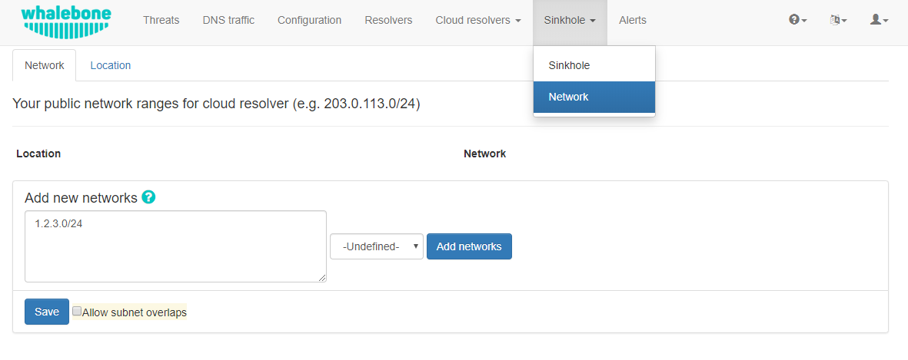
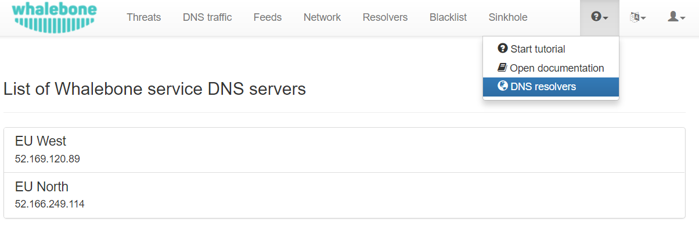

Cloud DNS resolvers
--------------------

You can watch step-by-step video guide `here <https://docs.whalebone.io/en/latest/video_guides.html#cloud-resolvers>`__.
Whalebone Cloud DNS resolver is a service aimed mainly for small or medium customers who can use cloud resolvers for a backup. Typically it is aimed at ISPs that have only one 
on-premise resolver and to ensure high availability, they use cloud DNS resolvers as a secondary recursive for their customers. One of the prerequisites is to define a public IP address 
or ranges to Cloud DNS resolver policy assignment so cloud resolver can differentiate and deliver the right filtering policy which you have setup for your network. 

Public network range definition serves to distinguish individual customers and their users. It is necessary to include all the public network ranges that will be used by DNS resolver 
as well as the users browsing the internet. The definition is used to customize the block page appearance (described later). Single customer can manage more network ranges, 
such ranges can be assigned to localities to easily distinguish between logical network zones in DNS traffic audit and incidents.

.. warning:: If you do not fill in your public network ranges, cloud resolvers will serve as a simple DNS resolvers **without any filtering**. If you use local resolvers, you still have to input your network ranges to display fully customized blocking page to the blocked users.

* Into the field **IP Range** insert one or more network ranges using notation <network address>/<mask>, e.g.: **198.51.100.0/24**. 
* Press button **Add IP range** to add more segments of the network.
* Don't forget to save your new setup through the **Save to resolver** button.

.. tip:: While testing Whalebone (e.g. through adding a testing domain into blacklist) don't forget that many DNS records could be recently in the DNS cache anywhere between the resolver and the user (including the browser, operating system or forwarders). Testing right after the configuration change could therefore fail and the timespan before the protection becomes active could vary based on the TTL of the particular DNS record (should all the caches along the way actually honor the TTL value).

You should forward your DNS traffic towards Whalebone cloud resolvers if this is your preferred deployment option. Cloud resolvers are available on an Anycasted IP address
**193.32.92.32**.

The IP addresses of the resolvers are accessible under **Cloud resolvers** and under the menu **Help** → **DNS resolvers**.

   :align: center

