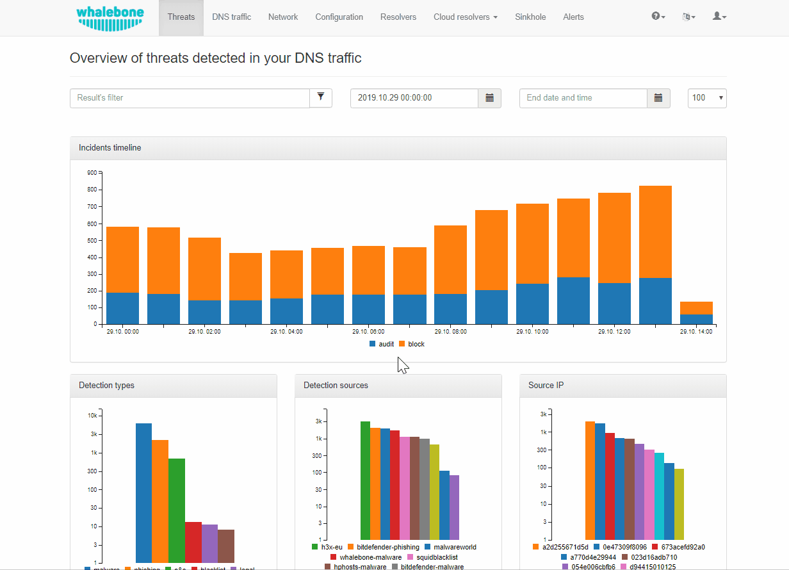
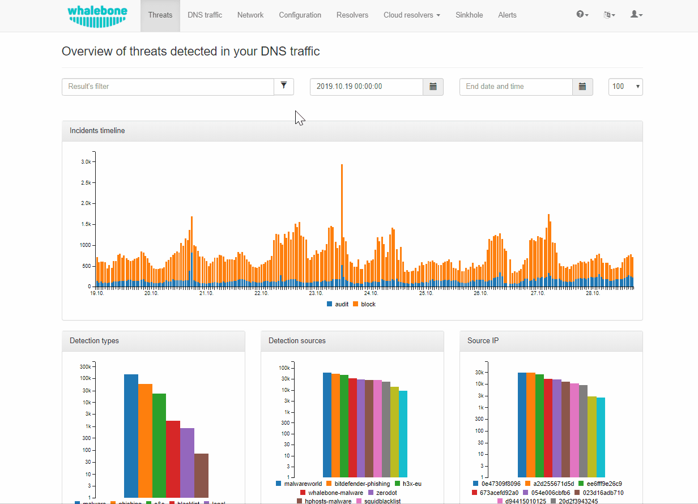
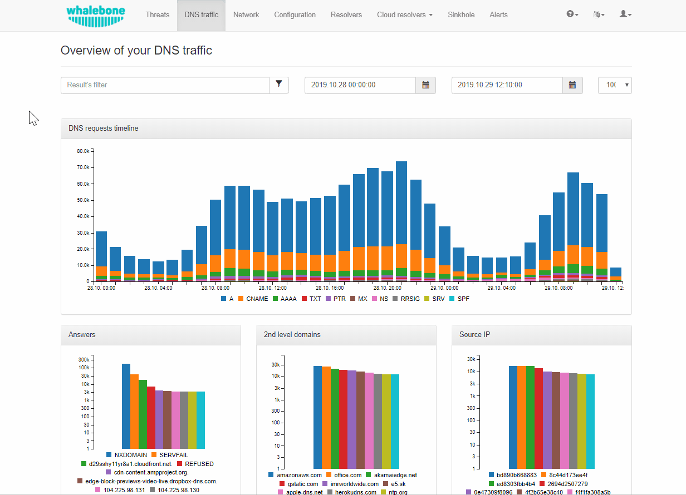

.. _header-n233:

Data Analysis
=============

Whalebone Portal (graphical user interface) gives the user number of
possibilities how to analyze what is happening on the DNS resolvers and
the network.

.. _header-n236:

Threats
-------

Threats are special events where there is a DNS request for a domain
that is present within the reputation database. There are two types of
actions when a threat is detected. The first is to audit the event while
the second is to block it.

The action that is to be implemented depends on the policies that are
assigned to the specific resolver. For more on that please refer to
`Security
Policies <http://docs.whalebone.io/cs/latest/local_resolver.html#bezpecnostni-politiky>`__.

There are some pre-configured filters that can be applied on the data on
the portal. Some sample queries can be found below. These queries depict
the majority of the use cases but there is no hard limit as the
available search engine is **full-text** and *any* query can be compiled
impromptu.

.. _header-n240:

How to search for audit/block events.
~~~~~~~~~~~~~~~~~~~~~~~~~~~~~~~~~~~~~

| There are two options in order to filter the different types of
  events. 
| In the first option a visual filter can be applied where the type that
  a user clicks is disabled from the graph. This can aid the process of
  having a basic overview of the traffic's qualities.

For more advanced usage a query can be issued:

-  ``action: block`` in order to filter the blocking events

-  ``action: audit`` in order to filter the auditing events

-  ``action: whitelist`` in order to view the Block page redirects

This query updates the content of the whole dashboard.

.. _header-n253:

How to search for events based on specific IP address.
~~~~~~~~~~~~~~~~~~~~~~~~~~~~~~~~~~~~~~~~~~~~~~~~~~~~~~

A filtering of an IP address is possible by clicking on the specific
``Source IP`` bar and in this way filtering the content of the whole
portal.

A more advanced use case could be to directly insert the IP address in
the search field.

.. tip:: In the following example the data are anonymized so a reader could
consider that instead of the previewed hash value, an IP address is
used.

.. _header-n258:

How to search for events based on specific threat category.
~~~~~~~~~~~~~~~~~~~~~~~~~~~~~~~~~~~~~~~~~~~~~~~~~~~~~~~~~~~

There are multiple threat categories available.

To name a few: ``legal`` , ``malware``, ``c&c``, ``blacklist``,
``phishing`` and ``exploit``.

A *simple* alternative could be to click on the bar that matches the
detected threat and filter only the specific type.

Another approach could be to click on the filter icon and in this way
specify the desired category, as can be seen in the next image.

.. _header-n266:

How to change the date range of the available data
~~~~~~~~~~~~~~~~~~~~~~~~~~~~~~~~~~~~~~~~~~~~~~~~~~

| The date range of the data that can be previewed in the portal can
  change in multiple ways.
| The following image show three of the available ways. These can be
  summarized as simply by clicking on the current date that
  automatically transcribes to the current time, by inserting the date
  in text in the ``YYYY.MM.DD HH:mm:ss`` format or by using the builtin
  tool that provides quick suggestions.

.. figure:: ./img/date_range.gif
   :alt: 

.. _header-n269:

DNS Traffic
-----------

The ``DNS Traffic`` tab contains an overview of the traffic that has
been logged on the resolver. It contains all the queries along with some
additional information such as the type, the answer and the TTL (time to
live) of the answer.

.. tip:: The data are subject to de-duplication. This means that the resolver
   logs only unique combinations of query, query type and answer per 24
   hour time frame. For this reason, a query might not be available on
   the portal even though it has been resolved.

Below, some of the most useful filtering options of the available data
will be described.

.. _header-n274:

How to view all queries of a specific type
~~~~~~~~~~~~~~~~~~~~~~~~~~~~~~~~~~~~~~~~~~

In order to view all queries of a specific type the most straight
forward way is to click on the filter icon and select the desired value.

Another option is to insert a query in the search field. This query
could be in the form ``query_type:<type>.`` The possible types are:
``A``,\ ``AAAA``, ``CNAME``, ``MX``, ``NS``, ``PTR``, ``RRSIG``,
``SPF``, ``SRV`` and\ ``TXT``.

.. _header-n279:

How to view all answers of a specific type 
~~~~~~~~~~~~~~~~~~~~~~~~~~~~~~~~~~~~~~~~~~~

The answers can be filtered by selecting the specific bar in the
respective ``Answers`` field. Additionally, the answers can be viewed by
issuing a query in the form ``answer:<answer_type>``.

.. _header-n282:

How to search for a domain
~~~~~~~~~~~~~~~~~~~~~~~~~~

In order to search for a domain's instances in the logs, the easiest way
is to click on it in the provided log history. Alternatively a query
could be issued in the search engine with the term: ``query:<domain>``

A more fine-grained search can be performed by searching for more
specific domain based on the available domain levels. The acceptable
search fields are ``domain_l1:<domain_l1>`` and
``domain_l2:<domain_l2>``.

.. _header-n285:

How to change the date range of the available data
~~~~~~~~~~~~~~~~~~~~~~~~~~~~~~~~~~~~~~~~~~~~~~~~~~

Please refer to `How to change the date range of the available
data <http://docs.whalebone.io/en/latest/data_analysis.html#how-to-change-the-date-range-of-the-available-data>`__
of the Threats section.

.. _header-n287:

How to view DGA (Domain Generation Algorithm) indications
~~~~~~~~~~~~~~~~~~~~~~~~~~~~~~~~~~~~~~~~~~~~~~~~~~~~~~~~~

Whalebone provides a view of indicators of DGA instances. These
indications can be accessed by using the filter icon and selecting DGA
as can be seen below.

