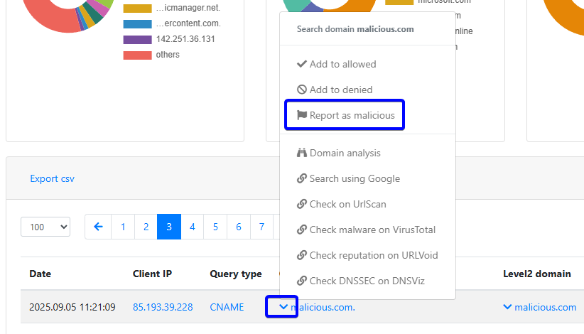

Data Analysis
=============

Whalebone Portal is a web user interface providing users with multiple options to analyze activity on DNS resolvers and the network.

Content
-------

The **content** tab shows an overview of logged traffic subject to content filtering settings. If you do not have the content filter enabled or are not using it, nothing will be logged in this tab.

How to view all queries of a specific type
~~~~~~~~~~~~~~~~~~~~~~~~~~~~~~~~~~~~~~~~~~

The easiest way to select queries of a particular type is by clicking the **filter** icon and selecting the desired query type. There are 17 categories to choose from, including ``Sexual Content``, ``Gambling``, ``Audio/video``, or ``Games``. Alternatively, you can click on one of the categories displayed on the pie graph under the **Category** section or directly in the plot showing all the data.

By clicking on the pie graphs, you can also filter out the **Client IP** and **Resolver**.

How to search for a domain
~~~~~~~~~~~~~~~~~~~~~~~~~~

To search for domains, use the **Result Filter** text box to enter the domain name you are looking for. Other ways to search for a domain are by clicking the domain in the **Domain** section or directly in the log list in the same column.

How to change the date range of the available data
~~~~~~~~~~~~~~~~~~~~~~~~~~~~~~~~~~~~~~~~~~~~~~~~~~

The range of data that can be displayed in the portal preview can be changed in several ways. The basic selection method includes selecting predefined time windows of 1 or 7 days from the drop-down list next to the **results filter**. If desired, a specific time range can be specified using the **Start Date and Time** and **End Date and Time** windows.

Domain categorization change
~~~~~~~~~~~~~~~~~~~~~~~~~~~~

It may happen that some of the domains are categorized incorrectly. You can check which categories a domain falls into by using the **Domain Analysis** tool located in the user menu. After entering a domain, the **Content Categorization** section will appear, showing the categories the domain falls into and also offering a **Suggest Category Change** button to suggest a change in categorization. It is also possible to report a domain as a false positive using the **Report as malicious** button.

Export to CSV
~~~~~~~~~~~~~

It is possible to export the raw data containing the date, client's IP address, device name, domain, and content category type to a CSV file. The export button is located at the beginning of the table with the raw data. The exported data will contain all the data that is currently filtered on the portal. The export button is available only when there are up to 1,000,000 records in the filtered data.
 
DNS Traffic
-----------

The ``DNS Traffic`` tab contains an overview of the traffic that has been logged on the resolver. It contains all the queries along with some additional information, such as the type, the answer, and the TTL (Time To Live) of the answer.

.. tip:: The data are subject to de-duplication. This means that the resolver logs only unique combinations of query, query type, and answer per 24-hour time frame. For this reason, a query might not be available on the portal even though it has been resolved.

You can watch a step-by-step video guide :ref:`here<DNS traffic video>`.

Below are some examples of the most useful filtering options for the available data.

How to view all queries of a specific type
~~~~~~~~~~~~~~~~~~~~~~~~~~~~~~~~~~~~~~~~~~

The easiest way to select queries of a particular type is by clicking the **filter** icon and selecting the desired query type. There are several options to choose from, including ``A``, ``AAA``, ``CNAME``, ``MX``, ``NS``, ``PTR``, ``RRSIG``,
``SPF``, ``SRV``, and ``TXT``.

How to view all answers of a specific type
~~~~~~~~~~~~~~~~~~~~~~~~~~~~~~~~~~~~~~~~~~

In the **Answers** window, you can select the desired answer, or in the log list in the **Answer** column, or click the desired answer.

How to search for a domain
~~~~~~~~~~~~~~~~~~~~~~~~~~

To search for domains, use the **Result Filter** text box to enter the domain name you are looking for. Other ways to search for a domain are by clicking the domain in the **Tier 2 Domains** section or directly in the log list in the same column.

.. _How to change the date range of the available data traffic:

How to change the date range of the available data
~~~~~~~~~~~~~~~~~~~~~~~~~~~~~~~~~~~~~~~~~~~~~~~~~~

The range of data that can be displayed in the portal preview can be changed in several ways. The basic selection method includes selecting predefined time windows of 1, 7, 14, or 30 days from the drop-down list located next to the **results filter**. If desired, a specific time range can be specified using the **Start Date and Time** and **End Date and Time** windows.

How to view DGA (Domain Generation Algorithm) indications
~~~~~~~~~~~~~~~~~~~~~~~~~~~~~~~~~~~~~~~~~~~~~~~~~~~~~~~~~

DGA indications can be filtered in a similar way to displaying queries of a particular type. In this case, just select the last record in the list - **DGA**.

.. figure:: ./img/data-analysis-1.png
   :alt: DGA indications
   :align: center

   DGA indications

How to report "False negative"
~~~~~~~~~~~~~~~~~~~~~~~~~~~~~~

In some cases, the score classification of a domain may not be correct. If you believe a domain should be blocked but is not, you can report it as malicious using the **Report as Malicious** button to initiate a domain review request. This option is located in the log table under the arrow icon for each query.

   Report false negative

Export to CSV
~~~~~~~~~~~~~

It is possible to export the raw data containing the date, client's IP address, device name, query type, query, second-level domain, country, answer, TTL (Time to Live), and class to a CSV file. The export button is located at the beginning of the table with the raw data. The exported data will contain all the data that is currently filtered on the portal. The export button is available only when there are up to 1,000,000 records in the filtered data.

Threats
-------

Threats are special events where there is a DNS request for a domain that is present within the reputation database. There are two types of actions when a threat is detected. The first is to **audit** the event, which only logs the domain, but access is possible. The second action **block** that blocks the request to the malicious site.

The action to be implemented depends on the policies assigned to the specific resolver. For more on that, please refer to :ref:`Security Policies<Security policies>`.

Some pre-configured filters can be applied to the data on the portal. Some sample queries can be found below. These queries depict the majority of the use cases, but there is no hard limit, as the
available search engine is **full-text** and *any* query can be compiled impromptu.

You can watch a step-by-step video guide :ref:`here<Threats video>`.

How to search for audit or block events
~~~~~~~~~~~~~~~~~~~~~~~~~~~~~~~~~~~~~~~

There are two options for filtering different types of events. The first option is to use a visual filter. Within the graph, you can click one of the actions (audit, block, or allow) to filter it and display only the cases in which the event occurred. The second one is to click next to the **Result's filter** field on the **Filter button** and choose the desired filtering option.

.. figure:: ./img/data-analysis-3.png
   :alt: Threats action filter
   :align: center

   Threats action filter

How to search for a domain
~~~~~~~~~~~~~~~~~~~~~~~~~~

The easiest way to search for a domain is by clicking on a specific domain in the log history. The second way is by typing the domain name into the **Result Filter** field.

How to search for events based on a specific IP address
~~~~~~~~~~~~~~~~~~~~~~~~~~~~~~~~~~~~~~~~~~~~~~~~~~~~~~~

Filtering logs from a specific IP address is possible by selecting a specific source IP address in the log history. The second option is to enter the domain name in the **Result Filter** field. Note that it will create field named "request_ip:" but fulltext filter is created using field "client_ip:"

How to search for events based on a specific threat category
~~~~~~~~~~~~~~~~~~~~~~~~~~~~~~~~~~~~~~~~~~~~~~~~~~~~~~~~~~~~

Threats are categorized by their types. The categories are:

* Blacklist
* C&C
* Coinminer
* Compromised
* Deny list
* Malware
* Phishing
* Spam

.. tip:: The Deny list category is a custom list maintained by the customer's administrators to block domains on demand. Blacklist is part of the Whalebone threat intelligence data for known domains that host multiple threats or when the exact category could not be determined.

A simple way to find attacks is by selecting a specific category from the pie charts or in the log list under the **Threat Categories** column. Another option is to click the **Filter result** button next to the **Filter** field and select the desired filtering option.

.. figure:: ./img/data-analysis-4.png
   :alt: Threats category filter
   :align: center

   Threats category filter

.. _How to change the date range of the available data threats:

How to change the date range of the available data
~~~~~~~~~~~~~~~~~~~~~~~~~~~~~~~~~~~~~~~~~~~~~~~~~~

The range of data that can be displayed in the portal preview can be changed in several ways. The basic selection method involves choosing predefined time windows of 1, 7, 14, or 30 days from the drop-down list next to the **results filter**. If necessary, a specific time range can be specified using the **Start Date and Time** and **End Date and Time** windows.

How to analyze a domain:
~~~~~~~~~~~~~~~~~~~~~~~~

To learn more about domain analysis, scoring of malicious domains, domain categories, or what external sources know about them, watch the step-by-step video :ref:`here<Domain analysis video>`.

How to report "False positive"
~~~~~~~~~~~~~~~~~~~~~~~~~~~~~~
In some cases, the score of a domain may be wrong. If you believe a domain should not be blocked but is, you can report it as misclassified using the **Report False Positive** button to initiate a domain review request.

Fulltext filtering
~~~~~~~~~~~~~~~~~~

For more advanced use, you can use the full-text filter and build a compound query.
These fields can be concatenated using logical operators. ``AND, OR, NOT, <, >``, and the wildcard character ``*`` are supported. Strings do not have to be wrapped with quotes. An example of the syntax is as follows:

``action: block AND accu:>70 AND (client_ip: 10.20.30.41 OR 10.20.30.40 OR 192.168.*)``
``AND NOT geoip.country_name: Germany AND matched_iocs.classification.type: malware AND NOT phishing``

When you run a full-text query, it updates the content of the entire dashboard.

+--------------------------------------+-------------------------------------------------------------------------------------------+--------------------------------------------------------------------------+
| Threats                              | Description                                                                               |  Example value                                                           |
+======================================+===========================================================================================+==========================================================================+
| ``timestamp``                        | The exact time when the resolver registered the DNS request or incident                   | ``2022-10-14T12:28:01.000Z``                                             |
+--------------------------------------+-------------------------------------------------------------------------------------------+--------------------------------------------------------------------------+
| ``client_ip``                        | The source IP address that made the DNS request or incident                               | ``192.168.2.3``                                                          |
+--------------------------------------+-------------------------------------------------------------------------------------------+--------------------------------------------------------------------------+
| ``domain``                           | The domain in the DNS query                                                               | ``whalebone.io`` OR ``whale*one.io``                                     |
+--------------------------------------+-------------------------------------------------------------------------------------------+--------------------------------------------------------------------------+
| ``resolver_id``                      | The ID of the resolver that handled the event                                             | ``2404``                                                                 |
+--------------------------------------+-------------------------------------------------------------------------------------------+--------------------------------------------------------------------------+
| ``device_id``                        | The device_id of the HOS agent                                                            | ``MB2A1b4OTDin3Xz6DgftAip72v57e``                                        |
+--------------------------------------+-------------------------------------------------------------------------------------------+--------------------------------------------------------------------------+
| ``geoip.continent_code``             | The code of the continent from the PHP geoIP library                                      | ``AF | AN | AS | EU | NA | OC | SA``                                     |
+--------------------------------------+-------------------------------------------------------------------------------------------+--------------------------------------------------------------------------+
| ``geoip.country_code3``              | The code of the country from the PHP geoIP library                                        | ``RU | CZ | US | CN | DE | ...``                                         |
+--------------------------------------+-------------------------------------------------------------------------------------------+--------------------------------------------------------------------------+
| ``geoip.country_name``               | The name of the country from the PHP geoIP library                                        | ``Russia``                                                               |
+--------------------------------------+-------------------------------------------------------------------------------------------+--------------------------------------------------------------------------+
| ``ip``                               | The IP in the DNS answer, or the IP that the resolver would answer if it didn't block     | ``174.85.249.36`` OR ``SERVFAIL`` OR ``NXDOMAIN``                        |
+--------------------------------------+-------------------------------------------------------------------------------------------+--------------------------------------------------------------------------+
| ``action``                           | The action that the resolver took with that specific query                                | ``block | allow | audit``                                                |
+--------------------------------------+-------------------------------------------------------------------------------------------+--------------------------------------------------------------------------+
| ``accu``                             | The score of the domain at the time of the event                                          |  ``0..100`` < and > operators can be used too                            |
+--------------------------------------+-------------------------------------------------------------------------------------------+--------------------------------------------------------------------------+
| ``matched_iocs.classification.type`` | The type of threat                                                                        | ``malware | c&c | phishing | coinminer | spam | compromised | blacklist``|
+--------------------------------------+-------------------------------------------------------------------------------------------+--------------------------------------------------------------------------+

.. tip:: Filtering operators are placed statically in the URL address. Therefore, you can create your set of Filters in advance (such as viewing on individual IPs) and use them when necessary. Afterwards, you can place them in your CRM for the specific user's account and to access the filtered view immediately. It will help save your time when a customer asks for support, as you can immediately open their details.

Export to CSV
~~~~~~~~~~~~~

It is possible to export the raw data containing the date, action, client's IP address, device name, country, domain, score, threat category, threat name, and resolver's name to a CSV file. The export button is located at the beginning of the table with the raw data. The exported data will contain all the data that is currently filtered on the portal. The export button is available only when there are up to 1,000,000 records in the filtered data.
