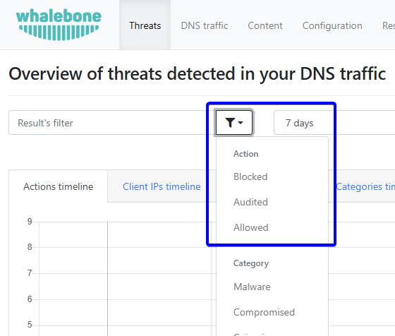

DNS Traffic
===========

The ``DNS Traffic`` tab provides an overview of traffic logged on resolvers. It contains all queries, along with additional information such as query type, answer, and TTL (Time To Live).

.. tip:: The data is subject to de-duplication. This means the resolver logs only unique combinations of query, query type, and answer within a 24-hour time frame. For this reason, a query might not appear on the portal even if it has been resolved.

You can watch a step-by-step video guide :ref:`here<DNS traffic video>`.

Filtering Options
~~~~~~~~~~~~~~~~~

The Filter button contains different options based on the type of data being analyzed. Here are the available options for each data type:

* **Client IP**: Filter the data based on specific client IP addresses.
* **Device ID**: Filter the data based on specific device IDs.
* **Domain**: Filter the data based on specific domain names.
* **Query Type**: Filter the data based on specific query types (e.g., A, AAAA, CNAME).
* **Query**: Filter the data based on specific DNS queries.
* **DNS Tunnel**: Filter out domains associated with DNS tunneling in DNS traffic.
* **DGA**: Filter out data classified as DGA (Domain Generation Algorithm) in DNS traffic.
* **Country code**: Filter the data based on specific country codes.
* **Segment**: Filter the data based on specific segments.
* **Brand**: Filter the data based on specific brands.
* **Resolver ID**: Filter the data received by specific resolvers.
* **Answer**: Filter the data based on specific DNS answers.
* **Protocol**: Filter the data based on specific protocols used in DNS traffic (e.g., UDP, TCP, DoH, or DoT).
* **EDE code**: Filter the data based on specific Extended DNS Error (EDE) codes in DNS traffic.

.. only:: Immunity or DNS4GOV

  .. tip:: The device ID has been assigned by the Home Office Security client installed on the device. The list of devices is in the **Home Office Security** section of the portal, which is located in the user menu.

.. only:: Aura or Peacemaker

  .. tip:: The device ID has been assigned by the customer using the Retail API. The list of devices is in the **Retail** section of the portal.

Extended DNS Error (EDE) Codes
~~~~~~~~~~~~~~~~~~~~~~~~~~~~~~

In the DNS protocol, Extended DNS Error (EDE) codes were introduced in RFC 8914 to provide more specific diagnostic information than the traditional, blunt RCODEs, such as SERVFAIL or NXDOMAIN. Instead of just saying "it failed," EDE codes tell you why—for example, if a DNSSEC validation failed or if a query was blocked by a firewall. The officially supported list of EDE codes can be found in `RFC 8914`_. The IANA organization maintains the proposed list of EDE codes, which currently includes codes from 0 to 30. The list is available at the `IANA website`_.

.. _RFC 8914: https://datatracker.ietf.org/doc/html/rfc8914
.. _IANA website: https://www.iana.org/assignments/dns-parameters/dns-parameters.xhtml#extended-dns-error-codes

.. list-table:: The Complete List of EDE Codes
   :header-rows: 1
   :widths: 10 30 60

   * - Code
     - Name
     - Meaning / Common Use Case
   * - 0
     - Other
     - A catch-all for errors that don't fit other categories.
   * - 1
     - Unsupported DNSKEY Algorithm
     - The resolver doesn't support the algorithm used to sign the zone.
   * - 2
     - Unsupported DS Digest Type
     - The resolver doesn't support the hash algorithm in the DS record.
   * - 3
     - Stale Answer
     - The resolver is returning expired data from cache because it can't reach the origin.
   * - 4
     - Forged Answer
     - The resolver suspects the answer was tampered with (e.g., via a captive portal).
   * - 5
     - DNSSEC Indeterminate
     - DNSSEC state is unclear; validation couldn't be completed.
   * - 6
     - DNSSEC Bogus
     - DNSSEC validation failed (the signatures are invalid).
   * - 7
     - Signature Expired
     - The RRSIG for the data has reached its expiration time.
   * - 8
     - Signature Not Yet Valid
     - The RRSIG start time is in the future (check your server clock!).
   * - 9
     - Missing DNSKEY
     - No DNSKEY record was found to match the DS record.
   * - 10
     - RRSIGs Missing
     - No RRSIG records were found for the queried data.
   * - 11
     - No Zone Key Bit Set
     - A DNSKEY was found, but the "Zone Key" bit wasn't set.
   * - 12
     - NSEC Missing Expected
     - NSEC/NSEC3 records are missing (proof of non-existence failed).
   * - 13
     - Cached Error
     - The resolver is returning a previously cached error.
   * - 14
     - Not Ready
     - The server is still booting up or loading the zone.
   * - 15
     - Blocked
     - The query was blocked due to local policy (e.g., a "Blacklist").
   * - 16
     - Censored
     - The query was blocked due to an external legal or regulatory requirement.
   * - 17
     - Filtered
     - The query was blocked by a filter that isn't strictly "policy" or "censorship."
   * - 18
     - Prohibited
     - The server refuses to answer this specific client.
   * - 19
     - Stale NXDOMAIN Answer
     - A cached "Does not exist" response is being served while the server is offline.
   * - 20
     - Not Authoritative
     - The server was expected to be authoritative for the zone but isn't.
   * - 21
     - Not Supported
     - The server doesn't support the specific operation or query type.
   * - 22
     - No Reachable Authority
     - The resolver couldn't connect to any of the upstream nameservers.
   * - 23
     - Network Error
     - A general network-level failure occurred upstream.
   * - 24
     - Invalid Data
     - The authoritative server provided data that is syntactically invalid.
   * - 25
     - Signature Expired before Valid
     - The signature's inception time is set later than its expiration time, creating a logical contradiction where the signature is never valid.
   * - 26
     - Too Early
     - The server declined to process the query received via Early Data (0-RTT) to mitigate replay risks. The client is expected to retry using a fully established connection.
   * - 27
     - Unsupported NSEC3 Iterations Value
     - The authoritative zone requires many NSEC3 hashing iterations that exceed the resolver's maximum limit for computational work.
   * - 28
     - Unable to conform to policy
     - The resolver cannot satisfy the specific administrative policy or provisioning domain requirements necessary to resolve the query.
   * - 29
     - Synthesized
     - The response was generated locally by the resolver's internal logic rather than being retrieved from an authoritative upstream source.
   * - 30
     - Invalid Query Type
     - The query was rejected because the requested Resource Record type (QTYPE) is undefined, reserved, or not supported by the server implementation.

How to Report "False Negative"
~~~~~~~~~~~~~~~~~~~~~~~~~~~~~~

In some cases, the score classification of a domain may not be correct. If you believe a domain should be blocked but is not, you can report it as malicious using the **Report as Malicious** button to initiate a domain review request. This option is located in the log table under the arrow icon for each query.

   Report false negative

CSV Export
~~~~~~~~~~

The CSV export contains the following details:

* date
* client's IP address
* device name
* query type
* query
* second-level domain
* country
* answer
* TTL (Time to Live)
* class
