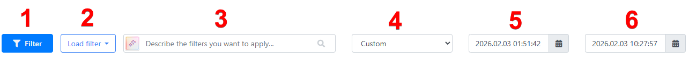
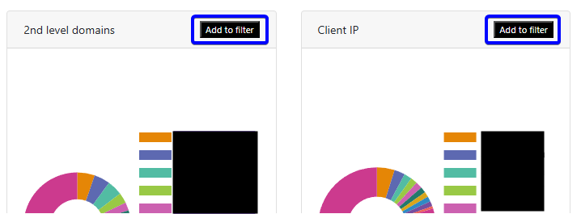

Data Analysis
=============

Whalebone Portal differentiates among three data types: **Content**, **DNS Traffic**, and **Threats**. Each of these categories has its own tab in the portal, allowing users to easily navigate and analyze the data. All three views share the same structure and use the same filtering options, as described in the following sections.

The page structure is as follows:

* **Filters**: Located at the top of the page, allowing users to filter the data based on various criteria.
* **A graph with a traffic overview in time**: Located below the filters, providing visual representations of the data in time.
* **Pie charts**: Located below the graph, showing the distribution of data based on different categories.
* **Raw data**: Located at the bottom of the page, displaying the raw data in a tabular format.

All graphs and tables are interactive, allowing users to click specific elements to filter the data. For example, clicking on a specific category in the pie chart will filter the data and update all charts to show only entries that belong to that category.

More detailed filtering options are available at the top of the page, where users can select specific criteria to filter the data. These filters include options such as date range, content type, query type, and more. The filters apply to all charts and tables on the page, enabling users to analyze data based on their specific needs.

The row with filters contains the following options:

1. **Filter**: Opens a drop-down menu with various filtering options based on the type of data being analyzed.
2. **Saved filters**: Allows users to access their saved filter settings for future use, making it easier to apply the same filters again without having to set them up each time.
3. **Describe the filters you want to apply...**: A text box that allows users to enter specific criteria for filtering the data. This can include domain names, IP addresses, or other relevant information. The field supports full-text search and the AI mode, allowing users to build queries using natural language.
4. **Quick date range selection**: Provides predefined time windows (e.g., 1 day, 7 days) for quick filtering of data based on common time frames.
5. **From date selection**: Allows users to select a specific date and time to filter the data starting from that point.
6. **To date selection**: To date selection: Allows users to filter data up to a specific date and time.

   Data analysis filters

.. important:: If you do not see filters in the portal, it means that you do not have access to them. Please check that your account has the appropriate permissions to access the respective data, i.e., content filtering, DNS traffic, or threats. The permission names are ``Read all traffic (content, DNS, threats)``, ``Traffic Content``, ``Traffic DNS``, and ``Traffic Threats``. You can edit user permissions in the **Users** section of the portal, which is located in the user menu.

.. tip:: Date selection can be performed in the graph, which shows the traffic overview over time. By clicking and dragging on the graph, users can select a time range, which automatically updates the filters and displays data for that period.

   .. figure:: ./img/data-analysis-2.gif
      :alt: Date selection in the graph
      :align: center

      Date selection in the graph

The **Describe the filters you want to apply...** search field supports natural language queries, allowing users to build complex filters using simple language. For example, users can enter queries like "Show me all blocked domains related to gambling in the last 7 days" or "Find all DNS requests from IP address 192.168.1.1". The AI mode will interpret the query and apply the appropriate filters to display the relevant data.

If you want to build the search query without AI support, click the ``Filter`` button and select the fields you want to search in and build the query manually. For example, entering a specific domain name or IP address will filter the data to show only entries that match the search criteria. All fields also support the ``*`` wildcard character, ``!`` negation operator, and ``,`` to join multiple queries, enabling users to search for patterns in the data. For instance, entering "example.*" will filter the data to show all entries that contain domains starting with "example.". Here are some examples of queries that can be used in the search field:

* ``*bone.io``: Shows all entries that contain domains ending with "bone.io", e.g., ``bone.io`` and ``whalebone.io``.
* ``whalebone.*``: Shows all entries that contain domains starting with "whalebone.", e.g., ``whalebone.io`` and ``whalebone.com``.
* ``*whalebone*``: Shows all entries that contain "whalebone" anywhere in the domain, e.g., ``whalebone.io`` and ``mywhalebone.com``.
* ``!*bone.io``: Shows all entries that **do not** contain domains ending with "bone.io", e.g., ``example.com`` and ``test.io``.
* ``!whale*``: Shows all entries that **do not** contain domains starting with "whale", e.g., ``example.com`` and ``test.io``.
* ``!*whalebone*``: Shows all entries that **do not** contain "whalebone" anywhere in the domain, e.g., ``example.com`` and ``test.io``.
* ``*.io, !whalebone.io``: Shows all entries that contain domains ending with ".io" but do not contain "whalebone.io", e.g., ``example.io`` and ``test.io``, but not ``whalebone.io``.

The "Add to filter" buttons in the pie charts with the top 10 clients and domains allow users to quickly add all items from the chart to the filters. For example, if a user clicks "Add to filter" in the top 10 clients pie chart, all client IP addresses listed in that chart will be added to the filters, allowing the user to analyze data specifically for those clients.

   Add to filter button in pie charts

All filters are saved in the user's session and will be applied when the user returns to the portal. This means that if a user applies specific filters and then leaves the portal or switches to a different part of the portal, those filters will still be in place when they return, allowing for a seamless experience without the need to reapply filters each time.

Raw DNS data can be exported to a CSV file using the button at the top of the table. The exported data will include all data currently filtered on the portal. Please note that the export is limited to 1,000,000 records. If you need to export more data, it is recommended to apply additional filters to narrow the results before exporting or to use the API to retrieve data.
