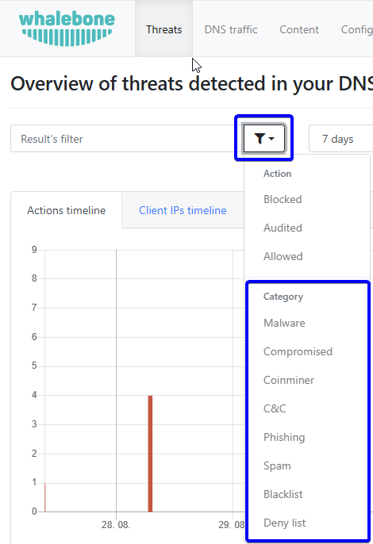

Threats
=======

Threats are special events in which a DNS request for a domain is present in the reputation database. There are two types of actions when a threat is detected. The first is to **audit** the event, which only logs the domain; however, access is still possible. The second action is a **block** that prevents requests to the malicious site and redirects the user to the blocking page.

You can watch a step-by-step video guide :ref:`here<Threats video>`.

Threats are categorized by their types. The categories are:

* Blacklist
* C&C
* Coinminer
* Compromised
* Malware
* Phishing
* Spam

How to Search for Events Blocked by a Deny List
~~~~~~~~~~~~~~~~~~~~~~~~~~~~~~~~~~~~~~~~~~~~~~~

.. tip:: The Deny list category is a custom list maintained by the customer's administrators to block domains on demand. Blacklist is part of the Whalebone threat intelligence data for known domains that host multiple threats, or when the exact category could not be determined.

You can select the deny list category in the pie charts or in the log list under the **Threat Categories** column. Another option is to click the **Filter** button and set the **Deny list** filter to **Yes**.

How to Analyze a Domain
~~~~~~~~~~~~~~~~~~~~~~~

To learn more about domain analysis, scoring of malicious domains, domain categories, or what external sources know about them, watch the step-by-step video :ref:`here<Domain analysis video>`.

How to Report "False Positive"
~~~~~~~~~~~~~~~~~~~~~~~~~~~~~~
In some cases, the score of a domain may be wrong. If you believe a domain should not be blocked but is, you can report it as misclassified using the **Report False Positive** button to initiate a domain review request.

   Report false positive

Filtering Options
~~~~~~~~~~~~~~~~~

* **Client IP**: The source IP address that made the DNS request or incident
* **Device ID**: The unique identifier of the device that made the DNS request or was involved in the incident.
* **Domain**: The domain in the DNS query
* **Action**: The action that the resolver took with that specific query, such as ``block``, ``allow``, and ``audit``
* **Threat category**: The category of the threat, such as ``malware``, ``phishing``, or ``c&c`` (command and control)
* **Threat name**: The specific name of the threat, which may provide more detailed information about the nature of the threat
* **Deny list**: Enable or disable the filter for domains that are present in deny lists
* **Country code**: The country code associated with the client's IP address, which can provide insights into the geographic location of the source of the DNS request or incident
* **Resolver ID**: The unique identifier of the resolver that processed the DNS request or was involved in the incident, which can help identify patterns or specific resolvers that may be associated with certain types of threats

.. only:: Immunity or DNS4GOV

  .. tip:: The device ID has been assigned by the Home Office Security client installed on the device. The list of devices is in the **Home Office Security** section of the portal, which is located in the user menu.

.. only:: Aura or Peacemaker

  .. tip:: The device ID has been assigned by the customer using the Retail API. The list of devices is in the **Retail** section of the portal.

CSV Export
~~~~~~~~~~

The CSV export contains the following details:

* date
* action
* client's IP address
* device name
* country
* domain
* score
* threat category
* threat name
* resolver's name
