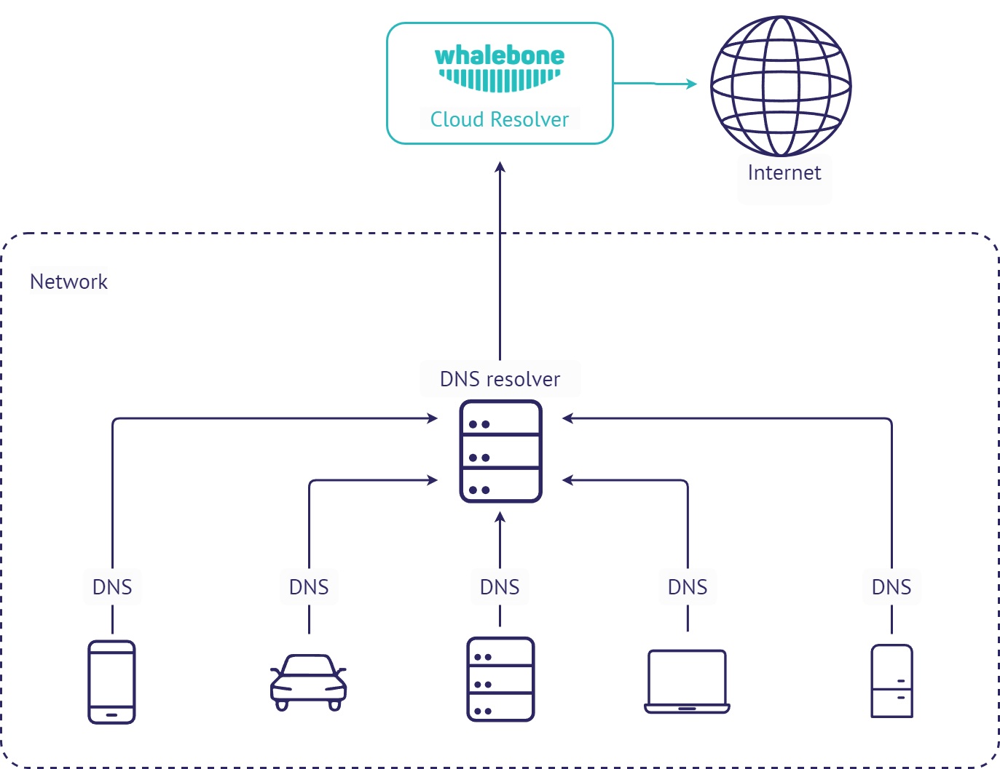

Deployment options
==================

Whalebone could be deployed in several scenarios which can be even combined to satisfy requirements of particular networks. Combination of cloud and local DNS resolver with single management console will satisfy even complex and distributed networks.

.. tip:: All of the options below could be combined together. Various network segments and zones could have different requirements and possibilities.

.. tip:: Should you believe none of the scenarios below is applicable to your use case, please contact Whalebone Support and we will help you with architecture that will suit your needs.

Cloud DNS
---------

This is the simplest method o deployment. To use Whalebone filtering, just change the configuration of your recent DNS resolvers and point them to Whalebone cloud resolvers.
The downside of this deployment is that all of the incidents will be visible with source IP of the DNS forwarder instead of the original source IP. Still this deployment could come in handy if the priority is to prevent the threats with as low effort and infrastructure changes as possible.

Cloud DNS (direct connection)
-----------------------------

This deployment is similar to forwarding the requests to Whalebone cloud resolvers, but the requests are sent directly to the cloud without local DNS cache. This could be usually set for all endpoints through DHCP. However not using local DNS cache means increased latency introduced by the network communication between the client and cloud resolver.
If the individual machines are not hidden behind a NAT, their IP addresses will be directly visible in the Whalebone reporting and the clients can be easilly distinguished.

.. image:: ./img/deployment_cloud_direct.png
   :align: center
