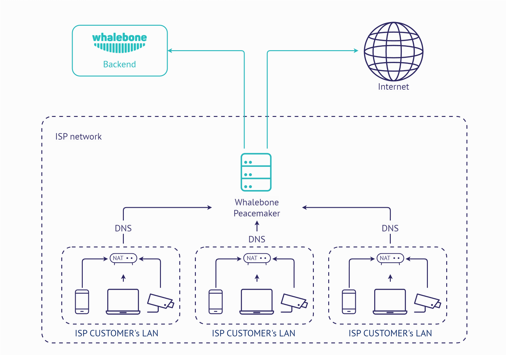

Deployment options
==================

Local DNS resolver for ISP (Whalebone Peacemaker)
------------------

This deployment scenario uses local Whalebone resolver, that communicates with Whalebone cloud through API. The DNS resolution takes place directly on the resolver and is completely independent on the cloud availability. Should the resolver not be able to reach the cloud service, it won't be able to update the threat intelligence and to reports any incidents.
The main advantage of this deployment is visibility into local network and individual IP addresses and native DNS resolver latency.

