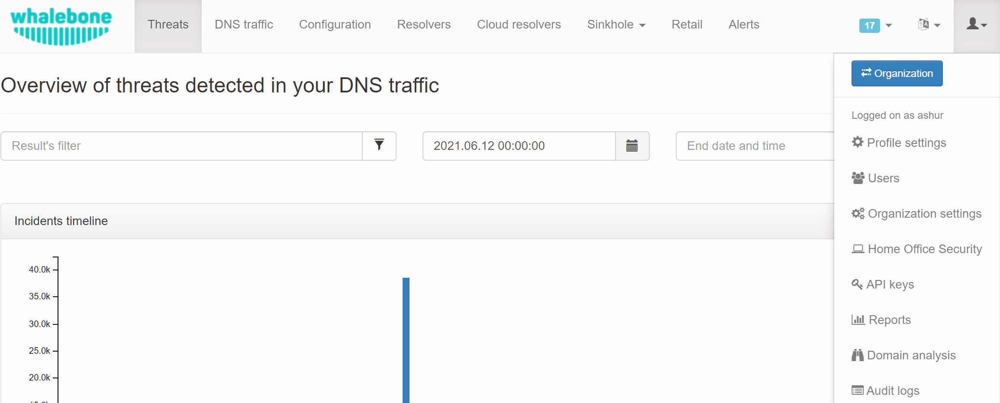
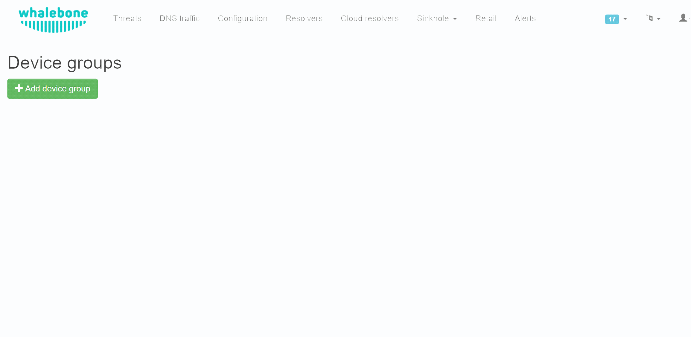
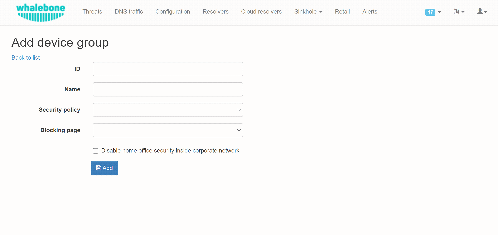
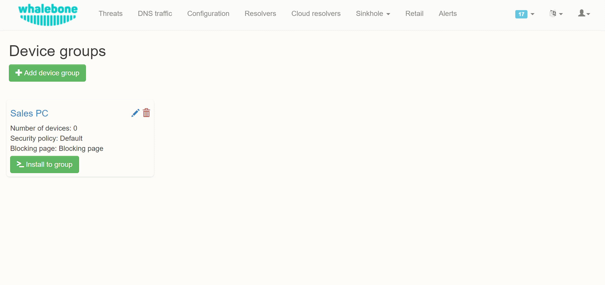
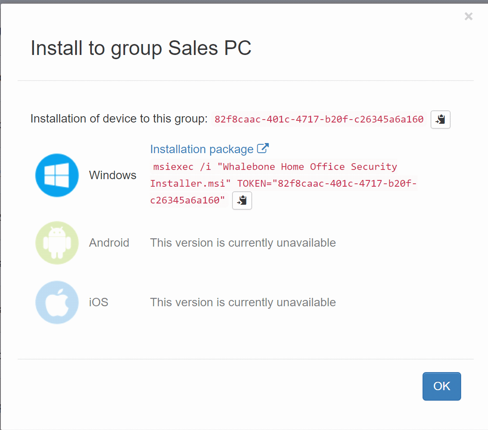
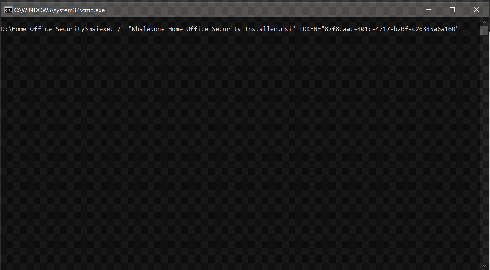

====================
Home Office Security
====================

************************
Step by step
************************

To install HOS on device you need to configure it first. Please open `Whalebone Portal` web page and use (1) `User menu` to navigate to (2) `Home Office Security`.

Create (3) a Device group.

Fill the form. The ID may represent your organization group, such as Active Directory. A `Name` column makes the friendly description of this group. Select policy and blocking pages. Click (4) `Add` button to create this group.

Click (5)  `Install to group` see installation instructions and download link to the installer.

Copy (6) the installation command to clipbord. If you haven't downloaded the HOS installer yet, you can do so by clicking `Installation package` link.

Locate the installation package, a file named `Whalebone Home Office Security Installer.msi`. Open up a command prompt, locate the installer file and paste (7) the command with your mouse (right click). Execute the installer.

Installer has minimal UI, if there was no error message installation succeeded.