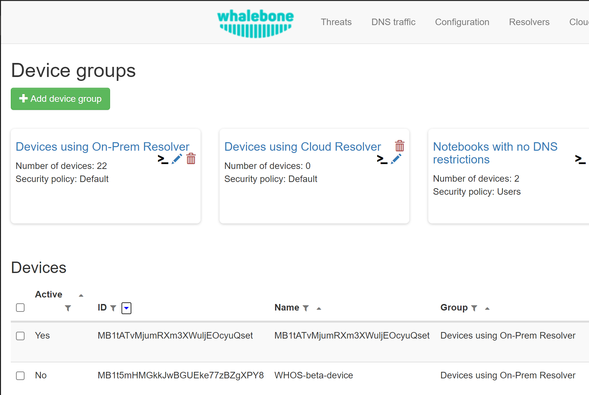
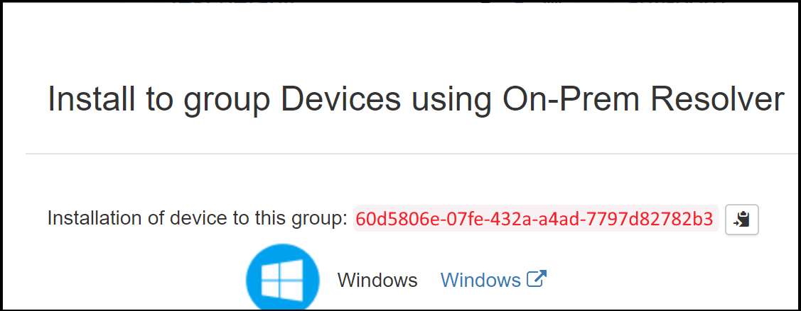

====================
Home Office Security
====================

Whalebone Home Office Security (HOS) provides a DNS filtering functionality for your desktop and mobile devices. It intercepts DNS traffic and inspects it before sending network packets to the wild. It protects the device from network threats by the divertion by scanning every DNS packet.

************************
Operation
************************
Policies 
========================
Policy is a set of rules that instructs how to operate. Based on policy the device or the local/cloud resolver decides what to during DNS resolution. This set of rules persist on the device and is updated initially and later synchronized. Because of that Portal provides monitoring of these devices.

Devices
========================
Your organization may divide devices into single or multiple groups. Every device may belong exactly to a single group only. Each must be a member of ``Device group`` before they get monitored. Each group provides a security ``Policy`` which is later conditionally applied to them. Whether the device is present on the ``internal`` or ``external`` network makes it ``active`` or ``inactive``. It separates the network location into ``internal`` or ``external`` and the biggest role here has the ``Internal server`` setting which must be defined in the ``Device group``. If HOS detects the ``Internal server`` the network location is decided as ``internal``.

States
========================
HOS is constantly monitoring changes on the network interfaces and based on the conditions it changes its states. 

``Active`` 
    All DNS traffic is diverted to DoH server. HOS becomes ``Active`` when it is connected to the public network, but the ``Internal server`` is unreachable. This state is used for the danger zones such as public wifi.

``Inactive`` 
    DNS trafic is left intact. This state is used when device can't connect to the Internet or when it is connected through internal network.

Security
========================
In the background HOS uses ``DNS-over-HTTPs`` or ``DoH``. The ``Hostname`` of the ``Resolver`` is never diverted and is cached. The identification and authenticity is left to the TLS protocol. When device belongs to any ``Domain``, then all domain names and their subdomains are allowed to reach the DNS servers they route to. HOS uses `Win32_NetworkAdapterConfiguration` WMI table to get the information.

************************
Installation
************************
HOS comes with Windows Installer for the deployment. No user interaction is required to perform the installation, installer requires ``token`` though. Default target directory:

``C:\Program Files (x86)\Whalebone\Home Office Security\``

Supported desktop OS
====================

=================== =================================
Desktop             Server                          
=================== =================================
☐ Windows XP        ☐ Windows 2000                  
☐ Windows Vista     ☐ Windows 2003, Windows 2003 R2 
☑ Windows 7         ☐ Windows 2008, Windows 2008 R2 
☑ Windows 8         ☑ Windows 2012, Windows 2012 R2 
☑ Windows 8.1       ☑ Windows 2016                  
☑ Windows 10        ☑ Windows 2019                  
=================== =================================

Windows 7 systems must be up-to-date or at least have KB3033929 installed.

Windows Server 2016 systems must have secure boot disabled.

Portal 
====================

First, check that your organization have <a href='https://docs.whalebone.io/en/hos/local_resolver.html#security-policies'>policies</a> and device groups prepared. If you haven't set any <a href='https://docs.whalebone.io/en/hos/local_resolver.html#security-policies'>policies</a> or device groups, please you proceed further.

Installation Token
====================

``Token`` must be provided for the installation to succeed. You may obtain one on ``Portal`` page titled ``Device groups`` when you click ``>_`` [Install to group] button on any of the ``Device group`` panel. If there is none create it. After that you can run the installer with token you find on the page ``Install to group...`` page. This token is unique for your Origanization.

Successfull installation gives no message.

Install Instructions
=====================

Install or Update:

.. code-block:: shell

    msiexec /i "Whalebone Home Office Security Installer.msi" TOKEN="60d5806e-07fe-432a-a4ad-7797d82782b3" UI="false"

Uninstall:

.. code-block:: shell

    msiexec /u "Whalebone Home Office Security Installer.msi

Service requirements
====================

Because HOS must intecept network traffic it requres to run as SYSTEM account. You can query the service by name ``hos`` to see if it started properly. When none or invalid installation token is supplied the service it will stop.

.. code-block:: shell

    C:\Users\admin>sc query HOS

    SERVICE_NAME: HOS
            TYPE               : 10  WIN32_OWN_PROCESS
            STATE              : 4  RUNNING
                                    (STOPPABLE, PAUSABLE, ACCEPTS_SHUTDOWN)
            WIN32_EXIT_CODE    : 0  (0x0)
            SERVICE_EXIT_CODE  : 0  (0x0)
            CHECKPOINT         : 0x0
            WAIT_HINT          : 0x0

On first run HOS also installs ``windivert`` system driver. 

.. code-block:: shell

    C:\Users\admin>sc query windivert type=kernel

    SERVICE_NAME: windivert
            TYPE               : 1  KERNEL_DRIVER
            STATE              : 4  RUNNING
                                    (STOPPABLE, NOT_PAUSABLE, IGNORES_SHUTDOWN)
            WIN32_EXIT_CODE    : 0  (0x0)
            SERVICE_EXIT_CODE  : 0  (0x0)
            CHECKPOINT         : 0x0
            WAIT_HINT          : 0x0

Service is configured to recover after crash three times and then stay stopped.

Endpoint
====================

Enable TCP port 443 for the *Whalebone Home Office Security.exe* in the application firewall. o enable it for all network profiles in Windows, adjust following command to let HOS connect to your DoH server (e.g. 185.150.10.71):

.. code-block:: shell

    netsh advfirewall firewall add rule name="Whalebone Home Office Security" dir=out action=allow program="C:\Program Files (x86)\Whalebone\Home Office Security\Whalebone Home Office Security.exe" enable=yes remoteip=185.150.10.71,LocalSubnet

It is not necessary for the service to listen on port 53, thus there is no requirement for the application firewall to follow.

Additionally, service is listening on *TCP endpoint localhost:9000* to provide data endpoint for UI app, and UI app server ``whosui.exe`` listens on *TCP endpoint localhost:55221* to render graphical components. Even though theese ports are not critical for HOS operation they are relevant for UI app ``AdminUI.exe``. Please ensure that services are allowed to listen on those local ports as this allows user to have insight into app operation.