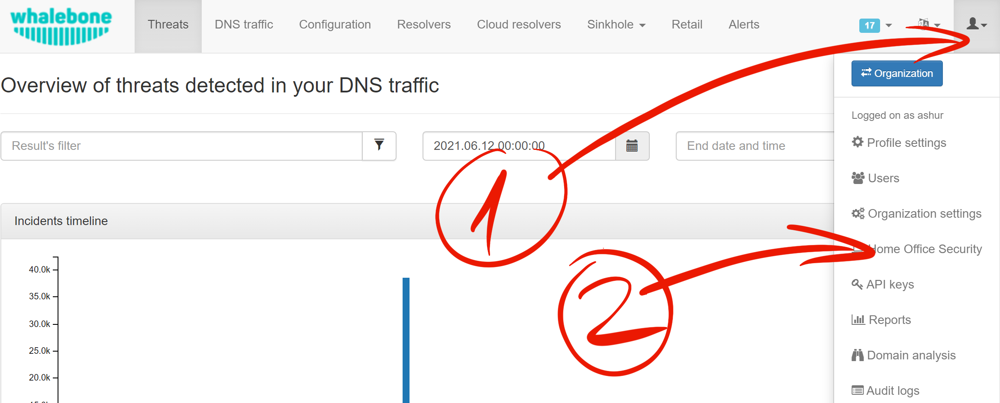
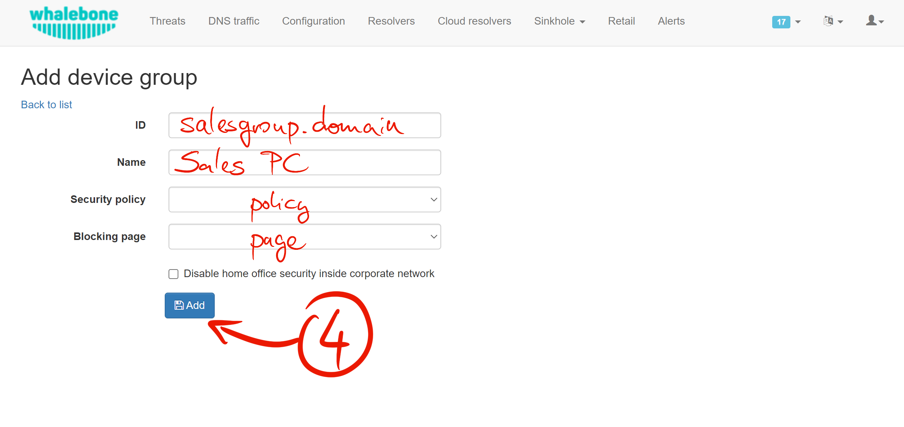
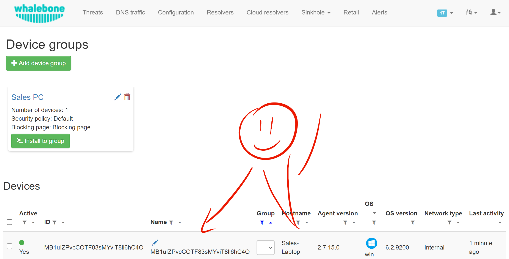

*************************
Step by step installation
*************************

To install HOS on device you need to configure it first. Open **Whalebone Portal** web page and use (1) **User menu** to navigate to (2) **Home Office Security**.

A Default Device group should already exist. If not, create one by clicking the (3) a **+ Add device group** button.

.. image:: ./img/hos-sbs-2.png
    :align: center

* **Name**: This should clearly identify the device group to differentiate it from others. If you only use one, you may leave its name as Default Group. 
* **Policy**: corresponds to the policies you create in the Configuration menu. It is a set of rules that instructs how to operate. Based on policy the device or the local/cloud resolver decides what to during DNS resolution. This set of rules persist on the device and is updated initially and later synchronized. Because of this Portal provides monitoring of these devices.
* **Blocking page**: corresponds to the blocking pages you create in the Configuration menu. 
* **Domain exceptions**: HOS service will not divert any DNS queries that contain question for domain on the exception list. E.g. when ``example.com`` is specified, the DNS request will be resolved as usual on the resolver configured by operating system. A same rule applies for question ``subdomain.example.com``.
* **Disable HOS inside the corporate network**: When this option is checked, 3 more text boxes will appear. The configuration allows the HOS to be disabled within the corporate network based on a query-response process. 
    * **Internal Domain**: Specifies which internal domain HOS will periodically query.
    * **Internal Response**: HOS expects the response specified in this field after sending a query to the internal domain.
    * **Query Type**: According to the selected query type (A, AAAA and MX), the record on the internal domain controller must be configured correctly.

When you're done, click **Add** button to create this group.

Click (5) **Install to group** button to see installation instructions and/or get download link to the HOS installer.

.. image:: ./img/hos-sbs-4.png
    :align: center

If you haven't already download the installer (6). While the installer is being downloaded please copy the installation command to clipboard (7). 
To install or Update:

.. code-block:: shell
    :caption: Install or update (Windows 64‑bit)

    msiexec /i "Whalebone.Home.Office.Security.Installer.msi" TOKEN="60d5806e-07fe-432a-a4ad-7797d82782b3" REGION="eu-01"

Uninstall:

.. code-block:: shell
    :caption: Uninstall (removes program data automatically from v 2.20 ↑)

    msiexec /x "Whalebone.Home.Office.Security.Installer.msi

.. image:: ./img/hos-sbs-5.png
    :align: center

.. note::
   • **REGION** is optional.  Accepted values are **eu-01**, **am-01**
     and **apac-01**.  
   • The installer is now **64‑bit only**; x86 Windows is no longer supported.

Find the folder where the installer is located. It should be file named **Whalebone.Home.Office.Security.Installer.msi**.

Open up a command prompt, change directory to the folder where is the installer and paste (8) the command with your mouse (right click). Execute the command. This requires admin priviledges.

Installer will end prematurely with error when executed without token argument.

.. image:: ./img/hos-sbs-6.png
    :align: center

.. Tip:: The installer has very minimal UI. If there was no error message, consider the installation successful.

Device is now visible in the Whalebone Portal web page. 

