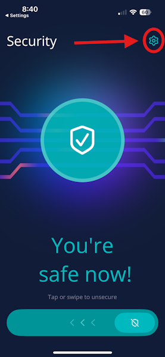
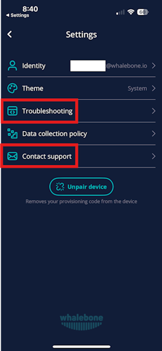

Troubleshooting
===============

MSI exits early
---------------

* **Possible cause:** Insufficient privileges to run the MSI file.
* **Resolution:** Run the command prompt as Administrator.

"Unsupported architecture" error
--------------------------------

* **Possible cause:** The 32-bit Windows operating system is not supported.
* **Resolution:** Install the application on 64-bit Windows operating systems.

Device not visible in the Admin Portal
--------------------------------------

* **Possible cause:** Network or token issue.
* **Resolution:** Check the connectivity to `hos.whalebone.io <http://hos.whalebone.io>`_ and all cloud resolvers on TCP port 443. Verify the token and region provided during installation. The list of resolvers can be obtained by running the following command: ``dig hos.whalebone.io TXT``.

Internal domain not recognized
------------------------------

* **Possible cause:** The Home Office Security client is running even when the user is in the office. Therefore, the device is connected to the Whalebone cloud DNS server, which cannot resolve internal domain names.
* **Resolution:** Enable and configure the "Disable home office security inside corporate network" feature in the user's device group. If it has already been enabled and configured, verify the DNS record and confirm it resolves correctly from the device.

Policy not updated
------------------

* **Possible cause:** The synchronization delay is up to 4 hours.
* **Resolution:** Allow the synchronization cycle to complete.

Internal domains cannot be resolved
-----------------------------------

* **Possible cause:** The browser or operating system has cached the domains based on their TTL (Time-to-Live).
* **Resolution:** Clear both the operating system and browser cache. Try to access the domain in an anonymized window.

The user can access domains that should be blocked (Windows)
------------------------------------------------------------

* **Possible cause:** The Windows service is not running.
* **Resolution:** Verify whether the Whalebone Home Office Security service is running.

The "Network has not Internet access" error on Android
------------------------------------------------------

.. image:: ./img/hos-troubleshooting-1.png
   :align: center

* **Possible cause:** The Private DNS feature is enabled on the Android device.
* **Resolution:** Disable Private DNS to resolve the issue because this feature is not compatible with Home Office Security.

  .. image:: ./img/hos-troubleshooting-2.png
    :align: center

Log and configuration locations (Windows)
-----------------------------------------

* Installation folder: ``C:\Program Files\Whalebone\Home Office Security\``
* Logs: ``C:\ProgramData\Whalebone\Home Office Security\Logs``
* Configuration: ``C:\ProgramData\Whalebone\Home Office Security\Config``

Technical support (Windows)
---------------------------

In case of any issues with the application, please proceed as follows:

1.  Collect the log files from ``C:\ProgramData\Whalebone\Home Office Security\Logs``.
2.  Collect the configuration files from ``C:\ProgramData\Whalebone\Home Office Security\Config``.
3.  Collect the Application, Setup, and System logs from Event Viewer.
4.  Contact **Whalebone Support** with your organization ID, the name of the affected device, a detailed description of the issue, and all collected logs.

Log and configuration locations (Android and iOS)
-------------------------------------------------

Users can access logs and other troubleshooting data by clicking the gear button in the upper-right corner of the screen.

The Troubleshooting menu opens a detailed overview of the application and the recent user's activity. The Contact Support button collects all data and sends it to the Whalebone support team.

