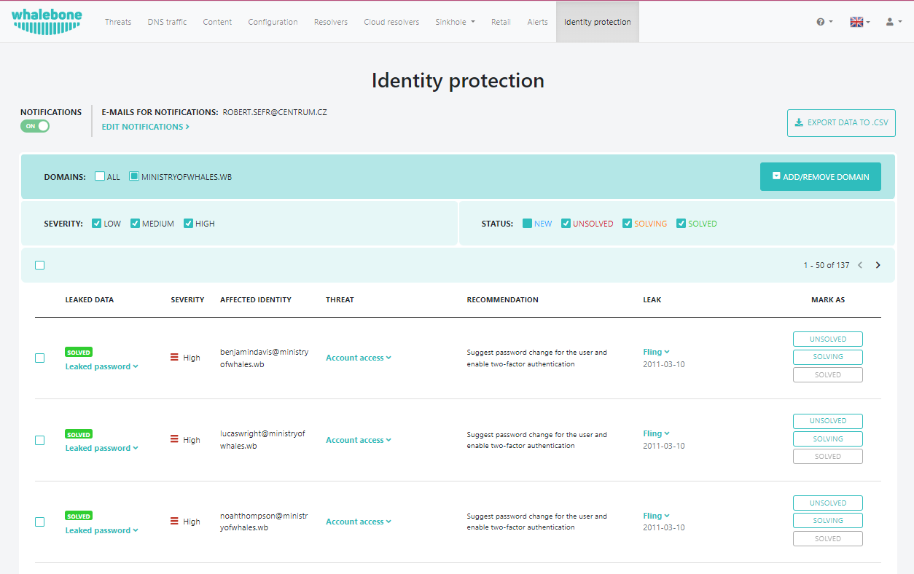
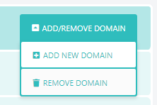
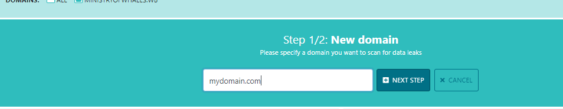
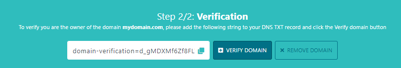
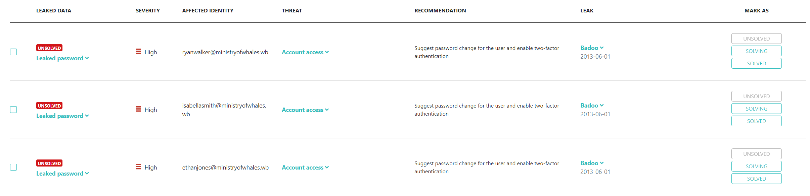
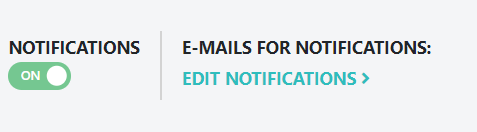

****************************
Identity Protection Overview
****************************
Whalebone Identity Protection is a comprehensive solution designed to safeguard your personal information from data breaches and identity theft.

Domain settings
===============

To get Identity Protection setup for a domain that you own click on **Add New Domain**. You can also remove registered domain using button **Remove Domain**.

In the field type in **domain name** you want to monitor using Identity Protection.

A string will be presented with instructions to add it as a **TXT record** on your **DNS**.

Once that is done your domain ownership will be verified and data breaches will start showing on the portal page.

For every leak you can set 3 states depending on the process of solving the leak. You can change from **UNSOLVED**, **SOLVING** and **SOLVED**. Every new leak will marked as **NEW**. You can also filter out for leaks using **SEVERITY** and **STATUS** filters. 

Notifications settings
======================
If you want to be alerted about new entries toggle on the **Notifications** switch and click on **Edit Notifications**.

You will be redirected to **Report settings** where you need to toggle **Identity protection Notifications** are enabled and insert email addresses where you want to be alerted. Finis the step by clicking on **Save**.

.. image:: ./img/idp_7.png
    :align: center

After adding the addresses you should see them displayed in section **E-mails for notifications:**.

.. image:: ./img/idp_7.png
    :align: center

More information
================

Identity Protection offers a multi-layered approach to protecting your online identity, providing peace of mind and proactive security measures.

* **Data Leak Monitoring:** Whalebone actively monitors public data breaches and the dark web for instances where your personal information might be exposed. This includes email addresses, passwords, social security numbers, and other sensitive details.
* **Breach Alerts and History:** If a data leak is detected that potentially exposes your information, Whalebone promptly notifies you. You'll also have access to a comprehensive history of past data leaks that might have impacted you.
* **Data Leak Breakdown:** Whalebone goes beyond simply notifying you of a leak. It provides a detailed breakdown of the leaked data, including the type of information exposed and the source of the breach. This empowers you to understand the scope of the risk.
* **Impact Assessment:** Whalebone doesn't just inform you about the leak, it also assesses the potential consequences on you. This assessment explains how the leaked information could be misused and the severity of the risk.
* **Actionable Steps:** Whalebone doesn't leave you hanging. Based on the leak details and impact assessment, it recommends specific actions you can take to mitigate the risk. This might involve changing passwords, enabling two-factor authentication on vulnerable accounts, or contacting relevant institutions to report the leak.

