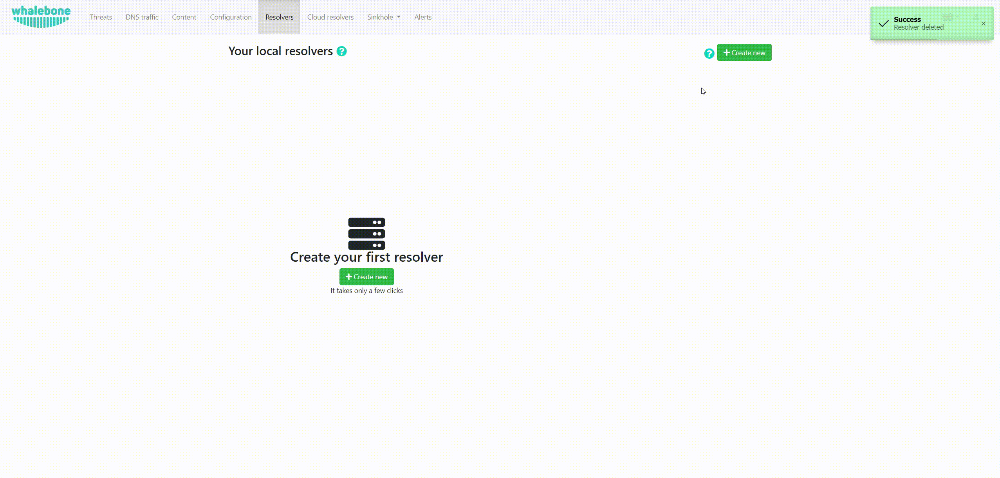
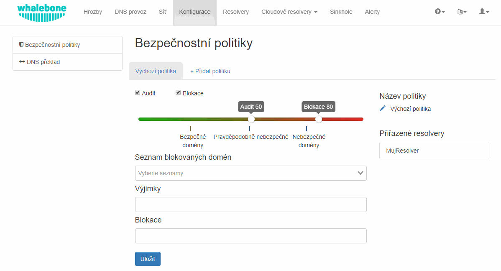

Local resolver
==============

Whalebone local resolver brings the advantage of visibility of local IP addresses that send the actual requests. Whalebone resolver is based on the implementation of `Knot Resolver <https://www.knot-resolver.cz/>`_ developed in the CZ.NIC labs.


System requirements
-------------------

Local resolver is supported on dedicated (hardware or virtual) machine running a supported operating system.

* **Supported operating system** (server editions of following distributions):

  * Red Hat Enterprise Linux 7
  * CentOS 7
  * Debian 8,9
  * Ubuntu 16.04

* **Recommended hardware sizing** for usual traffic (physical or virtual):

  * 2 CPU cores
  * 4 GB RAM
  * 40 GB HDD

* **Network setup requirements** (local resolver needs the following ports opened):
  
  * ``TCP+UDP/53`` into the internet destinations if responsible for the resolution
  * ``TCP/8443`` to ``resolverapi.whalebone.io`` 
  * ``TCP/443`` to ``logger.whalebone.io, agentapi.whalebone.io, portal.whalebone.io``

.. warning:: Without communication on port 8443 and 443 to the domains listed above the resolver won't be installed at all (the installation script will abort).

With recommended hardware resources the resolver will provide stable and fast DNS resolution and filtering. Resolver can be run with significantly lower resources, but that is recommended just for low volume testing environments.

.. note:: Should you need sizing estimation for large ISP or Enterprise network contact Whalebone. Whalebone local resolver will need approx. twice the RAM and CPU than usual resolver (BIND, Unbound). 

Installation of a new resolver
------------------------------

In menu **Resolvers** press the button **Create new**. Choose a name (identifier) for your new resolver. The input is purely informative and won't affect the functionality.
Once you've entered the name, click **Add resolver** button
After clicking the button an informative window will pop up with list of supported platforms and the one-line command for the installation. Copy the command and run on the machine dedicated for the local resolver.
The command will run the installation script and will pass the one time token used for the resolver activation (the same command can not be used repeatedly).



Once the command is run the operating system is being checked and requirements installed. Skript will inform you about the progress and it creates a detailed log named ``wb_install.log`` in current directory.
Successul run of the install script is ended with the notification ```Final tuning of the OS``` with value ``[ OK ]``. Right after the installation also the initialization takes place and it could take several minutes before the resolver starts the services.

.. image:: ./img/lrv2-install.gif
   :align: center

.. warning:: Local resolver is configured as an open resolver. It will respond to any request sent. This is quite comfortable in terms of availability of the services, but also could be a risk if the service is available from the outside networks. Please make sure you limit the access to the local resolver on port 53 (UDP and TCP) from the trusted networks only, otherwise it can be misused for various DoS attacks.


Security policies
-----------------

The behavior of DNS filtering on the resolvers could be defined in the menu item **Configuration** and tab **Security poicies**. In the default state there is only the **Default policy**, which is automatically assigned to any new resolver.
In any policy there are several options to be defined:

* **Malicious domains filtering**

  * Allows to apply actions Audit (logging) or Block (redirect to blocking page) on resolution of malicious domains
  * Individual action could be turned off - e.g. turn off the blocking for testing purposes
  * The slider values define the probability that the particular domain is malicious on the scale from 0 to 100 (0 is a safe domain, 100 is malicious)

.. tip:: The default threshold for blocking is set to ``80`` which is safe even for larger network with liberal policy towards the users. For more restrictive policy we suggest setting threshold for blocking to ``70-75``, in very restrictive networks even down to ``60``. Audit is purely informative, however setting the threshold too low can result in too many logged incidents.

* **Lists of blocked domains**

  * Lists of domains, that has to be blocked
  * Such domains do not have to be malicious, it could be just domains blokced based on legal requirements
  * These lists are regularly updated by Whalebone

* **Whitelist**

  * Domains that won't be blocked at any time
  * The whitelist is applied to the domain and all of the subdomains, e.g.: whitelisted domain ``whalebone.io`` will also whitelist ``docs.whalebone.io``, but not vice versa

* **Blacklist**

  * Domains that will be blocked at all times (higher priority has only **Whitelist**)
  * The blacklist is applied to the domain and all of the subdomains, e.g.: whitelisted domain ``malware.ninja`` will also blacklist ``super.malware.ninja``, but not vice versa 



.. note:: Changes will be applied to the resolvers in approx. 30 minutes. Saved configuration is used during preparation of the threat data package for the resolvers that download and apply those packages at regular intervals.


DNS resolution configuration
----------------------------

You can find the options to configure the resolver in the menu **Configuration** and tab **DNS resolution**. This page allows you to do the basic configuration without the knowledge of configuration syntax. Furthermore there is a text area allowing you to define any configuration to the underlying `Knot Resolver <https://www.knot-resolver.cz/>`_.

Available configuration options:

* **Enable IPv6**

  * Should the system has the IPv6 properly configured and working, it is possible to enable it. Otherwise the activation of IPv6 could have negative effects on the performance and latency of the resolver.

* **Forward queries to**

  * This option allows to redirect all or chosen queries to upstream resolvers or authoritative DNS servers (suitable e.g. for forwarding to domain controllers of Active Directory)

  * **Disable DNSSEC**

    * If checked, the answers from the forwarded queries won't be DNSSEC validated. We recommend to check this option should the upstream server have not DNSSEC configured properly.

  * **All queries to**

    * Option to forward all queries to one or more resolver

  * **Following domains**

    * Option to choose particular domains that should be forwarded to on more resolvers
    * Different resolvers could be defined for different domains

* **Static records**

  * Predefined answers that should be returned for particular domains
  * Could serve for special purposes such as monitoring or very simple substition of records on authoritative server

* **Advanced DNS configuration**

  * Text area for `complete Knot Resolver configuration <https://knot-resolver.readthedocs.io/en/stable/daemon.html#configuration>`_
  * Supports Lua scripting
  * Faulty configuration can impact stability, performance or security functions of the resolver

.. image:: ./img/lrv2-resolution.gif
   :align: center

   .. note:: Once the **Save** button is pressed changes in DNS resolution are saved and prepared to be deployed to target resolvers. The deployment itself has to be done from the **Resolvers** page. It is possible to do multiple changes and apply all of them at once to minimize the number of deployments to the resolver.