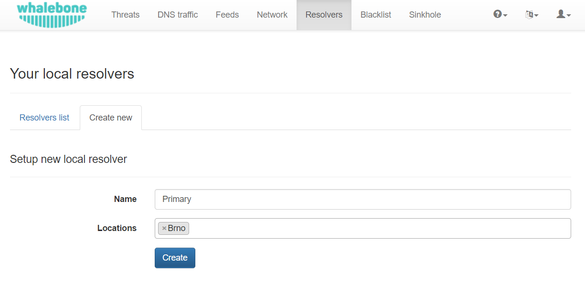
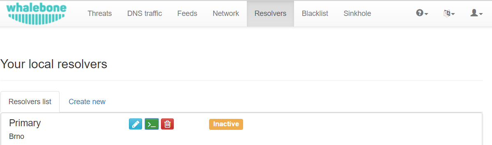
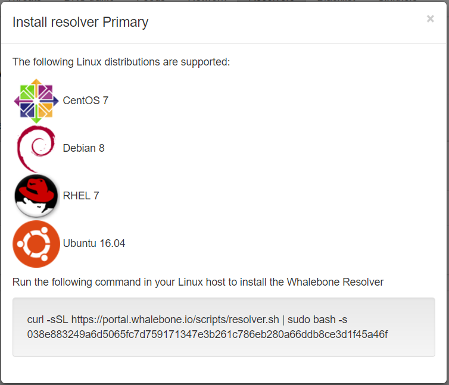
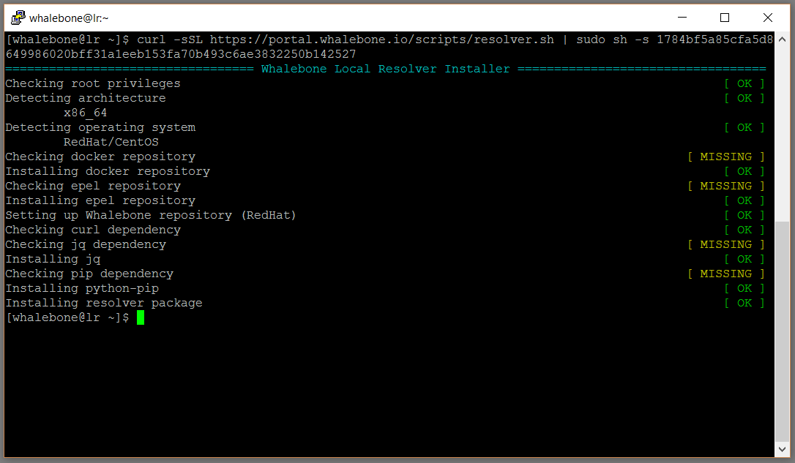
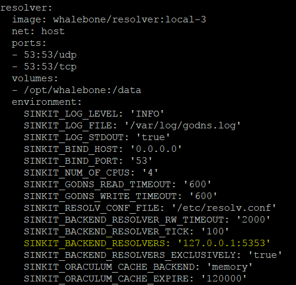

Local resolver
==============

Whalebone local resolver brings the advantage of visibility of local IP addresses that send the actual requests. Cloud resolver usually communicates with the caching resolver IP and can't distinguish between the individual clients and log the original client IP address.

System requirements
-------------------

Local resolver is supported on dedicated (hardware or virtual) machine running a supported operating system.

* Supported operating system (server editions of following distributions):

  * Red Hat Enterprise Linux 7
  * CentOS 7
  * Debian 8,9
  * Ubuntu 16.04

* Recommended hardware sizing for usual traffic (physical or virtual):

  * 2 CPU cores
  * 4 GB RAM
  * 40 GB HDD
  * 1 network interface

.. warning:: Machine with multiple network interfaces could introduce issues in gathering DNS audit. If multiple interfaces are needed, contact Whalebone support.

* Network setup requirements - local resolver needs the following ports opened:
  
  * ``TCP+UDP/53`` into the internet destinations if responsible for the resolution
  * ``TCP/8443`` to ``resolverapi.whalebone.io`` 
  * ``TCP/443`` to ``logger.whalebone.io``

.. warning:: Without communication on port 8443 and 55555 the resolver won't be able to proceed with initialization and won't start processing DNS requests (port 53 will stay closed until the initialization is complete)

With recommended hardware resources the resolver will provide stable and fast DNS resolution and filtering. Resolver can be run with significantly lower resources, but this is recommended just for low volume testing environments.

.. tip:: Should you need sizing estimation for large ISP or Enterprise network contact Whalebone. Whalebone local resolver will need slightly more RAM than usual resolver and approx. twice the CPU power. 

Installation
------------

In menu ``Resolvers`` select the tab ``Create new``. Choose a name (identifier) for your new resolver and optionally a location. Both inputs are purely informative and won't affect the functionality.
Once you've entered the details, click ``Create`` button



After clicking the ``Create`` button you will be moved to the list of available resolvers. Click the green button with the prompt icon.



After clicking the green button an informative window will pop up with list of supported platforms and the one-line command for installation. Copy the command and run in the machine dedicated for the local resolver. You can check the installation script before running it. 
The command will run the installation script and will pass the one time token used for the resolver activation.



Once the command is run the operating system is being checked and requirements installed. Skript will inform you about the progress and it creates a detailed log in current directory.
Successul run of the install script is ended with the notification ```Installing resolver package``` with value ``[ OK ]``. Right after the installation also the initialization takes place and it could take several minutes before the resolver starts the services.



.. warning:: Local resolver is configured as an open resolver. It will respond to any request sent. This is quite comfortable in terms of availability of the services, but also could be a risk if the service is available from the outside networks. Please make sure you limit the access to the local resolver on port 53 (UDP and TCP) from the trusted networks only, otherwise it can be misused for various DoS attacks.


Reverse proxy configuration
---------------------------

Configuring the local resolver as a pure reverse proxy forwarding requests to other existing resolvers requires a simple change of the configuration and a service restart.
Open configuration file ``/etc/whalebone/docker-compose.yml`` in your favorite editor and edit the parameter ``SINKIT_BACKEND_RESOLVERS`` which is in default configuration se to ``127.0.0.1:5353``. Reconfigure the destination IP address and port to include your resolvers (it can list several resolvers separated by comma), e.g. ``SINKIT_BACKEND_RESOLVERS: '10.20.30.40:53,192.168.1.20:53'``



After saving the changes you have to restart the resolver services (DNS service will be down during restart) with the following command:

.. code-block:: bash

     cd /etc/whalebone && sudo docker-compose down && sudo docker-compose up -d

firewalld configuration
-----------------------

In case firewalld service is enabled and started on the server with Whalebone resolver, ports 53/TCP,UPD will have to be opened to allow other machines sending requests to the resolver. You can open the ports with following command sequence:

.. code-block:: bash

    firewall-cmd --permanent --add-port=53/tcp
    firewall-cmd --permanent --add-port=53/udp
    firewall-cmd --reload

