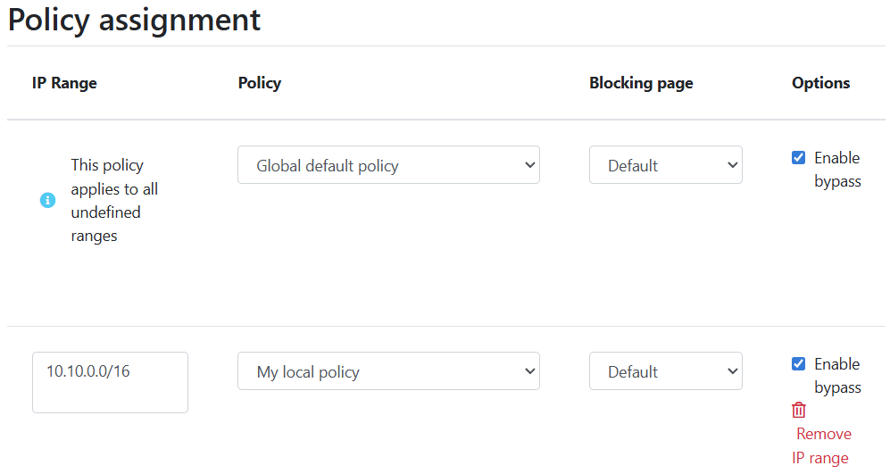

**************
Local resolver
**************

Whalebone local resolver brings the advantage of visibility of local IP addresses that send the actual requests. Whalebone resolver is based on the implementation of `Knot Resolver <https://www.knot-resolver.cz/>`_ developed in the CZ.NIC labs.


System requirements
===================

Local resolver is supported on dedicated (hardware or virtual) machine running a supported operating system.

* **Supported operating system** (64-bit, server editions of following distributions):

  * Red Hat Enterprise Linux 7, 8
  * CentOS 7, 8
  * Debian 9, 10
  * Ubuntu 16.04, 18.04, 20.04

* **Supported filesystems** 

  * ext4
  * xfs only with d_type support (ftype=1)

* **Minimum hardware sizing** (physical or virtual):

  * 2 CPU cores
  * 4 GB RAM
  * 40 GB HDD (at least 30 GB in /var partition)

.. warning:: In case the resolver is installed on vSphere you will have to `disable the balloon driver <https://kb.vmware.com/s/article/1002586>`_to avoid memory issues.

* **Network setup requirements** (local resolver needs the following ports opened):
  
  * ``TCP+UDP/53`` into the internet destinations if responsible for the resolution
  * ``TCP/443`` to ``resolverapi.whalebone.io``, ``logger.whalebone.io``, ``agentapi.whalebone.io``, ``transfer.whalebone.io``, ``portal.whalebone.io``, ``harbor.whalebone.io``, ``download.docker.com``, ``data.iana.org``
  * Reachability of software repositories for the operating system

.. warning:: Without communication on port 443 to the domains listed above the resolver won't be installed at all (the installation script will abort).

.. note:: Should you need sizing estimation for large ISP or Enterprise network contact Whalebone. Whalebone local resolver will need approx. twice the RAM and CPU than usual resolver (BIND, Unbound). 

Installation of a new resolver
==============================

In menu **Resolvers** press the button **Create new**. Choose a name (identifier) for your new resolver. The input is purely informative and won't affect the functionality.
Once you've entered the name, click **Add resolver** button
After clicking the button an informative window will pop up with list of supported platforms and the one-line command for the installation. Copy the command and run on the machine dedicated for the local resolver.
The command will run the installation script and will pass the one time token used for the resolver activation (the same command can not be used repeatedly).

.. image:: ./img/lrv2-create.gif
   :align: center

Once the command is run the operating system is being checked and requirements installed. Script will inform you about the progress and it creates a detailed log named ``wb_install.log`` in current directory.
Successul run of the installation script is ended with the notification ```Final tuning of the OS``` with value ``[ OK ]``. Right after the installation also the initialization takes place and it could take several minutes before the resolver starts the services.

.. image:: ./img/lrv2-install.gif
   :align: center

.. warning:: Local resolver is configured as an open resolver. It will respond to any request sent. This is quite comfortable in terms of availability of the services, but also could be a risk if the service is available from the outside networks. Please make sure you limit the access to the local resolver on port 53 (UDP and TCP) from the trusted networks only, otherwise it can be misused for various DoS attacks.

.. tip:: The resolver's processes need to communicate on localhost. In case some firewall is in place please make sure that the traffic is allowed, i.e. ``iptables -A INPUT -s 127.0.0.1 -j ACCEPT``

Verifying the installation
--------------------------

Whalebone resolvers come with a set of testing domains for the verification of the installation and the Security filtering.
These domains can be used in order to ensure that you are effectively using a Whalebone resolver:

* ``http://malware.test.whalebone.io``
* ``http://c2server.test.whalebone.io``
* ``http://spam.test.whalebone.io``
* ``http://phishing.test.whalebone.io``
* ``http://coinminer.test.whalebone.io``

Upon visiting these domains a blocking page similar to the following should be presented:

.. figure:: ./img/blocking-page-default.png
   :alt: Blocking Pages (Default)
   :align: center
   
   Blocking Page - Whalebone Resolver is being used

In case you come accross the following page, it means that the request was not blocked and thus a Whalebone resolver is not being used. 
Please review your settings and if the issue persists, please contact support.

.. figure:: ./img/testing-page.png
   :alt: Blocking Pages (Target)
   :align: center
   
   Blocking Page - Whalebone Resolver is not being used


Security policies
=================

The behavior of DNS filtering on the resolvers could be defined in the menu item **Configuration** and tab **Security poicies**. In the default state there is only the **Default policy**, which is automatically assigned to any new resolver.
In any policy there are several options to be defined:

* **Malicious domains filtering**

  * Allows to apply actions Audit (logging) or Block (redirect to blocking page) on resolution of malicious domains
  * Individual actions could be turned off - e.g. turn off the blocking for testing purposes
  * The slider values define the probability that the particular domain is malicious on the scale from 0 to 100 (0 is a safe domain, 100 is malicious)
  * There are available preconfigured policies that cover the most usual cases. This cases are: `Don't Block`, `Block carefully` and `Block strictly`.

.. tip:: The default threshold for blocking is set to ``80`` which is safe even for larger network with liberal policy towards the users. For more restrictive policy we suggest setting threshold for blocking to ``70-75``, in very restrictive networks even down to ``60``. Audit is purely informative, however setting the threshold too low can result in too many logged incidents.

* **Types of threats**

  * The default behavior is to include all types of threats
  * The drop-down menu allows the user to choose a more granular category of the threats they would like to audit or block. The available categories are: `blacklist`, `c&c`, `coinminer`, `compromised`, `malware`, `phishing` and `spam`.

A full list of what each category includes can be found below: 

* **C&C (Command and Control)**: domains that facilitate botnet communication for coordination of their activity 
* **Malware**: domains that host and distribute malware
* **Phishing**: domains aiming to trick users and extract sensitive information such as credit card details, login credentials etc. 
* **Blacklist**: domains that are known to serve multiple nefarious purposes
* **Spam**: domains that are linked with the spreading of spam email messages and scam offerings
* **Compromised**: legitimate domains that have been hacked and are temporarily used for malicious purposes
* **Coinminer**: domains linked with hijacking CPU resources and crypto mining activity


.. image:: ./img/security-policies.gif
   :align: center

* **Whitelist**

  * Domains that won't be blocked at any time
  * The whitelist is applied to the domain and all of the subdomains, e.g.: whitelisted domain ``whalebone.io`` will also whitelist ``docs.whalebone.io``, but not vice versa
  * The list can be configured on the `Blacklist/ Whitelist` tab

* **Blacklist**

  * Domains that will be blocked at all times (higher priority has only **Whitelist**)
  * The blacklist is applied to the domain and all of the subdomains, e.g.: whitelisted domain ``malware.ninja`` will also blacklist ``super.malware.ninja``, but not vice versa 
  * The list can be configured on the `Blacklist/ Whitelist` tab.

.. image:: ./img/whitelist.gif
   :align: center

.. warning:: After creating a blacklist or a whitelist, it should be assigned to the specific security policy, or else the changes will not take effect.

.. note:: Changes will be applied to the resolvers in approx. 2-3 minutes. Saved configuration is used during preparation of the threat data package for the resolvers that download and apply those packages at regular intervals.

* **Regulatory Restrictions**

  * Integrated list of domains that must be applied in order to conform to Regulatory Restrictions of a country.
  * Examples of these domains include cases of illegal gambling or child pornograpy. 

.. warning:: Each country has different Regulatory lists. In case of multi-country deployments different policies can be used in order to apply the proper Regulatory Restrictions. 

* **Content Filtering** 

  Particular Content categories can be applied on a per-policy level. This is useful in case different segments of the networks come with different requirements. For example, in case of a School environment all the **Adult** categories can be enabled and access to relevant content can be restricted.

  A diverse set of content filtering categories are available:

*	**Porn**: sexual and pornographic material
*	**Gambling**: games and activities involving betting money
*	**Weapons**: guns and weapon-related sites
*   **Audio-video**: audio and video streaming services
*	**Games**: online games and gaming websites
*	**Chat**: instant messaging and chatting applications
*	**Social-networks**: social networking sites and applications
*	**Drugs**: drug related websites including alcohol and tobacco
*	**Racism**: content linked to racism and xenophobia
*	**Violence**: explicit violence and gore
*	**Terrorism**: domains linked to terrorism support
*	**Advertisement**: banners, context advertisements and other advertisements systems
*	**Tracking**: web and email tracking systems
*	**Fake news**: domains hosting fake news
*	**Coinminers**: domains connected to crypto-currency mining activities


DNS resolution configuration
============================

You can find the options to configure the resolver in the menu **Configuration** and tab **DNS resolution**. This page allows you to do the basic configuration without the knowledge of configuration syntax. Furthermore there is a text area allowing you to define any configuration to the underlying `Knot Resolver <https://www.knot-resolver.cz/>`_.

Available configuration options:

* **Enable IPv6**

  * Should the system has the IPv6 properly configured and working, it is possible to enable it. Otherwise the activation of IPv6 could have negative effects on the performance and latency of the resolver.

* **Forward queries to**

  * This option allows to redirect all or chosen queries to upstream resolvers or authoritative DNS servers (suitable e.g. for forwarding to domain controllers of Active Directory)

  * **Disable DNSSEC**

    * If checked, the answers from the forwarded queries won't be DNSSEC validated. We recommend to check this option should the upstream server have not DNSSEC configured properly.

  * **All queries to**

    * Option to forward all queries to one or more resolver

  * **Following domains**

    * Option to choose particular domains that should be forwarded to on more resolvers
    * Different resolvers could be defined for different domains

* **Static records**

  * Predefined answers that should be returned for particular domains
  * Could serve for special purposes such as monitoring or very simple substition of records on authoritative server

* **Advanced DNS configuration**

  * Text area for `complete Knot Resolver configuration <https://knot-resolver.readthedocs.io/en/stable/config-overview.html>`_
  * Supports Lua scripting
  * Faulty configuration can impact stability, performance or security functions of the resolver

.. image:: ./img/lrv2-resolution.gif
   :align: center

   .. note:: Once the **Save** button is pressed changes in DNS resolution are saved and prepared to be deployed to target resolvers. The deployment itself has to be done from the **Resolvers** page. It is possible to do multiple changes and apply all of them at once to minimize the number of deployments to the resolver.

Blocking Pages
============================

In the case of blocking access to a domain (due to security, content or regulatory reasons), the resolvers are answering to the clients with a specific IP address that leads to the Blocking pages. Should the clients initiate the HTTP(S) connections towards the blocked domain, they are presented with the custom Blocking page with different content based on the reason of the blocking. 

Whalebone provides sample template pages for the Blocking Pages, however, they do not have to be followed and virtually every modification, branding and copywriting is possible. The template code is written to be compatible with the widest range of browsers to avoid problems with older versions.

Different versions of the Blocking Pages can be assigned to different segments of the networks.

.. figure:: ./img/blocking-pages-overview.png
   :alt: Blocking Pages Overview
   :align: center
   
   Blocking Pages Overview

For each version, based on the deployment details, there are four variants of the Blocking Pages that are available and can be configured:

* **Security**: displayed when access is blocked due to security reasons
* **Blacklist**: displayed when access is blocked by the Administrators
* **Regulatory**: displayed when access is regulated due to law or court order
* **Content**: displayed when access is blocked due to the content of the domain

Furthermore, each version can have different localization options. The language that is going to be presented to the user is infered from the language of the browser that is visiting the Blocking Page. New locales can be seamlessly added as an option.

.. figure:: ./img/blocking-pages.png
   :alt: Blocking Pages Menu
   :align: center
   
   Blocking Pages Menu

For each Locale several options are available. In the example above, the English version has the following options:

**1) Use Template**

  When using the template option, the information that are provided as input to the following form are injected in the template code. This is the fastest and easiest way to customize the blocking pages.

.. figure:: ./img/template.png
   :alt: Template Customization
   :align: center
   
   Template Customization

**2) Set as default locale**

  This option can customize the default language of the Blocking Pages. In case some browser does not declare its preferred language, the "Default" language acts as a fallback mechanism.

**3) Delete the locale**

  In case the locale is no longer needed, it can be deleted.


Each of the Versions of the Blocking Page (Security, Blacklist, Regulatory, Content) can be customized in more detail by modifying the HTML code. Upon clicking on each version an editor is presented that allows for any required changes.

The editor also exposes a "Verification" interface which parses the final HTML code and checks for the enabled functionalities. The check is based on the ``id`` of the specific elements. More information and requirements for each functionality can be found by clicking the respective labels.

.. note:: Each Version of the Blocking Page has unique characteristics that can be selected. For example, the Security Blocking Page can include a "Bypass" button which is not available in the respective Regulatory and Blacklist versions.


After editing and saving the changes to the Blocking Pages it is important that they are applied to the individual resolvers. More information can be found at the :ref:`Configure Blocking Pages Section<Configure Blocking Pages>`


.. tip:: The Redirection Pages are served from a web server directly on the Resolvers. The pages are expected to be a single file so any additional resources (CSS, images, scripts) must be either embedded directly in the HTML code or served from a publicly accessible web server. The resolver does not provide any option to serve other content.

Resolver management
===================

On the **Resolvers** page there is an overview of created resolvers. Administrator can adjust the configuration, deploy updates and install new resolvers.

Resolvers overview
------------------

In the main resolver overview there are tiles with resolver details and configuration options. The overview includes information about operating system and resources as CPU, Memory and HDD usage. Therre is also the state of services running on the resolvers (should state "Running" if everything is OK) and the status of the communication channel between the resolver and the cloud (it is expected to be "Active").

Deploy configuration
--------------------

Should you change any configuration related to the DNS resolution, you have to deploy the configuration afterwards. If there are any configuration changes available to be deployed, there will be a red icon with down right arrow visible on the resolver card. Once clicked, the webpage will ask for confirmation and the successful deployment will be notified in the top right corner.

.. note:: If the result is an deployment error, try to repeat the action. The reason for the error could be a short term communication outage between the cloud and the resolver.

.. image:: ./img/lrv2-deployconfig.gif
   :align: center

Configure Policy per Network Segment
------------------------------------
Security and content polices can be asssigned in a granular manner to different segments of the network. 

The setting applies per resolver and can be configured under **Resolvers** > ``<Name of the resolver>`` > **Policy Assignment** 

.. note:: The configuration is **per resolver**. In case you want to apply the configuration to more than one resolvers, please modify all the necessary resolvers. 

The policies can be applied by adding IP ranges in the available input form:



In order to provide a better understanding let's consider an example with the network range ``10.10.0.0/16``. 
We have created 3 different policies: 

* **Default**: the policy that we want to apply to the whole network, this is the most generic policy
* **Exception**: a policy that must be applied to a specific segment in the network which will have all security and content filtering disabled.
* **School**: a policy that we want to apply to 2 different subnets that have been assigned to school environments. In this case we have chosen to be more strict in the blocking.

.. image:: ./img/policies-example.png
   :align: center


.. note:: The first policy that is defined acts as a **default** policy and is applied in cases where a more granular policy for a network range is not available. This policy is always on the top of the list, is marked with a special icon and cannot be deleted. 


Let's summarize the requirements in the following matrix:

========== ===============================
**Policy** **Network**
========== ===============================
Default    10.10.0.0/16
Exception  10.10.10.0/24
School     10.10.20.0/24 and 10.10.40.0/24
========== ===============================

In the following capture the process of assigning the policies is described:

.. image:: ./img/policy-assignment.gif
   :align: center


.. note::  After adding the networks, and in order to take effect, you must click on `Save to resolver`. The changes will be then validated and a pop-up message will provide additional information.

In order to assign additional entries to an existing assignment, a new network range can be appended using `newline` as a separator.
Building on the previous example, in case we wanted to add the subnet 10.10.30.0/24 to the Exception Policy:

.. image:: ./img/add-range.gif
   :align: center


Configure Blocking Pages
-------------------------

In a similar manner to the Security Policies, the Blocking Pages can be also assigned to particular network ranges.

The first step is to select ``On-premise local resolver`` for the ``Blocking Page Location`` option. Two new fields are enabled where the IPv4 and IPv6 addresses of the Blocking Pages must be completed.

.. tip:: The Blocking Pages are being hosted **directly** on the Resolvers so the IP addresses that are advertised to the clients must be used. The clients will then be redirected to the IP address of the resolver upon blocking. Please ensure that ports 80 and 443 are accessible on the firewall.

For each IP range that is added, there is a drop-down menu for the Blocking Page that should be assigned. 

.. figure:: ./img/blocking-page-assign.png
   :alt: Assign Blocking Page to IP range
   :align: center
   
   Assign Blocking Page to IP range

.. important:: The first entry in the ``Policy Assignment`` is considered the Default/Fallback. In case a client accesses the resolver from an undefined IP range, the respective options will apply.

.. note:: After making the necessary changes to the Blocking Page settings, please check whether the resolvers need to be re-deployed.  

Upgrade/Rollback Resolver
------------------------------------

When a new version of the Resolver is released, a red ``Upgrade`` icon appears on the resolvers' management interface.

.. image:: ./img/upgrade.png
   :align: center

Upon clicking on the ``Upgrade`` icon, the respective menu is selected and important information about the new release are provided. 

.. image:: ./img/upgrade-2.png
   :align: center

From this menu, the upgrade of the resolver can be initiated.

In case the installation of the new version does not yield the expected outcome, a Rollback to the previous version is possible anytime:

.. image:: ./img/rollback.png
   :align: center


Resolver agent
===================

Command line interface
-----------------------
Agent's actions can be invoked using a proxy bash script present at path **/var/whalebone/cli**. This script calls a python script which handles the execution of the following agent actions: 

* **sysinfo** - returns the system status data in JSON format.
	* Parameters: None
	* Output: tested categories on tested key can have two values 'ok' and 'fail'
.. sourcecode:: js

	{
	   "hostname":"hostname",
	   "system":"Linux",
	   "platform":"CentOS Linux 7 (Core)",
	   "cpu":{
	      "count":4,
	      "usage":28.6
	   },
	   "memory":{
	      "total":7.6,
	      "available":3.9,
	      "usage":49.2
	   },
	   "hdd":{
	      "total":50.0,
	      "free":14.4,
	      "usage":71.1
	   },
	   "swap":{
	      "total":0.0,
	      "free":0.0,
	      "usage":0
	   },
	   "resolver":{
	      "answer.nxdomain":3284,
	      "answer.tc":35,
	      "answer.ad":849,
	      "answer.100ms":3983,
	      "answer.cd":6,
	      "answer.1500ms":74,
	      "answer.slow":215,
	      "answer.rd":224337,
	      "answer.1ms":104683,
	      "answer.servfail":215,
	      "predict.epoch":24,
	      "query.dnssec":6,
	      "answer.250ms":14941,
	      "query.edns":35498,
	      "answer.cached":86713,
	      "answer.nodata":3622,
	      "answer.aa":2362,
	      "answer.do":6,
	      "answer.edns0":35498,
	      "answer.ra":224337,
	      "predict.queue":0,
	      "answer.total":224337,
	      "answer.10ms":35351,
	      "answer.noerror":217216,
	      "answer.50ms":59766,
	      "answer.500ms":4642,
	      "answer.1000ms":653,
	      "predict.learned":80
	   },
	   "docker":{
	      "Platform":{
	         "Name":""
	      },
	      "Components":[
	         {
	            "Name":"Engine",
	            "Version":"17.12.1-ce",
	            "Details":{
	               "ApiVersion":"1.35",
	               "Arch":"amd64",
	               "BuildTime":"2022-02-27T22:17:54.000000000+00:00",
	               "Experimental":"false",
	               "GitCommit":"88888fc6",
	               "GoVersion":"go1.999.999",
	               "KernelVersion":"3.22.66-693.21.1.el7.x86_64",
	               "MinAPIVersion":"1.99",
	               "Os":"linux"
	            }
	         }
	      ],
	      "Version":"19.32.1-ce",
	      "ApiVersion":"1.98",
	      "MinAPIVersion":"1.12",
	      "GitCommit":"7390fc6",
	      "GoVersion":"go1.9.4",
	      "Os":"linux",
	      "Arch":"amd64",
	      "KernelVersion":"3.10.0-693.21.1.el7.x86_64",
	      "BuildTime":"2018-02-27T22:17:54.000000000+00:00"
	   },
	   "check":{
	      "resolve":"ok",
	      "port":"ok"
	   },
	   "containers":{
	      "lr-agent":"running",
	      "passivedns":"running",
	      "resolver":"running",
	      "kresman":"running",
	      "pcpy":"running",
	      "logrotate":"running",
	      "logstream":"running"
	   },
	   "images":{
	      "lr-agent":"whalebone/agent:1.1.1",
	      "passivedns":"whalebone/passivedns:1.1.1",
	      "resolver":"whalebone/kres:1.1.1",
	      "kresman":"whalebone/kresman:1.1.1",
	      "logrotate":"whalebone/logrotate:1.1.1",
	      "logstream":"whalebone/logstream:1.1.1"
	   },
	   "error_messages":{
	   },
	   "interfaces":[
	      {
	         "name":"lo",
	         "addresses":[
	            "127.0.0.1",
	            "::1",
	            "00:00:00:00:00:00"
	         ]
	      },
	      {
	         "name":"eth0",
	         "addresses":[
	            "1.1.1.1",
	            "::c8",
	            "fe80::",
	            "00:00:00:00:00:00"
	         ]
	      },
	      {
	         "name":"docker0",
	         "addresses":[
	            "198.1.1.1",
	            "00:00:00:00:00:00"
	         ]
	      }
	   ]
	}


* **stop** - stops up to three containers 
	* Parameters: containers to stop (up to 3), Example: ./cli.sh stop resolver lr-agent kresman
	* Output: 
.. sourcecode:: js

	{
		'resolver': {'status': 'success'}, 
		'lr-agent': {'status': 'success'}, 
		'kresman': {'status': 'success'}
	}
	
* **remove** - removes up to three containers
	* Parameters: containers to remove (up to 3), Example: ./cli.sh remove resolver lr-agent kresman
	* Output: 
.. sourcecode:: js

	{
		'resolver': {'status': 'success'}, 
		'lr-agent': {'status': 'success'}, 
		'kresman': {'status': 'success'}
	}
	
* **upgrade** - upgrades up to three containers, the container's configuration is specified by a docker-compose in agent container (can also be found in a volume **/etc/whalebone/agent**)
	* Parameters: containers to upgrade (up to 3), Example: ./cli.sh upgrade resolver lr-agent kresman
	* Output: 
.. sourcecode:: js 

	{
		'resolver': {'status': 'success'}, 
		'lr-agent': {'status': 'success'}, 
		'kresman': {'status': 'success'}
	}
	
* **create** - creates containers, the containers are specified by a docker-compose in agent container (can also be found in **/etc/whalebone/agent**)
	* Parameters: None, Example: ./cli.sh create
	* Output: 
.. sourcecode:: js

	{'resolver': {'status': 'success'}
	

	Pending configuration request deleted.
	
* **updatecache** - forces the update of resolver's IoC cache (which is used for blocking), this action should be done to manually force the update and refresh of the domains present in the malicous domain cache
	* Parameters: None
	* Output: 
.. sourcecode:: js

	{'status': 'success', 'message': 'Cache update successful'}
	
* **containers** - lists the containers and their information which include: labels, image, name and status. 
	* Parameters: None
	* Output: 
.. sourcecode:: js

	[
	   {
	      "id":"b8f4489379",
	      "image":{
	         "id":"c893b4df5ca3",
	         "tags":[
	            "whalebone/agent:1.1.1"
	         ]
	      },
	      "labels":{
	         "lr-agent":"1.1.1"
	      },
	      "name":"lr-agent",
	      "status":"running"
	   },
	   {
	      "id":"e433d58f13",
	      "image":{
	         "id":"2c4b84a7daee",
	         "tags":[
	            "whalebone/passivedns:1.1.1"
	         ]
	      },
	      "labels":{
	         "passivedns":"1.1.1"
	      },
	      "name":"passivedns",
	      "status":"running"
	   },
	   {
	      "id":"2aeec00121",
	      "image":{
	         "id":"fc442e625539",
	         "tags":[
	            "whalebone/kres:1.1.1"
	         ]
	      },
	      "labels":{
	         "resolver":"1.1.1"
	      },
	      "name":"resolver",
	      "status":"running"
	   },
	   {
	      "id":"662dac2e6c",
	      "image":{
	         "id":"b37d0d1bd10b",
	         "tags":[
	            "whalebone/kresman:1.1.1"
	         ]
	      },
	      "labels":{
	         "kresman":"1.1.1"
	      },
	      "name":"kresman",
	      "status":"running"
	   },
	   {
	      "id":"05188ac1df",
	      "image":{
	         "id":"5b50cdc924fc",
	         "tags":[
	            "whalebone/logrotate:1.1.1"
	         ]
	      },
	      "labels":{
	         "logrotate":"1.1.1"
	      },
	      "name":"logrotate",
	      "status":"running"
	   },
	   {
	      "id":"01e64dd697",
	      "image":{
	         "id":"fffb52c2dadd",
	         "tags":[
	            "whalebone/logstream:1.1.1"
	         ]
	      },
	      "labels":{
	         "logstream":"1.1.1"
	      },
	      "name":"logstream",
	      "status":"running"
	   }
	]


Each of those actions execute similarly named actions and the status of that action, or output of that action, is printed. The **list** and **run** actions are intended for the scenario when a confirmation of a certain action is required. The action list shows the action that should be executed and the changes that would be done by that action for containers specified in that action. This serves as an example of what would happen if the awaiting action would have been executed. The run action then executes the awaiting action cleans up afterwards. 

The actions of upgrade and create use the docker-compose template present in the agent container to create/upgrade the desired container. This template is mounted in the volume **/etc/whalebone/agent** if the user decides to change it. However this change needs to be done also to the template present at **portal.whalebone.io**, if not than the local changes will be overwritten from the cloud during next upgrade. 

The bash script should be invoked like this: **./cli.sh action param1 param2 param3**. Action is the action name and parameters are the action parameters. Only actions for container stop, remove and upgrade use these and specify what containers should be affected by the respective action.

Strict mode
------------------
The agent's default option is to execute actions from the cloud management immediately. It is however possible to enable manual confirmation of requests. This gives the administrator control over when and what gets executed. To enable the resolver Strict mode, please create a ticket to Whalebone support.

To list changes the request introduces the cli option **list** option should be used. To execute the request use cli option **run**. There can only be one  request pending in the queue. New request from the cloud will ovewrite the previous one, but the new one holds the full desired state anyway. To delete waiting request use cli option **delete_request**. The actions that can be persisted are: **upgrade**, **create** and **suicide**. Please see examples of the CLI command usage.

* **list** - lists the awaiting command and the changes that would be made to the containers specified in the awaiting action, this action is intended for human check hence it's format 
	* Parameters: None, Example: ./cli.sh list
	* Output: 
.. code-block:: lua

	-------------------------------
	Changes for resolver
	New value for label: resolver-1.1.1
	
	  	Old value for label: resolver-1.0.0
	-------------------------------
	
* **run** - executes the awaiting command
	* Parameters: none, Example: ./cli.sh run
.. sourcecode:: js

	{'resolver': {'status': 'success'}

* **delete_request** - deletes the awaiting request
	* Parameters: none, Example: ./cli.sh delete_request
.. code-block:: lua
	Pending configuration request deleted.


Knot Resolver - Tips & Tricks
=============================

Advanced configuration of Whalebone resolver allows to apply any Knot Resolver configuration. In this section we are going to describe the most frequent use cases and examples of such configuration snippets.
Views, policies and their actions are evaluated in the sequence as they are defined (except special chain actions that are described in the official Knot Resolver documentation). First match will execute the action, the rest of the policy rules is not evaluated. If you are going to combine different configuration snnippets, you can load the same module just once at the beginning of the configuration.

Allow particular IP ranges
--------------------------

Define a list of IP ranges that will be allowed to use this DNS resolver. Queries from all other ranges will be refused.

.. code-block:: lua

  -- load modules
  modules = {'policy', 'view'}

  --define list of ranges to allow
  --127.0.0.1 should always be allowed
  allowed = {
    '127.0.0.1/32',
    '10.10.20.5/32',
    '10.30.10.0/24'
  }

  -- allow list of ranges
  for i,subnet in ipairs(allowed) do
    view:addr(subnet, policy.all(policy.PASS))
  end

  -- block all other ranges
  view:addr('0.0.0.0/0', policy.all(policy.DENY))


Refuse particular IP ranges
---------------------------

Define a list of IP ranges that will be blocked to use this DNS resolver. Queries from all other ranges will be allowed.

.. code-block:: lua

  -- load modules
  modules = {'policy', 'view'}

  --define list of ranges to block
  blocked = {
    '10.10.20.5/32',
    '10.30.10.0/24'
  }

  -- block list of ranges
  for i,subnet in ipairs(blocked) do
    view:addr(subnet, policy.all(policy.REFUSE))
  end

Allow list of domains
---------------------

.. code-block:: lua

  -- load modules
  modules = {'policy'}

  --define list of allowed domains
  domains = {
    'example.com',
    'anotherexample.org'
  }

  -- allow list of domains
  for i,domain in ipairs(domains) do
    policy.suffix(policy.PASS, {todname(domain)})
  end

Disable DNSSEC globally
-----------------------

.. code-block:: lua

  trust_anchors.negative = { '.' }

Disable DNSSEC validation for a domain
--------------------------------------

.. code-block:: lua

  trust_anchors.set_insecure({ 'domain.com' })


Disable Query Case Randomization
--------------------------------

.. code-block:: lua

  policy.add(policy.suffix(policy.FLAGS('NO_0X20'), {todname('domain.com')}))


Disable QNAME Minimization
--------------------------

.. code-block:: lua

  policy.add(policy.suffix(policy.FLAGS('NO_MINIMIZE'), {todname('domain.com')}))

Disable Domain caching
----------------------

.. code-block:: lua

  policy.add(policy.suffix(policy.FLAGS('NO_CACHE'), {todname('domain.com')}))

Enable Prometheus Metrics
-------------------------

The resolver can expose its metrics in Prometheus text format. 
The following script enables the HTTP module and the respective ``/metrics`` endpoint is made available.

More information and configuration options can be found on `Knot Resolver Documentation <https://knot-resolver.readthedocs.io/en/stable/modules-stats.html#prometheus-metrics-endpoint>`_

.. code-block:: lua

	modules.load('http')
	function startHttp ()
	net.listen('127.0.0.1', 8453, { kind = 'webmgmt' })
	end
	pcall(startHttp)

Uninstalling a local resolver
=============================

In order to uninstall a resolver and remove all Whalebone configuration files the following steps should be followed:

.. warning:: Before starting the process it should be noted that all the individual components that support the resolver functionality are being executed as docker containers. Steps 1 and 2 apply only in case the host server is **dedicated** and **no other services** are running as containers. Should the situation be different, please contact us and we will provide an up to date list of the containers that should be removed.

1. **Stop and remove all the running docker containers**:

   .. code::

   		docker rm -f lr-agent && docker rm -f $(docker ps -q)

2. **Uninstall Docker**:

   Please follow the instructions for the applicable operating system:

   -  `CentOS <https://docs.docker.com/install/linux/docker-ce/centos/#uninstall-docker-engine---community>`__

   -  `Red Hat <https://docs.docker.com/install/linux/docker-ce/centos/#uninstall-docker-engine---community>`__

   -  `Debian <https://docs.docker.com/install/linux/docker-ce/debian/#uninstall-docker-engine---community>`__

   -  `Ubuntu <https://docs.docker.com/install/linux/docker-ce/ubuntu/#uninstall-docker-engine---community>`__

1. **Remove all resolver configuration files, log files and related data**:

   .. code:: 

      rm -rf /etc/whalebone 
      rm -rf /var/whalebone
      rm -rf /var/log/whalebone
      rm -rf /var/lib/kres
