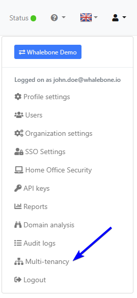
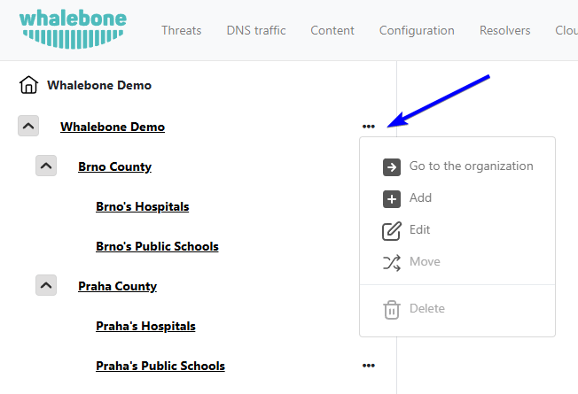

************
Multitenancy
************

.. only:: Aura

    .. warning:: Multitenancy is available only to Aura Full and Aura Premium customers.

.. only:: Peacemaker

    .. warning:: Multitenancy is available only to Peacemaker Profit customers.

Multitenancy allows MSPs, ISPs, CERTs, and large enterprises to manage many customer environments from one place while keeping their data and configurations isolated. This improves resource efficiency, simplifies maintenance, and reduces operational costs compared to running separate environments for each tenant.

Main features:

* **Master-Tenant Creation & Sub-Tenant Management**: Flag any customer as a Master Tenant to spawn sub-tenants; parent/child links can be renamed, moved, or safely deleted with built-in resolver, traffic, and device checks.

* **Nested Tenant Hierarchy**: Unlimited depth tree with an at-a-glance customer switcher for instant context changes.

* **Role-Based Access Control**: Three cascading roles (Tenant Owner, Tenant Administrator, Tenant Analyst) define who can create, read, update, delete, configure, or just view each branch.

* **Cross-Tenant User Invitation**: Invite Full-Admin or Read-Only users that automatically inherit rights across all sub-tenants, or assign granular per-tenant roles.

* **Master Console**: Dedicated dashboard, visible to any tenant-role user, for one-click create, move, delete, and CSV export of per-tenant query stats.

* **Privacy Disclosure Banner**: A persistent notice on the Users page clarifies that service-provider admins may view the user list for environment management.

* **Tenant Statistics & CSV Export**: Monthly query counts shown in the console and downloadable by any tenant-role user.

.. Enable these when the feature is ready and published to all regions:
.. * **Inherited Policies**: Parent tenants can publish Blocking Thresholds, Content Filters, Regulatory Lists, and Allow/Deny Lists that flow to descendants.
.. * **Policy Enforcement & Fine-Tuning**: Mark any policy or an individual rule as Enforced to lock it, or allow sub-tenants to adjust, view deltas, and "Reset to Default."

Tenant administration
=====================

Tenant administration is accessible from the account settings in the upper right screen on the Whalebone portal.

When in the tenant list, the three dots next to each tenant open a menu where administrators can access the tenant's dashboard, create a sub-tenant, edit it, move it to a different sub-tree, or delete it.

