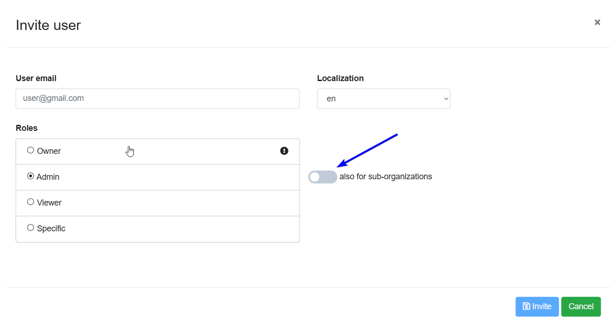
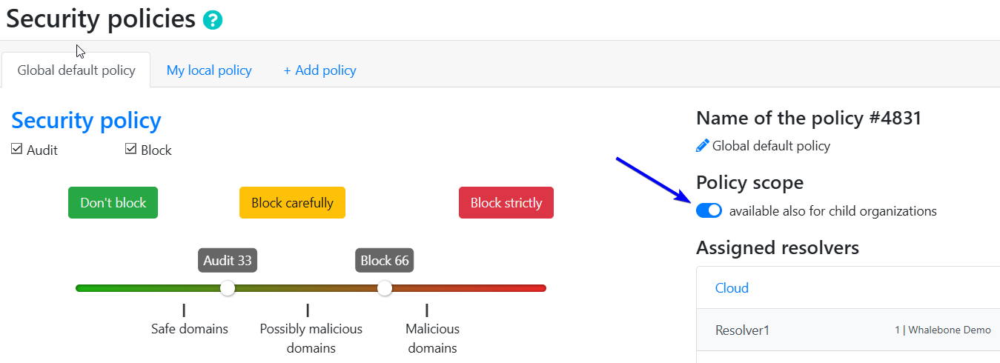
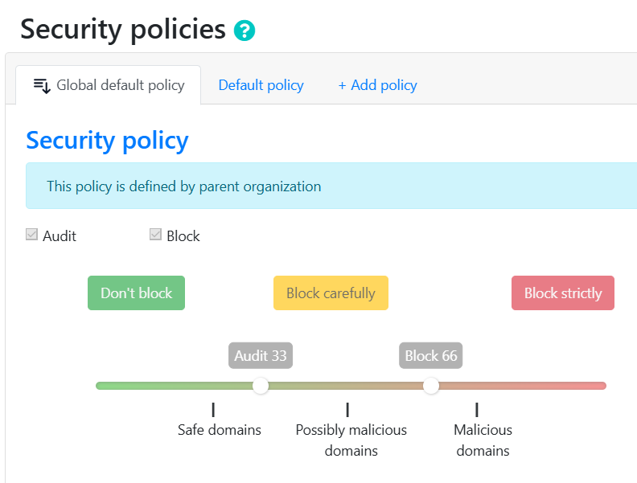

************
Multitenancy
************

.. note:: Multitenancy is disabled by default. If you want to enable it, please contact us using the Whalebone Helpdesk.

.. only:: Aura

    .. warning:: Multitenancy is available only to Aura Full and Aura Premium customers.

.. only:: Peacemaker

    .. warning:: Multitenancy is available only to Peacemaker Profit customers.

Multitenancy allows MSPs, ISPs, CERTs, and large enterprises to manage many customer environments from one place while keeping their data and configurations isolated. This improves resource efficiency, simplifies maintenance, and reduces operational costs compared to running separate environments for each tenant.

Main features:

* **Master-Tenant Creation & Sub-Tenant Management**: Flag any customer as a Master Tenant to spawn sub-tenants; parent/child links can be renamed, moved, or safely deleted with built-in resolver, traffic, and device checks.

* **Nested Tenant Hierarchy**: Unlimited depth tree with an at-a-glance customer switcher for instant context changes.

* **Role-Based Access Control**: Three cascading roles (Tenant Owner, Tenant Administrator, Tenant Analyst) define who can create, read, update, delete, configure, or just view each branch.

* **Cross-Tenant User Invitation**: Invite Full-Admin or Read-Only users that automatically inherit rights across all sub-tenants, or assign granular per-tenant roles.

* **Master Console**: Dedicated dashboard, visible to any tenant-role user, for one-click create, move, delete, and CSV export of per-tenant query stats.

* **Manage Tenants API**: Batch create, read, update, delete, hierarchy moves, and optional force-delete for external provisioning or ticketing systems.

* **Inherited Policies**: Parent tenants can publish Blocking Thresholds, Content Filters, Regulatory Lists, and Allow/Deny Lists that flow to descendants.

* **Privacy Disclosure Banner**: A persistent notice on the Users page clarifies that service-provider admins may view the user list for environment management.

* **Tenant Statistics & CSV Export**: Monthly query counts shown in the console and downloadable by any tenant-role user.

.. Enable these when the feature is ready and published to all regions:
.. * **Policy Enforcement & Fine-Tuning**: Mark any policy or an individual rule as Enforced to lock it, or allow sub-tenants to adjust, view deltas, and "Reset to Default."

Tenant administration
=====================

Tenant administration is accessible from the account settings in the upper right screen on the Whalebone portal.

.. image:: ./img/multitenancy-1.png
    :align: center

When in the tenant list, the three dots next to each tenant open a menu where administrators can access the tenant's dashboard, create a sub-tenant, edit it, move it to a different sub-tree, or delete it.

.. image:: ./img/multitenancy-2.png
    :align: center

Roles
=====

The following roles are available for tenant management:

* **Tenant Owner**:

    * Full control over the tenant (create, read, update, delete, and move), including creating sub-tenants, managing policies, and configuring settings.

    * When a Tenant Owner switches to a customer he or she behave as a customer administrator.

* **Tenant Administrator**:

    * Can manage sub-tenants, policies, and settings but cannot delete.

    * When a Tenant Administrator switches to a customer he or she behaves as a customer administrator.

* **Tenant Viewer**:

    * Can view all tenants, tenant information and statistics but cannot make changes.

    * When a Tenant Viewer switches to a customer he or she behaves as a read only role.

All users with the Tenant Owner or Tenant Administrator roles can invite other users to the tenant. Tenant Owners can invite users with the Tenant Owner, Tenant Administrator, or Tenant Viewer roles. Tenant Administrators can invite users with the Tenant Administrator or Tenant Viewer roles. There is a switch on ther invite form to allow the invited user to manage sub-tenants.

Inherited policies
==================

Inherited policies allow parent tenants to define and publish policies that are automatically offered to sub-tenants as default policies when creating a new resolver or registering a subnet on cloud resolvers. This ensures consistent policy enforcement across the tenant hierarchy. It also allows administrators on higher levels to manage policies centrally, reducing the need for repetitive configuration at each sub-tenant level. In addition, administrators always have the option to choose an inherited policy or create a new one with custom configuration.

    Policy inheritance can be enabled or disabled for each policy in its settings.

    When a policy is inherited, it cannot be modified at the sub-tenant level.

Known limitations
=================

* Inherited policies cannot be configured using the API.

* Blocking pages cannot be inherited.
